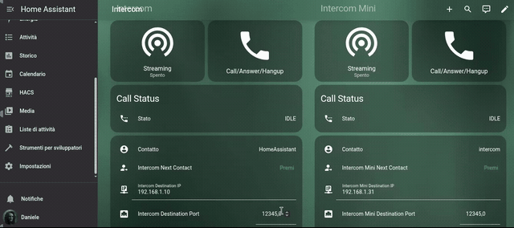
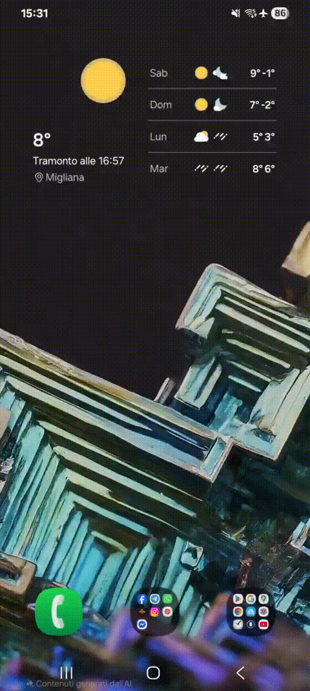

# ESPHome Intercom Audio

[](https://www.espressif.com/en/products/socs/esp32-s3)
[](https://esphome.io/)
[](https://www.home-assistant.io/)
[](LICENSE)

An ESPHome component for bidirectional UDP audio streaming. Enables full-duplex communication between ESP32 and Home Assistant (via go2rtc/WebRTC) or directly between ESP32 devices.

## What You Can Build

The `intercom_audio` component provides the foundation for:

- **Smart doorbell** - Push notifications when someone rings, answer and talk from your phone
- **Multi-room intercom** - Room-to-room communication throughout your home
- **Baby monitor** - One-way listening with remote speaker
- **Remote access** - Talk to your home remotely via Home Assistant app
- **P2P system** - Direct ESP-to-ESP communication without a server

Using native ESPHome tools (automations, scripts, lambdas), you can build complex logic: contact lists, destination selection, auto-answer, call timeouts, and much more.

## Preview

### Home Assistant Dashboard


### Device Demo


### Device Display States
| Idle | Ringing | In Call |
|------|---------|---------|
|  |  |  |

## Installation

Add the components as external_components in your YAML:

```yaml
external_components:
  - source:
      type: git
      url: https://github.com/n-IA-hane/esphome-intercom
      ref: main
    components: [intercom_audio, i2s_audio_duplex, mdns_discovery, esp_aec]
```

## Basic Configuration

### Core Component: `intercom_audio`

```yaml
intercom_audio:
  id: intercom
  microphone: mic_id        # ESPHome microphone ID
  speaker: speaker_id       # ESPHome speaker ID
  listen_port: 12346        # UDP port to listen on (receives audio)
  remote_ip: !lambda 'return id(destination_ip).state;'
  remote_port: !lambda 'return (uint16_t)id(destination_port).state;'
  buffer_size: 8192         # Jitter buffer in bytes
  prebuffer_size: 2048      # Pre-buffer before playback
  mic_gain: 1               # Microphone gain (1-10)
  dc_offset_removal: false  # Enable for mics with DC offset (e.g., SPH0645)
  on_start:
    - logger.log: "Streaming started"
  on_stop:
    - logger.log: "Streaming stopped"
```

### Parameters

| Parameter | Description | Default |
|-----------|-------------|---------|
| `listen_port` | UDP port to receive audio | 12346 |
| `remote_ip` | Destination IP (lambda for dynamic value) | - |
| `remote_port` | Destination port | 12346 |
| `buffer_size` | Jitter buffer size (bytes) | 8192 |
| `prebuffer_size` | Minimum buffer before playback | 2048 |
| `mic_gain` | Microphone amplification (1-10) | 1 |
| `dc_offset_removal` | DC offset removal for MEMS mics | false |

### Available Actions

```yaml
# Start streaming
- intercom_audio.start:
    id: intercom
    remote_ip: "192.168.1.10"
    remote_port: 12345

# Stop streaming
- intercom_audio.stop:
    id: intercom

# Reset packet counters
- intercom_audio.reset_counters:
    id: intercom
```

### Exposed Sensors

```yaml
sensor:
  - platform: intercom_audio
    intercom_audio_id: intercom
    tx_packets:
      name: "TX Packets"
    rx_packets:
      name: "RX Packets"
    buffer_fill:
      name: "Buffer Fill"
```

## Home Assistant + WebRTC Integration

To receive audio in Home Assistant, you need **go2rtc** as a bridge.

### go2rtc Configuration

```yaml
streams:
  intercom:
    - "exec:ffmpeg -f s16le -ar 16000 -ac 1 -i udp://0.0.0.0:12345?timeout=5000000 -c:a libopus -b:a 48k -application voip -f mpegts -"
    - "exec:ffmpeg -re -f alaw -ar 8000 -ac 1 -i pipe: -f s16le -ar 16000 -ac 1 udp://192.168.1.31:12345?pkt_size=512#backchannel=1"

  intercom_mini:
    - "exec:ffmpeg -f s16le -ar 16000 -ac 1 -i udp://0.0.0.0:12346?timeout=5000000 -c:a libopus -b:a 48k -application voip -f mpegts -"
    - "exec:ffmpeg -re -f alaw -ar 8000 -ac 1 -i pipe: -f s16le -ar 16000 -ac 1 udp://192.168.1.18:12346?pkt_size=512#backchannel=1"

webrtc:
  candidates:
    - 192.168.1.10:8555  # go2rtc server IP
    - stun:8555
  ice_servers:
    - urls: [stun:stun.l.google.com:19302]

api:
  listen: ":1984"

rtsp:
  listen: ":8554"
```

### WebRTC Card for Dashboard

Install [WebRTC Camera](https://github.com/AlexxIT/WebRTC) from HACS, then:

```yaml
type: custom:webrtc-camera
url: intercom
mode: webrtc
media: audio+microphone
muted: false
style: 'width: 100%; aspect-ratio: 1/1; background: #1a1a1a; border-radius: 12px;'
```

## P2P Communication (ESP-to-ESP)

For direct communication between two ESP32 devices, configure reciprocal IP and port:

**ESP A** (192.168.1.31):
```yaml
intercom_audio:
  listen_port: 12345
  remote_ip: "192.168.1.18"
  remote_port: 12346
```

**ESP B** (192.168.1.18):
```yaml
intercom_audio:
  listen_port: 12346
  remote_ip: "192.168.1.31"
  remote_port: 12345
```

Start streaming on both for bidirectional communication.

## Additional Components

### `i2s_audio_duplex`

Native ESPHome `i2s_audio` microphone and speaker components **do not support full-duplex on a single I2S bus**. Codecs like ES8311 (used in Xiaozhi Ball V3) share the same I2S bus for both microphone and speaker.

We developed `i2s_audio_duplex` to handle simultaneous TX and RX on the same bus:

```yaml
i2s_audio_duplex:
  id: duplex_audio
  i2s_audio_id: i2s_bus
  bits_per_sample: 16
  mic_sample_rate: 16000
  speaker_sample_rate: 16000
```

Then in `intercom_audio` use `duplex` instead of separate `microphone` + `speaker`:

```yaml
intercom_audio:
  id: intercom
  duplex: duplex_audio    # instead of microphone + speaker
  listen_port: 12345
  # ...
```

> **Note**: If you use hardware with separate I2S buses for mic and speaker (e.g., INMP441/SPH0645 + MAX98357A), you can use native ESPHome `microphone` and `speaker` components.

### `mdns_discovery`

Automatically discovers other intercom devices on the local network:

```yaml
mdns_discovery:
  id: discovery
  service_type: "_intercom._udp"

sensor:
  - platform: mdns_discovery
    mdns_discovery_id: discovery
    peer_count:
      name: "Peer Count"
```

### `esp_aec` (Echo Cancellation)

Acoustic echo cancellation based on ESP-SR to reduce speaker→microphone feedback:

```yaml
esp_aec:
  id: aec

intercom_audio:
  id: intercom
  aec: aec
  # ...
```

> Requires PSRAM. Improves audio quality in environments with echo.

## Complete Examples

The repository includes fully working configurations:

- **`intercom.yaml`** - Xiaozhi Ball V3 (ES8311 codec + GC9A01A display)
- **`intercom-mini.yaml`** - ESP32-S3 Mini (INMP441/SPH0645 mic + MAX98357A speaker)
- **`packages/intercom_base.yaml`** - Shared package with call logic

These files implement a complete intercom system with:
- Call state machine (IDLE → RINGING → IN_CALL)
- Contact list with cyclic selection
- UDP signaling for CALL/ANSWER/HANGUP
- Configurable auto-answer and auto-hangup
- Display and LED integration

## Home Assistant Dashboard

Complete dashboard example to manage two intercoms:

```yaml
title: Intercom
views:
  - title: Intercom
    icon: mdi:phone-voip
    cards: []
    type: sections
    max_columns: 2
    sections:
      - type: grid
        cards:
          - type: vertical-stack
            title: Intercom Mini
            cards:
              - type: horizontal-stack
                cards:
                  - show_name: true
                    show_icon: true
                    type: button
                    entity: switch.intercom_mini_streaming
                    name: Streaming
                    icon: ''
                    show_state: true
                    tap_action:
                      action: toggle
                  - show_name: true
                    show_icon: true
                    type: button
                    entity: button.intercom_mini_call_answer_hangup
                    name:
                      type: entity
                    icon: ''
                    tap_action:
                      action: call-service
                      service: button.press
                      target:
                        entity_id: button.intercom_mini_call_answer_hangup
              - type: conditional
                conditions:
                  - condition: state
                    entity: switch.intercom_mini_streaming
                    state: 'on'
                  - condition: state
                    entity: sensor.intercom_mini_selected_contact
                    state: HomeAssistant
                card:
                  type: custom:webrtc-camera
                  url: intercom_mini
                  mode: webrtc
                  media: audio+microphone
                  muted: false
                  style: >-
                    width: 100%; aspect-ratio: 1/1; background: #1a1a1a;
                    border-radius: 12px;
              - type: entities
                title: Call Status
                entities:
                  - entity: sensor.intercom_mini_call_state
                    name: State
              - type: conditional
                conditions:
                  - condition: state
                    entity: sensor.intercom_mini_call_state
                    state: RINGING_IN
                card:
                  type: entities
                  entities:
                    - entity: sensor.intercom_mini_call_from
                      name: Caller
                      icon: mdi:phone-incoming
              - type: entities
                entities:
                  - entity: sensor.intercom_mini_selected_contact
                    name: Contact
                  - entity: button.intercom_mini_next_contact
                  - entity: text.intercom_mini_destination_ip
                  - entity: number.intercom_mini_destination_port
                  - entity: number.intercom_mini_speaker_volume
                    name: Speaker Volume
                  - entity: number.intercom_mini_microphone_gain
                    name: Microphone Gain
                  - entity: number.intercom_mini_ring_timeout
                    name: Ring Timeout
                  - entity: number.intercom_mini_auto_hangup_timeout
                  - entity: switch.intercom_mini_auto_answer
                    name: Auto Answer
                  - entity: switch.intercom_mini_auto_hangup
                    name: Auto Hangup
                  - entity: switch.intercom_mini_echo_cancellation
              - type: entities
                title: Diagnostics
                entities:
                  - entity: sensor.intercom_mini_wifi_signal
                    name: WiFi
                  - entity: sensor.intercom_mini_peer_count
                    name: Peers
                  - entity: sensor.intercom_mini_tx_packets
                    name: TX
                  - entity: sensor.intercom_mini_rx_packets
                    name: RX
                  - entity: button.intercom_mini_reset_stats
                    name: Reset Stats
                  - entity: button.intercom_mini_refresh_peers
      - type: grid
        cards:
          - type: vertical-stack
            title: Intercom
            cards:
              - type: horizontal-stack
                cards:
                  - show_name: true
                    show_icon: true
                    type: button
                    entity: switch.intercom_streaming
                    icon: ''
                    show_state: true
                    tap_action:
                      action: toggle
                    name: Streaming
                  - show_name: true
                    show_icon: true
                    type: button
                    entity: button.intercom_call_answer_hangup
                    icon: ''
                    tap_action:
                      action: call-service
                      service: button.press
                      target:
                        entity_id: button.intercom_call_answer_hangup
                    name: Call/Answer/Hangup
              - type: conditional
                conditions:
                  - condition: state
                    entity: switch.intercom_streaming
                    state: 'on'
                  - condition: state
                    entity: sensor.intercom_selected_contact
                    state: HomeAssistant
                card:
                  type: custom:webrtc-camera
                  url: intercom
                  mode: webrtc
                  media: audio+microphone
                  muted: false
                  style: >-
                    width: 100%; aspect-ratio: 1/1; background: #1a1a1a;
                    border-radius: 50%;
              - type: entities
                title: Call Status
                entities:
                  - entity: sensor.intercom_call_state
                    name: State
              - type: conditional
                conditions:
                  - condition: state
                    entity: sensor.intercom_call_state
                    state: RINGING_IN
                card:
                  type: entities
                  entities:
                    - entity: sensor.intercom_call_from
                      name: Caller
                      icon: mdi:phone-incoming
              - type: entities
                entities:
                  - entity: sensor.intercom_selected_contact
                    name: Contact
                  - entity: button.intercom_next_contact
                  - entity: text.intercom_destination_ip
                  - entity: number.intercom_destination_port
                  - entity: number.intercom_speaker_volume
                    name: Speaker Volume
                  - entity: number.intercom_microphone_gain
                    name: Microphone Gain
                  - entity: number.intercom_ring_timeout
                    name: Ring Timeout
                  - entity: number.intercom_auto_hangup_timeout
                  - entity: switch.intercom_auto_answer
                    name: Auto Answer
                  - entity: switch.intercom_auto_hangup
                  - entity: switch.intercom_echo_cancellation
                    name: Echo Cancellation
              - type: entities
                title: Diagnostics
                entities:
                  - entity: sensor.intercom_wifi_signal
                    name: WiFi
                  - entity: sensor.intercom_peer_count
                    name: Peers
                  - entity: sensor.intercom_tx_packets
                    name: TX
                  - entity: sensor.intercom_rx_packets
                    name: RX
                  - entity: button.intercom_reset_stats
                    name: Reset Stats
                  - entity: button.intercom_refresh_peers
      - type: grid
        cards:
          - type: logbook
            title: Call History
            hours_to_show: 24
            entities:
              - switch.intercom_streaming
              - switch.intercom_mini_streaming
              - text_sensor.intercom_call_state
              - text_sensor.intercom_mini_call_state
            grid_options:
              columns: 24
              rows: 6
        column_span: 2
```

## Tested Hardware

| Device | Codec/Mic | Speaker | Notes |
|--------|-----------|---------|-------|
| Xiaozhi Ball V3 | ES8311 (I2S duplex) | Built-in | Round GC9A01A display |
| ESP32-S3 Mini | INMP441 or SPH0645 (I2S) | MAX98357A | Budget-friendly setup |

> **Note**: The `intercom_audio` component should work with **any microphone and speaker supported by ESPHome**. The devices above are the ones we have tested. If you use a different microphone (e.g., INMP441, SPH0645, PDM mics), just configure it in ESPHome as usual and pass it to `intercom_audio`.

### GPIO Configuration for Xiaozhi Ball V3

All components are pre-soldered on the board.

| Function | Component | GPIO |
|----------|-----------|------|
| **I2C (ES8311)** | SDA | GPIO15 |
| | SCL | GPIO14 |
| **I2S Audio** | LRCLK | GPIO45 |
| | BCLK | GPIO9 |
| | MCLK | GPIO16 |
| | DIN (mic) | GPIO10 |
| | DOUT (spk) | GPIO8 |
| **Speaker Amp** | Enable | GPIO46 |
| **Display (SPI)** | CLK | GPIO4 |
| | MOSI | GPIO2 |
| | CS | GPIO5 |
| | DC | GPIO47 |
| | Reset | GPIO38 |
| **Backlight** | PWM | GPIO42 |
| **Status LED** | WS2812 | GPIO48 |
| **Button** | Main | GPIO0 |
| **Touch** | Input | GPIO12 |

### Wiring for ESP32-S3 Mini

| Component | Pin | GPIO |
|-----------|-----|------|
| **INMP441/SPH0645 Mic** | WS (LRCLK) | GPIO3 |
| | SCK (BCLK) | GPIO2 |
| | SD (DOUT) | GPIO4 |
| | L/R | GND (left channel) |
| **MAX98357A Amp** | LRC (LRCLK) | GPIO6 |
| | BCLK | GPIO7 |
| | DIN | GPIO8 |
| **Status LED** | WS2812 | GPIO21 |

## Audio Format

- **Sample rate**: 16000 Hz
- **Bit depth**: 16-bit signed PCM
- **Channels**: Mono
- **UDP packet**: 512 bytes (256 samples, 16ms)

## License

MIT License - see [LICENSE](LICENSE)

## Credits

Developed by [@n-IA-hane](https://github.com/n-IA-hane) with [Claude Code](https://claude.ai/code)
