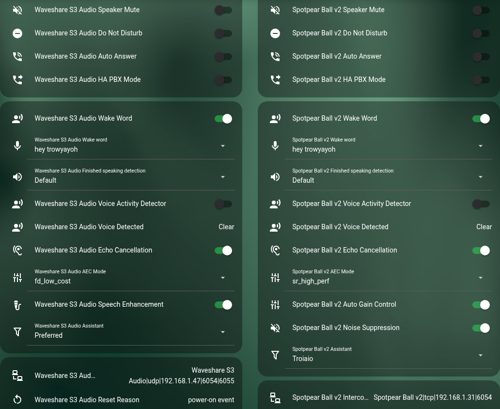

# VoIP Stack for ESPHome and Home Assistant

[](#supported-hardware)
[](https://www.home-assistant.io)
[](https://esphome.io)

Turn ESPHome audio devices and Home Assistant into a local SIP phone system,
or use the maintained full-experience firmware to combine VoIP with a complete
ESPHome voice satellite.

ESP devices become standards-based SIP phones, with audio on every maintained
VoIP profile and optional video on qualified ESP32-P4 profiles. Home Assistant
can be a SIP video softphone, call router, RTP bridge, local registrar,
conference focus, callable Assist destination and optional trunk endpoint.
Browser phones, wall tablets, ESP room stations, standard SIP clients and an
external PBX can share one phonebook without requiring a separate Asterisk or
FreeSWITCH server for the normal home use case.

VoIP is only one part of the project. The optional full-experience ESP YAMLs
also provide an independent on-device Voice Assistant, Micro Wake Word, media
playback, TTS, Sendspin support, runtime audio controls and touch interfaces.
That local assistant is not created or controlled by calling Assist over SIP.

The project therefore has three cooperating, independently useful surfaces:

| Surface | Runs on | Purpose |
|---|---|---|
| ESP VoIP endpoint | ESPHome device | A standards-based SIP/RTP phone, with audio and optional qualified P4 video. |
| Home Assistant VoIP Stack | Home Assistant | Browser phones, PBX routing, registrar, bridges, groups, conferences, callable Assist and an optional trunk. |
| Full ESP experience | ESPHome device | A local voice satellite with wake word, Voice Assistant, media, TTS, optional Sendspin, runtime UI and VoIP. |

Install only the surfaces you need. A VoIP-only ESP does not require the local
Voice Assistant, and a full-experience ESP keeps its local assistant even when
no SIP Assist extension is configured.


_One dashboard can control a browser phone, an ESP endpoint and the shared
phonebook. Each room phone still has its own identity and call state._

<table>
  <tr>
    <td align="center"><br/><b>ESP to HA</b></td>
    <td align="center"><br/><b>SIP video</b></td>
    <td align="center"><br/><b>ESP Voice Assistant</b></td>
    <td align="center"><br/><b>ESP TTS response</b></td>
    <td align="center"><br/><b>Runtime audio controls</b></td>
  </tr>
</table>

<table>
  <tr>
    <td>
      <strong>Support this project</strong><br/>
      If this work is useful to you, please consider a donation. It helps cover
      development tools, services and test hardware, which means better
      compatibility and fewer regressions for everyone.<br/><br/>
      <a href="https://github.com/sponsors/n-IA-hane">
        
      </a>
    </td>
  </tr>
</table>

## What can you build?


| Goal | What VoIP Stack provides | Start here |
|---|---|---|
| Video doorbell | A SIP video door station can ring a browser phone in a dashboard or Companion app. Standard ESP profiles remain audio-only; qualified ESP32-P4 profiles can also send and receive SIP video. | [SIP video](docs/SIP_VIDEO.md) · [door-station recipe](#door-station-and-unanswered-calls) |
| Room-to-room calls | Create a logical HA phone and dedicated dashboard view for each kiosk or tablet. Calls may be private audio or video. | [Logical phones](#logical-home-assistant-phones) |
| ESP room phones | Flash one maintained VoIP YAML per room. ESPs can call names and extensions from the shared phonebook. | [Deployment guide](docs/DEPLOYMENT_GUIDE.md) |
| Full ESP voice device | Flash a maintained full-experience YAML to combine a local Voice Assistant, Micro Wake Word, media, TTS, optional Sendspin and VoIP on one device. | [Full ESP experience](#full-esp-voice-experience) |
| Existing SIP equipment | Register Zoiper, Linphone, baresip, an IP phone or an ATA directly to HA. | [Local accounts](docs/SERVICES.md#local-sip-endpoint-account-services) |
| Ring groups | Ring several eligible endpoints; the first answer wins and the losing branches are cancelled. | [Groups](docs/GROUPS.md#ring-group) |
| Audio conferences | Host a local audio conference in HA and optionally ring its members. | [Groups](docs/GROUPS.md#conference-group) |
| Callable Assist | Give a native Assist pipeline an extension and talk to it from ESP, SIP or trunk callers. | [Assist calls](#assist-as-a-phone-extension) |
| External calls | Register an optional provider/PBX trunk for inbound and outbound calls. | [SIP trunk](docs/SIP_TRUNK.md) |
| Contextual routing | Use native HA entities, conditions and services for presence, schedules, no-answer forwarding and in-call DTMF. | [Automation cookbook](docs/AUTOMATION_DIALPLAN.md) |

## Fastest start

1. Install **VoIP Stack** from HACS and restart Home Assistant.
2. Add **VoIP Stack** from **Settings → Devices & services**.
3. Keep SIP `5060` and RTP base `40000` unless they conflict with your network.
4. Choose a maintained YAML under [`yamls/`](yamls/) and adapt only its
   substitutions, pins and secrets.
5. Add the flashed device through the normal ESPHome integration.
6. Add the VoIP Stack card to a dashboard and select the intended phone Device.
7. Call the phonebook name shown by the card or ESP.

For one ESP intercom, that is enough. Local SIP accounts, multiple browser
phones, callable Assist and a trunk are optional PBX layers. The full ESP
experience is a separate firmware choice, not another PBX requirement.

| Device goal | Maintained starting point |
|---|---|
| ESP VoIP only | [`yamls/voip-only/`](yamls/voip-only/) |
| Local Voice Assistant + MWW + media + TTS + optional Sendspin + VoIP | [`yamls/full-experience/`](yamls/full-experience/) |
| Native ESPHome mic/speaker paths | [`yamls/voip-only/esphome-native/`](yamls/voip-only/esphome-native/) |
| New or unqualified hardware | [`yamls/experimental/`](yamls/experimental/) |

The [user guide](docs/USER_GUIDE.md) continues from installation through cards,
calls, SIP accounts, groups, Assist, trunks and diagnostics. The
[deployment guide](docs/DEPLOYMENT_GUIDE.md) explains how to choose between
single-bus, dual-bus, lightweight AEC and full AFE profiles.

## How it works


The system has one call model and four main surfaces:

- **ESP endpoint:** A lightweight SIP/SDP/RTP phone with a microphone,
  speaker or both.
- **Home Assistant runtime:** Logical browser phones, routing, media bridges,
  groups, local registration, Assist and the optional trunk.
- **Central phonebook:** Names, extensions, groups, registered clients,
  routable SIP endpoints and external numbers.
- **Lovelace card:** A UI bound to one phone Device; it projects backend state
  and invokes normal HA services instead of running a second call controller.

SIP dialogs, transactions and transports have separate lifecycles. Logical
phones share the listener and RTP pool, so creating another room phone does not
open another SIP server. Each phone owns at most one active call; calls to
different phones remain independent.

The detailed ownership and media model is in
[`docs/ARCHITECTURE.md`](docs/ARCHITECTURE.md). Complete peer-to-peer and
HA-bridged sequences are in [`docs/CALL_FLOWS.md`](docs/CALL_FLOWS.md).

## Logical Home Assistant phones

The integration creates one ordinary Home Assistant browser phone on first
setup, named from Home Assistant's location. Add or remove phones
from:

**Settings → Devices & services → VoIP Stack → Add phone → Home Assistant
browser phone**

Give every real place its own name and optional extension: `Kitchen`,
`Reception`, `Garage`, `201`, and so on. Each logical phone is represented by a
native HA Device with entities for call state, connectivity, DND, extension,
groups, auto answer, camera transmission settings and call events.

Bind the card to that Device:

```yaml
type: custom:voip-stack-card
mode: ha_softphone
device_id: <phone_device_id>
```

`device_id` answers "which local phone owns this card or action?".
`destination` answers "who should this phone call?". The central phonebook
resolves the destination, so a normal call does not require the destination's
Device ID:

```yaml
action: voip_stack.call
data:
  device_id: <kitchen_phone_device_id>
  destination: Garage
```

Omit `device_id` only when a preferred phone is configured or exactly one
compatible phone exists. Otherwise the action asks you to select the local
phone explicitly.

The card's idle `Options` panel includes a `Microphone anti-alias filter`.
It is enabled by default and stored per browser and logical phone. The setting
takes effect when the next call opens the microphone and only adds processing
when the negotiated transmit rate is lower than the browser capture rate.

Each room-to-room media endpoint needs a distinct browser or Companion session.
Two cards in one browser tab can display two phones, but one tab still owns one
physical microphone, speaker and camera pipeline.

## ESP endpoints and media roles

ESP media roles are derived from the configured components; they are not a
separate user mode.

| Derived role | Media | Typical use |
|---|---|---|
| `full_duplex` | microphone TX + speaker RX | Room phone, door station, wall panel |
| `mic_only` | microphone TX | Monitor or capture endpoint |
| `speaker_only` | speaker RX | Paging or announcement target |

An endpoint must have at least one real media direction. ESP VoIP intentionally
uses uncompressed PCM for audio. Standard profiles are audio-only; qualified
ESP32-P4 videophone profiles compile exactly one video codec, JPEG or H.264.
HA performs format conversion when a standard SIP peer negotiates another
supported audio codec; ESP firmware is not downgraded to a telephone codec for
that purpose.

Audio component details live in the companion projects:

- [`esp_audio_stack`](https://github.com/n-IA-hane/esphome-audio-stack)
- [`esp_aec`](https://github.com/n-IA-hane/esphome-audio-stack/tree/main/esphome/components/esp_aec)
- [`esp_afe`](https://github.com/n-IA-hane/esphome-audio-stack/tree/main/esphome/components/esp_afe)
- [`voip_stack`](https://github.com/n-IA-hane/esphome-voip-stack)
- [`runtime_controller`](https://github.com/n-IA-hane/esphome-runtime-controller)

## Full ESP voice experience

The [`yamls/full-experience/`](yamls/full-experience/) profiles are complete
ESPHome voice devices, not merely larger SIP configurations. They combine the
VoIP endpoint with an independent local Voice Assistant stack and coordinate
all realtime consumers through one audio and runtime ownership model.

The underlying audio stack is also reusable without VoIP. Custom ESPHome voice
devices can use it to share codec or I2S ownership, speaker reference, AEC/AFE
processing and a cleaned microphone stream between their own consumers.

<table>
  <tr>
    <td align="center"><br/><b>Animated assistant</b></td>
    <td align="center"><br/><b>Assistant response</b></td>
    <td align="center"><br/><b>Runtime audio controls</b></td>
    <td align="center"><br/><b>Call end reason</b></td>
  </tr>
  <tr>
    <td align="center"><br/><b>Positive mood</b></td>
    <td align="center"><br/><b>Neutral mood</b></td>
    <td align="center"><br/><b>Negative mood</b></td>
    <td align="center"><br/><b>AFE controls in HA</b></td>
  </tr>
</table>

<table>
  <tr>
    <td align="center"><br/><b>P4 weather, Voice Assistant and VoIP controls</b></td>
    <td align="center"><br/><b>Ducking and barge-in</b></td>
  </tr>
</table>

The full profiles provide:

- continuous Micro Wake Word on the cleaned post-AEC microphone stream;
- a native ESPHome Voice Assistant started by wake word or touch;
- media playback, announcements, TTS, ringtones and optional Sendspin through
  one shared speaker path;
- ducking and barge-in, including interruption of a current assistant reply;
- VoIP calls that coexist with the assistant instead of creating a second
  microphone or speaker owner;
- AEC or AFE processing, with runtime controls and diagnostics where supported;
- coordinated LEDs, display pages, timers, call state and media activity
  through `runtime_controller`;
- headless operation on audio boards, plus full LVGL interfaces on supported
  displays;
- optional animated and mood-aware assistant artwork on display profiles.

The shared pipeline matters because Micro Wake Word, Voice Assistant and VoIP
all need the same cleaned user speech while music, TTS or a ringtone may still
be playing. Speaker output also supplies the phase-coherent reference used by
AEC instead of letting each feature open its own audio path.


### Assistant artwork and avatars

Display profiles can select an assistant avatar with the `ai_avatar`
substitution. Each avatar directory may provide idle animation frames plus
listening, thinking, loading, error, timer and mood images. The selected assets
are resized for the target display during the build.

```yaml
substitutions:
  ai_avatar: my_assistant
```

This artwork represents the ESP device's own Voice Assistant state. It is
unrelated to the optional HA Assist pipeline that SIP callers can dial as an
extension.

See the [deployment guide](docs/DEPLOYMENT_GUIDE.md) for profile selection and
the companion [audio stack documentation](https://github.com/n-IA-hane/esphome-audio-stack)
for AEC, AFE, I2S and codec topology details.

## Home Assistant as a SIP video phone

Video is available to compatible browser phones in current browsers and the
Home Assistant Companion app. Standard SIP video door stations, video phones,
softphones and PBX/trunk legs can negotiate H.264, VP8 or RTP/JPEG. An optional
bounded FFmpeg path can receive selected legacy codecs and bridge incompatible
H.264/JPEG SIP legs when direct encoded relay is impossible.

Receiving video does not require camera permission. Sending the browser camera
is a separate persisted phone setting and still requires browser permission.
Audio remains usable when video is unavailable or deliberately disabled.

Audio-only ESP endpoints and audio conferences remain audio-only. Qualified
ESP32-P4 videophone profiles can negotiate RTP/JPEG or H.264 directly, while
the full P4 profile supports bidirectional RTP/JPEG. Video compatibility
depends on the actual offer/answer, packetization and browser decoder, not only
on a codec name printed on a product page.

See the [capability matrix, privacy controls and limits](docs/SIP_VIDEO.md).

## Phonebook and routing

Home Assistant publishes the shared roster through
`sensor.voip_phonebook`. It combines:

- online ESPHome VoIP endpoints;
- logical Home Assistant phones;
- registered local SIP accounts;
- manual contacts;
- Assist destinations;
- dynamic ring/conference groups;
- optional trunk-routed numbers.

A name is the contact identity. An `extension` is an internal alias for that
same destination; a `number` is normally routed through the trunk. The resolver
can also handle canonical SIP URIs.

SIP routing identity and presentation identity remain separate. ESPHome node
names and account usernames provide stable URI users, while friendly names are
sent as standard SIP display names with spaces preserved. Incoming caller text
comes from the peer's `From` header, and the answering endpoint can publish its
resolved name through RFC 4916 connected identity.

Use the card, voice intents or `voip_stack.call` with a phonebook name or
extension. Do not copy endpoint addresses into automations unless you
deliberately need a raw SIP route.

- [Resolver rules](docs/DIALPLAN_RESOLVER.md)
- [Phonebook protocol](docs/PHONEBOOK_PROTOCOL.md)
- [Services](docs/SERVICES.md)
- [ESP discovery/entity surface](docs/ESP_ENTITY_SURFACE.md)


## Groups


A **ring group** forks one call to all eligible members. DND, disabled and busy
members are excluded; the caller is excluded if it belongs to the target
group. The first successful answer wins and every losing leg is cancelled.

An **audio conference group** joins answered members to one HA-hosted mixer.
`conference_ring` optionally rings the declared members when somebody joins.
Auto answer is a per-phone policy: enabling it on several group members means
several endpoints may join or compete immediately, which is the configured
behavior.

Membership declared by a phone becomes visible in HA dynamically. A group
disappears when no current endpoint declares it. See
[`docs/GROUPS.md`](docs/GROUPS.md) for declaration and collision rules.

## Assist as a phone extension

There are two separate Assist-related features:

| Feature | Where it runs | How it starts |
|---|---|---|
| ESP Voice Assistant | On a full-experience ESP device | Local wake word, touch control or an ESPHome action. |
| Callable HA Assist | In Home Assistant through VoIP Stack | A SIP caller dials its phonebook name or extension. |

Enable **Include voice assistant** while configuring VoIP Stack, choose the
pipeline and assign an extension. ESPs, registered SIP phones, browser phones
and trunk callers can then call that Assist pipeline like any other contact.

This is a Home Assistant PBX feature. The SIP caller talks to the selected HA
Assist pipeline over the call. It does not start, replace or change the local
Voice Assistant running on a full-experience ESP device.

VoIP Stack sends one initial user message such as
`Incoming SIP call from "Daniele".` and then streams the selected pipeline's
STT, conversation and TTS over the same call. It does not inject a second
persistent personality prompt. Put behavioral instructions in the conversation
agent itself.

Optional advanced call context appends caller ID, phonebook match, ingress and
called extension once. Treat those fields as untrusted call metadata, not
authentication.

Voice intents may also resolve commands such as "Call Kitchen", "Answer" and
"Hang up" against the live phonebook and the satellite's selected phone.

## Door station and unanswered calls


A typical path is:

1. a door station calls `Front door`;
2. a ring group alerts selected browser, SIP and ESP phones;
3. the first endpoint to answer owns the call;
4. if nobody answers, a native HA automation forwards the still-live call to
   another phone or Assist;
5. call events can trigger a mobile notification or another HA action.

Copyable, current recipes:

- [route a trunk caller to a ring group](docs/AUTOMATION_DIALPLAN.md#route-only-providerpbx-trunk-calls-to-a-ring-group)
- [forward an unanswered phone to Assist](docs/AUTOMATION_DIALPLAN.md#forward-an-unanswered-ha-call-to-assist)
- [forward an unanswered phone to a mobile number](docs/AUTOMATION_DIALPLAN.md#forward-an-unanswered-call-to-a-mobile-number)
- [route a known caller according to presence](docs/AUTOMATION_DIALPLAN.md#route-a-known-caller-according-to-presence)
- [send an actionable mobile notification](docs/AUTOMATION_DIALPLAN.md#actionable-doorbell-notification)
- [notify a no-answer timeout](docs/AUTOMATION_DIALPLAN.md#notify-a-no-answer-timeout)

The assistant's personality is entirely up to your prompt. Professional
receptionist and verbally abusive domestic secretary are both technically
valid configurations.

## Automation routing preview

The phonebook is always the normal dial plan. Advanced HA automation routing is
an opt-in preview and is disabled by default.

Automations may act only at explicit points:

- initial `route_requested`, before the configured inbound fallback;
- a logical phone remaining `ringing` for a native HA `for:` duration;
- a connected call producing a negotiated DTMF event.

Explicit extension digits entered during the trunk DTMF window remain
authoritative and bypass the automation override. If an automation does
nothing, the configured fallback continues normally.

Use per-phone state and Event Entities for room-specific behavior. Use
`event.voip_stack_call` for the PBX-wide initial routing decision. The card's
visible text is not an automation source of truth.

Start from a complete recipe:

- [route calls during office hours](docs/AUTOMATION_DIALPLAN.md#route-to-reception-during-office-hours)
- [dial a phonebook extension with initial DTMF](docs/AUTOMATION_DIALPLAN.md#dial-a-phonebook-extension-during-initial-trunk-routing)
- [run an HA action from in-call DTMF](docs/AUTOMATION_DIALPLAN.md#open-a-gate-with-in-call-dtmf)

Read the full [automation cookbook and concurrency rules](docs/AUTOMATION_DIALPLAN.md)
for forwarding, presence routing, missed-call notifications and concurrent
call controls.

> [!WARNING]
> Automation routing semantics may still change as more real installations are
> tested. Do not use preview routing as the only control path for emergency or
> safety-critical access.

## Optional SIP trunk

The trunk is disabled by default. Enable it only when HA must register to a
provider or another PBX.

Inbound mode can route immediately or collect an internal extension through
negotiated RTP `telephone-event`/compatible SIP INFO DTMF. Outbound contacts
with public numbers use the same trunk. Explicit digits, no-digit fallback and
automation overrides have distinct, documented precedence.

See [`docs/SIP_TRUNK.md`](docs/SIP_TRUNK.md) before exposing the listener beyond
a trusted network.

## Installation

### Home Assistant through HACS

1. Search for **VoIP Stack** in HACS.
2. Open the integration and select **Download**.
3. Restart Home Assistant.
4. Open **Settings → Devices & services → Add integration**.
5. Select **VoIP Stack** and complete the config flow.


The card is registered automatically. A normal LAN can keep SIP `5060` and RTP
base `40000`. Container, LXC, VPN and multi-subnet installs may need an explicit
reachable **Advertise host** and host networking.

Manual source and release-archive installation, port requirements and network
topologies are documented in the
[deployment guide](docs/DEPLOYMENT_GUIDE.md#home-assistant).

### ESPHome components

Use the maintained YAML whenever possible. A minimal custom external-component
declaration is:

```yaml
external_components:
  - source: github://n-IA-hane/esphome-voip-stack@main
    components: [voip_stack]
  - source: github://n-IA-hane/esphome-audio-stack@main
    components: [esp_audio_stack, esp_aec]
```

Replace `esp_aec` with `esp_afe` only when the profile actually uses the full
AFE pipeline. All maintained YAMLs point to the stable `main` branches.

After a major ESPHome or component upgrade, clear that device's ESPHome build
cache before compiling. The [deployment guide](docs/DEPLOYMENT_GUIDE.md)
contains the complete component and cache instructions.

## Upgrading

This project is maintained by one person and major releases may make deliberate
breaking changes. Maintaining old and new call engines or service semantics in
parallel is not sustainable; new features can require updates to automations,
dashboards, config entries or custom ESPHome YAML.

Before every upgrade:

1. read [`docs/BREAKING_CHANGES.md`](docs/BREAKING_CHANGES.md) and the release
   note;
2. update through HACS and restart HA;
3. run **Reconfigure** on the VoIP Stack integration and review every step;
4. verify phone/routing automations;
5. reset the frontend cache on dashboards or Companion sessions using the card;
6. clear the ESPHome build cache before rebuilding firmware after package
   changes.

Never assume an automation still has the same contract merely because the
integration loaded successfully.

## What's new in `2026.8.2-dev`

`2026.8.2-dev` is a lifecycle, video and qualification pre-release built on the
interoperability work introduced in `2026.8.1-dev`:

- capability-gated G.722 on HA SIP legs, while ESP endpoints keep their native
  high-quality PCM path;
- automatic Dahua `PCM/16000` interoperability for matching registered
  door-station profiles;
- stronger SIP digest stale-nonce recovery and registered TCP-flow reuse;
- RFC 7616/8760 Digest with MD5, SHA-256, SHA-512-256, `auth` and `auth-int`
  across the HA registrar and trunk client;
- reliable provisional responses with `100rel` and PRACK, shared RFC 4028
  session refresh policy, initial and in-dialog delayed offers, remote SIP fork
  settlement and standards-based REFER/NOTIFY call transfer;
- RFC 3263 NAPTR/SRV discovery, IPv6 SIP addressing and verified SIP TLS on HA
  SIP legs, including preserved `sips:` routing and transfer identities;
- FRITZBox-compatible trunk REGISTER Request-URI handling and RTP reframing
  when a peer sends packets shorter than its negotiated `ptime`;
- browser media preflight before Call or Answer, so a missing microphone API
  leaves an incoming call ringing instead of answering and immediately sending
  BYE;
- one persisted preferred Home Assistant phone, selected by its real Device ID,
  so service calls remain deterministic with multiple browser phones;
- one authoritative termination and cleanup path for browser, routed, trunk,
  conference and forwarded calls, with stale-generation protection;
- faster vectorized G.711 conversion on HA;
- smaller call-routing orchestrators with the existing single authoritative
  call lifecycle preserved;
- a substantially expanded, schema-checked automation cookbook.
- fail-closed candidate qualification with real HA, browser, SIP peers,
  maintained firmware builds and hardware-in-the-loop evidence.
- one generation-owned call session with common answer, bridge, projection,
  rollback and termination primitives across direct, trunk, forward, group and
  conference paths;
- stabilized P4 bidirectional JPEG/H.264 negotiation, audio-first video
  upgrades, bounded presentation queues and post-call LVGL recovery;
- exact candidate locks for all four repositories, firmware manifests and a
  deterministic HACS ZIP built, validated and published explicitly;
- executable regression evidence for community interop fixes and post-call
  quiescence.

The complete development delta is in
[`What is new in 2026.8.2-dev`](docs/WHATS_NEW_2026_8_2.md). Once published,
the immutable artifact will be attached to the
[`2026.8.2-dev` pre-release](https://github.com/n-IA-hane/esphome-intercom/releases/tag/v2026.8.2-dev).
The illustrated
[`2026.8.0` release](https://github.com/n-IA-hane/esphome-intercom/releases/tag/v2026.8.0)
remains the stable feature overview.

## Supported hardware

Ready profiles are examples of complete pin, codec and resource choices; they
are not a claim that every board with the same chip has the same wiring.

| Device/profile | Configuration | Status |
|---|---|---|
| Spotpear Ball v2 | [`spotpear-ball-v2-full-afe.yaml`](yamls/full-experience/single-bus/spotpear-ball-v2-full-afe.yaml) | Field tested |
| Waveshare ESP32-S3 Audio Board | [`waveshare-s3-full-afe.yaml`](yamls/full-experience/single-bus/waveshare-s3-full-afe.yaml) | Field tested |
| Waveshare ESP32-P4 Touch LCD, full JPEG videophone | [`waveshare-p4-touch-full-afe-landscape-videophone-jpeg.yaml`](yamls/full-experience/single-bus/waveshare-p4-touch-full-afe-landscape-videophone-jpeg.yaml) | Field tested |
| Waveshare ESP32-P4 Touch LCD, portrait | [`waveshare-p4-touch-full-afe-portrait.yaml`](yamls/full-experience/single-bus/waveshare-p4-touch-full-afe-portrait.yaml) | Experimental layout |
| Generic ESP32-S3, single bus | [`generic-s3-full-aec.yaml`](yamls/full-experience/single-bus/generic-s3-full-aec.yaml) | Reference profile |
| Generic ESP32-S3, dual bus | [`generic-s3-full-aec.yaml`](yamls/full-experience/dual-bus/generic-s3-full-aec.yaml) | Reference profile |
| Native ESPHome mic/speaker | [`generic-s3-full-esphome-native.yaml`](yamls/full-experience/esphome-native/generic-s3-full-esphome-native.yaml) | Reference profile |

The complete hardware, memory and C6 firmware notes are in the
[deployment guide](docs/DEPLOYMENT_GUIDE.md#esp-devices).

## Documentation

Start with the practical [user guide](docs/USER_GUIDE.md) for normal setup and
daily operation. Use the [automation cookbook](docs/AUTOMATION_DIALPLAN.md) for
redirect, fallback, DTMF and guarded concurrent routing, and the
[development feature guide](docs/WHATS_NEW_2026_8_1.md) for the new SIP and PBX
capabilities.

| Topic | Document |
|---|---|
| Choose and install a profile | [Deployment guide](docs/DEPLOYMENT_GUIDE.md) |
| Upgrade safely | [Breaking changes](docs/BREAKING_CHANGES.md) |
| Services, selectors and side effects | [Home Assistant services](docs/SERVICES.md) |
| Automations and contextual routing | [Automation cookbook](docs/AUTOMATION_DIALPLAN.md) |
| Ring and conference groups | [Groups](docs/GROUPS.md) |
| SIP video codecs and browser privacy | [SIP video](docs/SIP_VIDEO.md) |
| Provider/PBX registration | [SIP trunk](docs/SIP_TRUNK.md) |
| Names, extensions and route precedence | [Dial-plan resolver](docs/DIALPLAN_RESOLVER.md) |
| ESP/HA phonebook representation | [Phonebook protocol](docs/PHONEBOOK_PROTOCOL.md) |
| Expected signaling and media paths | [Call flows](docs/CALL_FLOWS.md) |
| Runtime ownership and architecture | [Architecture](docs/ARCHITECTURE.md) |
| Every option, trigger and condition | [Reference](docs/reference.md) |
| Logs, captures and qualification | [Testing and debug](docs/TESTING_AND_DEBUG.md) |
| Common failures | [Troubleshooting](docs/troubleshooting.md) |
| All documentation | [Documentation index](docs/README.md) |

## Testing

The repository maintains more than 1,100 automated tests plus real SIP, RTP,
browser, trunk and hardware qualification tools. A green unit suite is not
treated as proof of a complete call: release qualification also checks media
in both directions, remote/local hangup and final resource cleanup.

Developer commands and capture locations are in
[`docs/TESTING_AND_DEBUG.md`](docs/TESTING_AND_DEBUG.md).

## Troubleshooting

Start with [`docs/troubleshooting.md`](docs/troubleshooting.md). It covers:

- an ESP or browser phone that does not ring;
- unknown callers or route failures;
- `488 media_incompatible`;
- missing or one-way audio;
- SIP registration/trunk failures;
- hold, UPDATE and re-INVITE;
- stale card state or frontend cache.

When opening an issue, attach Home Assistant diagnostics and sanitized logs.
Remove passwords, tokens, public numbers, private addresses and SIP credentials.

## Support the project

If this work is useful, consider
[sponsoring it on GitHub](https://github.com/sponsors/n-IA-hane). Donations help
cover development tools, services and test hardware.

Bug reports and hardware feedback are welcome. Include the exact board, ESPHome
and HA versions, relevant YAML substitutions, the peer/PBX model, sanitized
SIP/SDP logs and whether audio/video worked in each direction.

## Contributing

Contributions should preserve standards-based SIP/SDP/RTP behavior and the
single authoritative call lifecycle. Avoid endpoint-specific timing
workarounds when a transaction, dialog, media or ownership invariant can solve
the underlying problem.

Before submitting a change, run the repository test environment documented in
[`docs/TESTING_AND_DEBUG.md`](docs/TESTING_AND_DEBUG.md).

## License

Project-owned code is licensed under the MIT License; see
[`LICENSE`](LICENSE).

External Espressif components and optional system codecs keep their own
licenses. They are consumed as upstream dependencies and are not copied into
the project license.

> [!NOTE]
> VoIP Stack is an enthusiast open-source project maintained primarily by one
> person. It is designed for trusted home and laboratory networks, not as an
> emergency telephone service.
