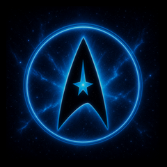

# Starfleet assistant artwork

Community theme contributed by [rvdv01](https://github.com/rvdv01), who offered
these screens for inclusion in [discussion #110](https://github.com/n-IA-hane/esphome-intercom/discussions/110).
Thank you for building on the shared assistant avatar format!



To opt in, set the following substitution in your own display profile:

```yaml
substitutions:
  ai_avatar: starfleet
```

The maintained profiles keep their existing default avatar. This selection
changes assistant artwork only, including the idle animation and listening,
thinking, loading, error, timer and mood screens. The original images are
240 by 240 pixels; larger display layouts upscale them during compilation.

The contributed [ringtone](../../../sounds/starfleet/ringtone.flac) is also
included as a separate optional asset. Choosing this avatar does not change
the ringtone or enable automatic return to the home screen.

The PNGs and FLAC are preserved unchanged from the author's
[original archive](https://github.com/user-attachments/files/31812123/starfleet.zip).
