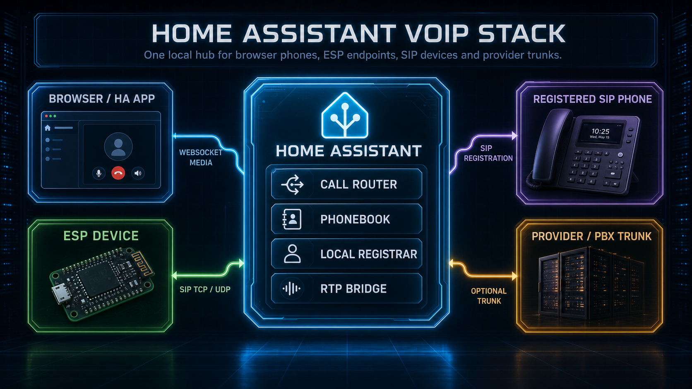

# SIP architecture

This document describes the active VoIP architecture. It intentionally does not
describe the retired proprietary intercom protocol except by omission: SIP,
SDP and RTP are the functional primitives.



## Product model

Every ESP running `voip_stack` is a SIP user agent:

- it can originate and receive SIP calls;
- it does not register to a PBX;
- it does not require SIP authentication;
- it accepts compatible PCM SDP and rejects incompatible media with SIP status;
- it can run full-duplex, mic-only or speaker-only; signaling-only endpoints
  are rejected because every VoIP endpoint must expose real audio media.

Inbound reachability is deliberately independent of roster membership. The
phonebook is a dial plan, not a caller allowlist: a reachable compatible SIP
peer can call an ESP even when it is unknown to HA and has no registration.

Home Assistant is more than a card backend:

- HA is its own SIP softphone endpoint;
- HA is the central phonebook/dial-plan publisher;
- HA is a SIP router/B2BUA for logical names, numbers, bridge requests and
  transport boundaries;
- HA can optionally register one provider/PBX trunk;
- HA can optionally act as a local registrar for standard SIP endpoints such as
  Zoiper, Linphone, baresip or pjsua;
- HA can optionally expose one native Assist pipeline as a local phonebook
  destination.

The default install needs no user dialplan. Direct ESP calls happen when the
phonebook has complete direct SIP endpoint data. Logical names, numeric targets
and external numbers go to HA, which decides whether to answer locally, forward
to a local endpoint, bridge, group-call, use the trunk or reject.

## Components

```text
ESP voip_stack
  SIP UA + SDP offer/answer + RTP PCM + local phonebook + SipPhoneState

Home Assistant voip_stack
  HA softphone + SIP UDP/TCP endpoint + router/B2BUA + RTP relay/resampler
  + central phonebook + optional local registrar + optional trunk client
  + optional native Assist pipeline media consumer

Lovelace card
  ESP mirror mode: ESPHome entities and ESP buttons
  HA softphone mode: HA softphone snapshot, commands and browser audio socket
```

Component ownership:

- `voip_stack` owns ESP SIP signaling, RTP sockets, selected call formats and
  the public ESP call state.
- `esp_audio_stack`, native ESPHome microphone/speaker components, `esp_aec`
  and `esp_afe` own physical audio capture/playback and processing.
- `voip_stack` owns HA-side SIP dialogs, route decisions, trunk
  registration, local SIP endpoint registrations, HA softphone media sessions
  and the optional Assist call adapter.
- Cards never own the call FSM. They render state pushed by the owner and send
  user commands back to that owner.

Home Assistant actions and card configuration select the local phone only by
`device_id`. The backend also assigns an internal `endpoint_id` in a common
namespace covering browser phones, ESPHome phones and registered SIP accounts.
That identifier lets the protocol core correlate a logical phone, call leg and
media owner without depending on Home Assistant Device Registry APIs. It is
reported in runtime snapshots for diagnostics and correlation, but it is not a
second user-selectable identity and is never stored by new card configuration.

### HA runtime ownership model

The PBX ownership core is built alongside the existing SIP dispatcher as a
migration seam; it is not a second router and a call never passes through two
independent dial plans.

- `SipEndpointRuntime` owns endpoint-wide components such as listeners,
  registrar, trunk and conference manager.
- `EndpointCallSession` is the authoritative owner of one logical call,
  including its generation, legs, tasks, media reservations and cleanup
  barrier.
- `CallLeg` represents one SIP, browser, ESP, trunk or Assist participant.
- `DialForkController` supplies the shared first-answer-wins primitive used by
  ring groups and other parallel dial attempts.
- `AnswerTransaction` implements prepare, final response and commit with
  rollback of ports, sockets and optional video resources.
- `ActiveMediaCall` resolves the one generation-current browser media session
  from `SipEndpointRuntime`. Audio and video WebSocket views
  subscribe to the same call-lifetime primitive instead of maintaining
  independent interpretations of when a call has ended.
- audio and video renegotiation commit the complete media contract before they
  increment its generation and wake attached WebSockets. Consumers therefore
  never observe a new generation with a partially updated RTP destination,
  direction or codec description.
- bridged audio and video peer changes are staged independently but preflighted
  together. A commit is rejected if either relay leg or the owning call
  generation changed while the SIP answer was in flight, so a late re-INVITE
  cannot leave audio and video on different peer revisions.
- public HA state observations follow an explicit call-phase transition graph.
  The intentional `connecting -> ringing` fallback remains valid, while a late
  provisional event cannot regress an established dialog back to `calling` or
  `ringing`.

Termination is generation-guarded, idempotent and cancellation-safe. The
session enters `terminating` synchronously, then waits for a shielded cleanup
barrier so late dial winners, media callbacks or duplicate BYE/CANCEL observers
cannot resurrect the call. A transport callback may claim that terminal state
before handing off a transport adapter, but only `EndpointCallSession` starts
and owns the cleanup barrier. `SipEndpointRuntime` records the bounded
tombstone needed to absorb delayed SIP observations and never starts a second
teardown.

Card commands use standard Home Assistant service actions. Outbound card calls
request the optional response from `voip_stack.call`; the backend returns the
authoritative endpoint snapshot instead of making the frontend infer a new
Call-ID or state. Integration-specific WebSocket subscriptions remain where
they carry live call/media presence rather than one-shot commands.

`endpoint_runtime.py` assembles the canonical dispatcher from the routing and
session primitives. New routing policy must enter that dispatcher and must not
create a parallel lifecycle or dial plan.

## Call control

All call control is SIP:

- outbound call: `INVITE`
- provisional ringing: `180 Ringing`
- answer: `200 OK` plus `ACK`
- caller cancellation before answer: `CANCEL` and `487 Request Terminated`
- established hangup: `BYE`
- busy/DND: `486 Busy Here`
- declined: `603 Decline`
- incompatible media: `488 Not Acceptable Here`
- auth challenges unsupported by ESP: `auth_required_unsupported`
- optional HA trunk registration: `REGISTER` with digest auth toward the
  provider/PBX only

ESP devices do not implement provider/PBX registration. HA trunk registration
and HA local SIP registration are separate features that live only in
`voip_stack`.

For outbound INVITE failures, HA sends the required ACK for non-2xx final
responses before surfacing the terminal reason. This keeps failed calls SIP
compliant rather than relying on retry side effects.

ESP endpoints do not renegotiate established media. They reject a hold or
media-changing in-dialog re-INVITE with `488 Not Acceptable Here` without
replacing or tearing down the original dialog.

HA-owned dialogs accept a compatible peer-initiated re-INVITE or UPDATE. The
new offer may change direction, RTP destination, payload type, packet duration
or another audio format already supported on that leg. An established video
stream may be held and resumed or move its RTP endpoint only while its codec
contract remains compatible. A direct HA-browser dialog may also add or remove
a compatible video stream. A SIP-to-SIP bridge can add video to an audio-only
call by sending a serialized re-INVITE on the destination dialog. HA answers
the source only after the destination accepts and a direct or transcoded relay
is ready. HA stages the replacement resources and commits only the current call
generation. Rejected or stale updates leave the original audio session usable,
and a later BYE still terminates it normally.

Confirmed dialogs retain the remote Contact and every Record-Route value. UAC
route sets reverse the response order, UAS route sets preserve request order,
and subsequent ACK/BYE requests follow RFC 3261 loose or strict routing instead
of bypassing an intervening proxy.

## Media

SDP offer/answer negotiates RTP. RTP media is always UDP, even when SIP
signaling uses TCP.

ESP devices are PCM-only endpoints. The supported ESP profile is linear PCM
with network byte order on RTP; incompatible SDP receives `488 Not Acceptable
Here` or the equivalent terminal reason.

HA can accept richer media on softphone/trunk legs when it has a bidirectional
converter for the selected codec. Optional codecs are capability-gated and are
not advertised when the runtime cannot encode and decode them. The goal is
best-quality-per-leg:

- a browser, phone or trunk leg can negotiate Opus, G.722, G.711 or high-rate
  PCM as its own capability permits;
- G.722 uses the RFC 3551 8 kHz RTP timestamp clock while decoding to 16 kHz
  mono PCM inside HA;
- an ESP speaker leg should receive 48 kHz PCM when its speaker path supports
  it;
- an ESP AFE/AEC mic leg can still transmit 16 kHz PCM because that is the
  processor output surface;
- the HA bridge converts between leg formats instead of forcing the whole call
  to the lowest common endpoint where a per-leg bridge is possible.

Direct ESP-to-ESP standard SIP calls use one common packet duration for the
dialog. TX and RX sample rate may differ when the endpoints and SDP negotiation
support it, but `ptime` must be coherent for the selected dialog. If no
compatible media shape exists, the call fails explicitly.

HA bridge owns two SIP dialogs and relays RTP between them. When both legs
negotiate different supported media shapes, HA decodes/converts/resamples and
reframes between the formats. If conversion is not possible, the bridge fails
with `media_incompatible`.

Inbound provider trunk calls are also two-leg calls. When SDP negotiates RTP
`telephone-event`, HA may collect RFC 4733 digits using provisional `183`
early media. When the offer has no named-event payload and legacy SIP INFO is
the available compatibility transport, HA confirms the dialog with `200 OK`
before collecting digits. It then originates a normal call to the selected HA
softphone or local phonebook target and bridges RTP with the same relay.

An Assist destination is local to the HA SIP endpoint, so it does not create a
second SIP dialog or listener. VoIP Stack decodes the negotiated incoming RTP,
feeds continuous 16 kHz mono PCM to HA's selected pipeline, and encodes streamed
TTS chunks back into the call's negotiated RTP format. The SIP Call-ID and HA
conversation ID remain stable across repeated listen/reply turns until hangup.

Current non-goals are SRTP, DTLS, ICE, STUN, TURN and SIP/TLS on ESP devices.
The supported ESP trust boundary is a local LAN/VPN plus Home Assistant and
ESPHome API security. HA SIP legs can use verified TLS and the media runtime
uses separate RTP/RTCP sockets where the negotiated profile requires them.
Codec-rich or encrypted signaling legs should terminate on Home Assistant,
where the bridge can convert and route them to lightweight ESP PCM endpoints.
Because local SIP/RTP is plaintext and inbound calls are not phonebook-gated,
deployments needing caller admission must enforce it at a firewall, VLAN, VPN
or SBC boundary.

## State

The public contract is `SipPhoneState`, including:

- state
- call_id
- direction
- caller/callee
- local_uri/remote_uri/contact
- sip_transport
- sip_status_code
- terminal_reason
- selected_tx_format/selected_rx_format
- RTP packet and byte counters
- last_sip_event

The same state vocabulary is used on ESP and HA:

- `idle`
- `calling`
- `remote_ringing`
- `ringing`
- `connecting`
- `in_call`
- `terminating`
- terminal states such as `busy`, `declined`, `cancelled`,
  `media_incompatible`, `transport_unreachable`,
  `auth_required_unsupported`

Terminal reasons are backend-owned and may contain exact SIP/application
reasons. The frontend must display the supplied reason rather than mapping it
through a private parallel FSM.

HA runtime call ownership is centralized in `EndpointCallSession`, indexed by
the single `SipEndpointRuntime`. Pending
routes, pending INVITEs, pre-answered trunk legs, HA softphone media, SIP
clients, bridge clients, relays and watcher tasks are generation-bound to the
same logical session. Service handlers, inbound SIP callbacks, WebSocket media
and debug snapshots therefore observe one lifecycle. This avoids HA softphone
state being polluted by router-only bridges and makes bridge teardown propagate
BYE and cleanup through the same call session.

## Routing

Direct SIP targets are dialed as SIP URIs. Logical names are resolved through
the local ESP phonebook or the HA roster.

ESP-origin routing:

- explicit `sip:name@host[:port]` or `name@host[:port]`: direct SIP;
- known ESP with complete host/port/transport and no `ha_bridge`: direct SIP;
- known target without direct route data: HA bridge;
- unknown name: HA bridge;
- numeric target: HA bridge.

HA-router routing:

- HA target: ring HA softphone;
- Assist target: answer locally and run the configured native HA pipeline;
- ESP target: forward/bridge to the ESP SIP endpoint;
- registered local SIP endpoint: forward to its REGISTER Contact;
- external/public number: trunk if registered, otherwise reject
  `trunk_unavailable`;
- disabled entry: reject;
- unresolved explicit route hint: reject `route_not_found`.

The source caller need not be registered or present in the phonebook. HA still
applies the Request-URI dial plan, media checks, DND and busy policy. The local
registrar authenticates account registration and supplies a current Contact;
it is not a global INVITE allowlist.

The optional SIP trunk is used only when configured and registered. It never
registers ESP devices to the provider. ESP devices remain local SIP user agents;
HA maps provider-side numbers or DTMF extension digits to local SIP targets.

Inbound trunk calls use deterministic policy:

- no explicit route hint: resolve the configured inbound default target;
- explicit DTMF/SIP route hint that resolves: bridge to that target;
- explicit DTMF/SIP route hint that does not resolve: terminate
  `route_not_found`.

DTMF is a route-hint source for provider/trunk callers only. Internal ESP
routing uses SIP request context and the phonebook; it does not encode ESP
routing as DTMF.

## Phonebook

The central phonebook is a SIP dial plan. `name` is the only mandatory contact
field. Optional fields include:

- `extension`: local/internal alias;
- `number`: external/public number used through the optional trunk;
- `address`, `sip_uri`, and top-level `port`;
- `transport`: `udp` or `tcp`, plus `rtp_port` and media metadata;
- `ha_bridge`: force HA bridge routing.

Imported/discovered endpoint metadata may expose compatibility aliases such as
`sip_port` and `sip_transport`; user-authored HA service fields are `port` and
`transport`.

User-facing contacts are data-driven. Name-only contacts route through HA,
`extension` resolves local/internal targets, `number` resolves external trunk
targets, endpoint contacts expose `address` or `sip_uri`, and local SIP
accounts are published by the registrar.

ESP phonebook storage is bounded. The runtime accepts up to 64 normalized
contacts per ESP phonebook and replaces existing names in place. Larger rosters
must be filtered by HA before push rather than relying on dynamic ESP heap
growth during call handling.

## SIP/TCP backpressure

Every SIP/TCP connection has one governed writer task. Producers enqueue SIP
messages through `SipTcpWriter`; the writer owns `StreamWriter.write()` and
`drain()`. Queue pressure is explicit and logged instead of spawning ad-hoc
drain tasks or writing from multiple call paths. Closing or reconnecting a TCP
flow first closes the governed writer and only then replaces the stream. A
confirmed dialog is not owned by that flow: Call-ID and local/remote tags keep
it addressable when an authenticated peer sends the next in-dialog request on
a replacement connection.

This applies to outbound SIP clients, the TCP SIP listener and trunk
registration/call legs. UDP signaling still sends datagrams directly.

## Frontend contract

Cards do not own call control state.

- The HA softphone card mirrors the HA softphone state pushed by
  `voip_stack`.
- ESP mirror cards use ESPHome entities and controls from the selected ESP.
- Frontend buttons issue commands such as call, answer, decline, hangup or
  contact navigation; they do not infer terminal SIP reasons or run a parallel
  call FSM.

ESP mirror cards are synchronized through ESPHome entities and buttons. Contact
left/right presses go to the ESP and the selected contact shown by the card is
the ESP selected contact. HA softphone cards are synchronized through
`voip_stack` snapshots and events. Browser audio belongs to the HA
softphone leg and is attached through `/api/voip_stack/ws`.

Browser capture runs inside an AudioWorklet. The worklet uses a small reusable
frame pool and posts fixed negotiated frames to the engine. The engine reuses a
single WebSocket send buffer for the negotiated frame size. Playback is paced by
the adaptive jitter buffer in the playback worklet, not by fixed UI-thread
timers. This keeps browser audio resilient across local LAN, HA app, SSL proxy
and remote WebSocket paths without tuning one set of magic delay constants.

## Observability

INFO logs describe user-level SIP progress: incoming call, ringing, answered,
bridged, hangup, trunk registered/unregistered and route decisions. DEBUG logs
carry SIP/SDP/RTP details useful for protocol investigation.

Snapshots expose listener readiness, active dialogs, pending transactions,
selected formats, RTP packet/byte counters, last SIP event/status and terminal
reason. Debug mode additionally exposes one bounded call-resource snapshot:
sessions, legs, routes, SIP clients, browser owners, active audio/video
sessions, media locks, transcoders and allocated RTP ports. A terminal lab test
must return `call_scoped_quiescent` to `true`; an idle card alone is not proof
that teardown completed.
