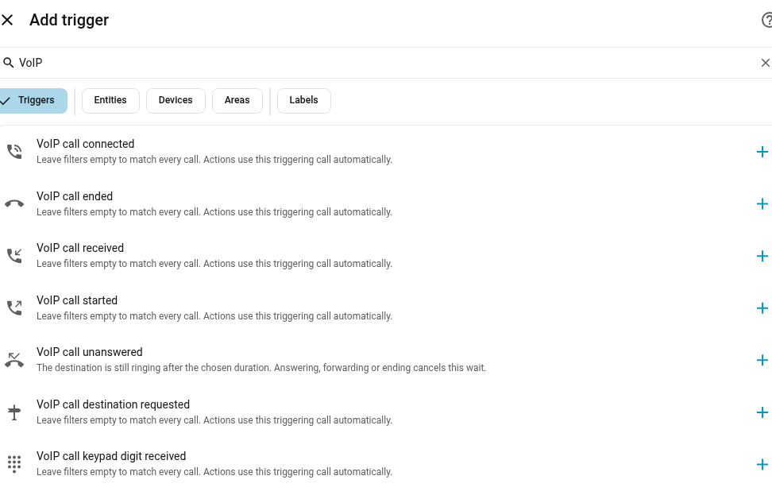
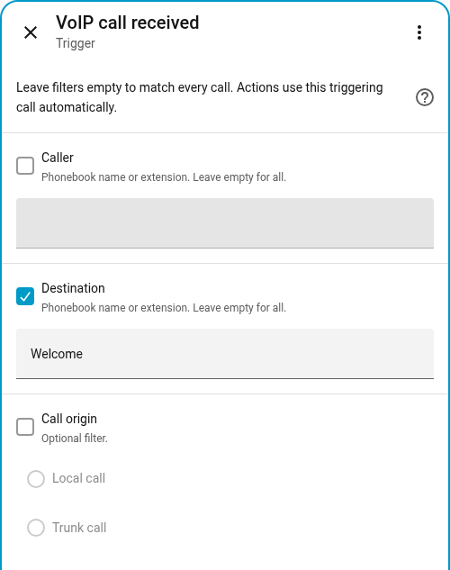
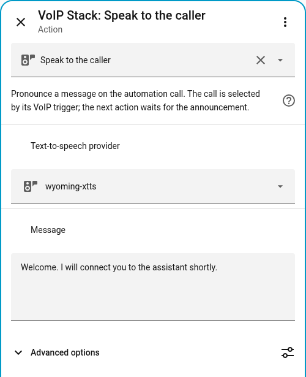
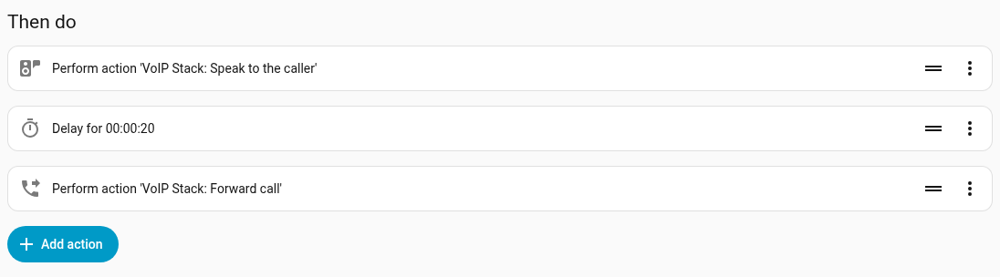
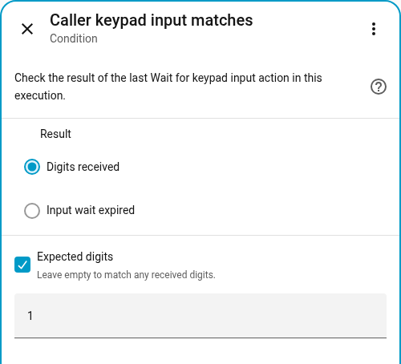

# Automations as dialplan

A dialplan is the set of rules that decides what happens to a phone call:
which phone rings, what the caller hears, how long to wait, and where the call
goes next. With VoIP Stack, you can write those rules as ordinary Home Assistant
automations, using the same editor you use for lights and heating.

For example: **someone calls Welcome, hears a greeting, then
speaks to your voice assistant**. Another rule can ring reception during the
day, use a smaller group at night, or let the caller press a key to choose.

**Phonebook as dialplan** is the default: calls follow the contacts, extensions
and groups in your phonebook, without requiring an automation.

**Automations as dialplan** overrides that behavior for the calls your rules
handle. An applicable routing rule can select another destination; without
that selection, normal phonebook routing continues. HA's conditions and action
sequences express your policy; VoIP Stack handles the call itself.

This cookbook describes the native call automation interface developed for
2026.10.0. The native triggers and Automation contact workflow are not part of
2026.9.2. Existing event and state automations have a
[migration guide](#move-existing-automations-gradually).

## Find the example you need

| I want to... | Start here |
| --- | --- |
| Create my first call automation entirely in the editor | [First greeting](#create-your-first-greeting-in-the-editor) |
| Say a message, then connect to Assist | [Greeting and forward](#forward-after-the-greeting) |
| Use a name instead of a number | [Destination names and extensions](#destination-names-and-extensions) |
| Make a contact that runs an automation | [Automation contacts](#automation-contacts) |
| Play information and end the call | [Information line](#say-a-message-and-end-the-call) |
| Choose where a call rings based on presence or time | [Initial routing](#override-the-initial-destination) |
| Ring a phone first, then try Assist | [No-answer forwarding](#forward-an-unanswered-ha-call-to-assist) |
| Offer "press 1 or 2" choices | [Keypad menu](#build-a-small-keypad-menu) |
| Act on a key during a conversation | [In-call DTMF](#dtmf-during-a-connected-call) |
| Answer or decline from a phone notification | [Actionable notification](#actionable-doorbell-notification) |
| Understand failures, time limits and multiple callers | [Call behavior](#what-happens-to-the-call) and [troubleshooting](#test-and-troubleshoot-your-automation) |

## Contacts and phones have different jobs

| Item | What it represents | Example |
| --- | --- | --- |
| Phone | A device or endpoint that can make and receive calls | Browser card, ESP intercom, registered SIP phone |
| Ordinary contact | A saved destination, such as an external number or SIP address | Mobile number, reception desk |
| Automation contact | A named service whose call is handled by an HA automation | Welcome, Opening hours, Visitor menu |

Use **Add phone** for a phone. Use **Add contact > Automation** for a greeting
or menu. An Automation contact does not create a pretend phone device or phone
entities in HA. It appears in the central phonebook so it can be called.

Creating the contact does not create an automation. The contact makes the
service callable; the automation defines what that service does. A numeric
extension is optional. Assign one if people should reach it by typing digits
on a SIP phone or in the trunk's extension menu.

## Create your first greeting in the editor

The labels below use the English HA interface. Their wording is translated
when your HA profile uses another language.

In **Add trigger**, search for `VoIP`. Select the **Triggers** filter to see
all the call triggers together:



1. Open **Settings > Devices & services > VoIP Stack**. Choose **Add contact**,
   select **Automation**, and name it `Welcome`.
2. Leave **Extension** empty if you only want to call it by name. Leave the
   contact's other options at their defaults for this first example.
3. Open **Settings > Automations & scenes**, create a new automation, and
   choose an empty automation. No blueprint is required.
4. Under **When**, select **Add trigger**, search for `VoIP`, and choose
   **VoIP call received**.
5. Enable the optional **Destination** field and enter `Welcome`. Leave
   **Caller** and **Call origin** unused to accept calls from any supported
   source. An unused filter means "all", not "unknown".
6. Leave **And if** empty. The trigger already filters the destination, so
   there is no additional condition to write.
7. Under **Then do**, choose **Add action**, search for **Speak to the caller**,
   and select the VoIP Stack action.
8. Choose your configured **Text-to-speech provider** and enter a short
   **Message**, such as `Hello. This is a test.` Leave **Advanced options** closed.
9. Save the automation as `Welcome greeting` and make sure it is enabled.
10. From your VoIP card or phone, call the phonebook contact **Welcome**.

Only Destination is enabled in this example. Caller and Call origin stay
unused, so the automation accepts any supported caller to Welcome:



The caller hears the message and the call ends when the automation finishes.
You do not need an Answer action before TTS, a Hangup action afterwards, or a
Call-ID anywhere. VoIP Stack answers when the announcement starts and keeps
the actions associated with the call that triggered them.

Use your actual TTS entity. For example, xTTS may appear as
`tts.wyoming_xtts`; Piper or another HA TTS provider can be selected instead.
The provider must be configured and available. TTS provider selection controls
the greeting voice. Your Assist pipeline independently selects the assistant's
speech recognition, conversation agent and response voice.

The TTS action needs the provider and message. The less common settings remain
under Advanced options:



The equivalent ordinary automation YAML is:

```yaml
alias: Welcome greeting
mode: parallel
triggers:
  - trigger: voip_stack.call_received
    options:
      destination: Welcome
conditions: []
actions:
  - action: voip_stack.tts_say
    data:
      tts_entity_id: tts.wyoming_xtts
      message: "Hello. This is a test."
```

`Parallel` allows separate callers to run their own copies of the sequence.
For a first test with one caller, HA's default `Single` mode also works.

## Forward after the greeting

Edit the greeting automation. Immediately after the TTS action,
add **VoIP Stack: Forward call** and set **Destination** to the name or extension
of your configured voice assistant.

Suppose the assistant is listed in your phonebook as `Home assistant`, with
extension `1000`. Either value can identify that same destination. These are
example values, not names or numbers reserved by VoIP Stack.

```yaml
alias: Welcome greeting then assistant
mode: parallel
triggers:
  - trigger: voip_stack.call_received
    options:
      destination: Welcome
actions:
  - action: voip_stack.tts_say
    data:
      tts_entity_id: tts.wyoming_xtts
      message: "Welcome. I will connect you to the assistant shortly."
  - action: voip_stack.forward
    data:
      destination: Home assistant
```

The actions run in order: the greeting finishes, then forwarding starts.
There is no artificial pause between them. A successful forward keeps the
caller on the same call. Finishing the automation does not hang up the
forwarded conversation. Remove Forward call for an information-only service.
Keep TTS and Forward sequential, not in a parallel action block.

### Add a delay before forwarding

A delay is optional and is not needed to let TTS finish. Only add HA's
**Delay** action between TTS and Forward if your scenario intentionally needs
an answered call to wait. For example, `delay: "00:00:20"` means 20 seconds
of silence after the greeting. It does not play hold music or ring a phone.

This screenshot illustrates that optional delay, not the recommended default:



To ring a destination for a limited time and forward only if nobody answers,
use [VoIP call unanswered](#forward-an-unanswered-ha-call-to-assist) instead.

## Destination names and extensions

Call and Forward resolve their destination through the central phonebook.

| Destination | Meaning |
| --- | --- |
| `Reception` | The contact or phone with that name |
| `'1000'` | The entry assigned extension 1000 |
| `Evening group` | A configured group with that name |
| `Welcome` | An Automation contact with that name |
| A public number or SIP address | A route to that number or SIP address, when configured |

Use the name displayed in your phonebook. The name and numeric extension are
alternatives; you do not enter both. Misspellings are not corrected for you.
Keep numeric extensions quoted in YAML. A contact without an extension is still
callable by its name, but it cannot be selected by typing a numeric extension.

`Assist` is not a universal alias for every voice assistant. Use the name
published for your configured Assist endpoint or its configured extension.
If you rename a destination or change its extension, update automations that
refer to the changed value.

## What happens to the call

| Situation | Result |
| --- | --- |
| The sequence contains only TTS | VoIP Stack answers, speaks, then ends the Automation contact call |
| TTS is followed by Delay | The answered call stays open while HA waits |
| A forward succeeds | The same caller is connected to the new destination |
| The caller hangs up during TTS or keypad input | Call-owned audio or input work is cancelled and released |
| The caller hangs up during an ordinary HA delay | The call ends; a later VoIP action rejects the ended call instead of selecting a different one |
| No automation takes control of the contact | Its initial waiting limit expires, then its configured fallback is tried, or the call ends |
| A controlling native automation errors or is cancelled | The configured fallback is tried if it still owns the contact call, or the call ends |
| A notification-only automation finishes | It does not end an ordinary phone conversation |

A regular HA delay is not automatically a cancellable telephone timer. HA may
finish that delay and execute non-VoIP actions afterwards, even if the call
has ended. The protection above concerns VoIP actions selecting their original
call. Use appropriate conditions for unrelated lights, locks or notifications.

For a long waiting sequence, start with TTS or keypad input so the automation
takes control of the contact. A delay before the first call-handling action
still counts against the contact's initial "Wait for an automation" limit.
After TTS has taken control, a later delay belongs to that native execution.

## Start in the Home Assistant editor

Use the [first greeting walkthrough](#create-your-first-greeting-in-the-editor)
for the simplest setup. For other rules, add a native VoIP trigger and use its
optional caller, destination and origin filters directly. Ordinary HA
conditions can then add presence, time, calendar or alarm rules.

You do not need Call-ID templates in these call-handling sequences. The native
trigger supplies the call identity across waits and synchronous scripts.
An advanced action that intentionally coordinates two calls, such as attended
transfer, still needs to identify the other call.

Choose one controlling automation per Automation contact. Put alternative
routes inside that automation with **If-then** or **Choose**. Separate
notification automations can observe the call without taking control of it.
Two controlling automations are not an ordered dialplan: their execution order
is not a priority setting, and one cannot take over a call already claimed by
the other.

Use **Parallel** automation mode for independent callers. This is different
from putting the actions inside one call in a parallel block.

| Automation mode | Effect when another matching call arrives |
| --- | --- |
| Parallel | Each call gets its own action sequence |
| Single | The new execution is ignored while the first is running |
| Queued | The new execution waits behind earlier executions; its call may end before its turn |
| Restart | HA stops the previous execution and starts the new one |

These are HA's [normal automation modes](https://www.home-assistant.io/docs/automation/modes/).
A reusable call-handling script should be called synchronously, so the parent
waits for it. `script.turn_on` starts a separate run and does not wait for it;
use a direct script action for a greeting-and-forward sequence.

## Choose when to intervene

| Trigger | When it runs | Main options |
| --- | --- | --- |
| `voip_stack.call_started` | A phone starts a call | Caller, destination, origin |
| `voip_stack.call_received` | A phone or automation contact receives a call | Caller, destination, origin |
| `voip_stack.route_requested` | Before the initial destination rings | Caller, destination, origin |
| `voip_stack.call_unanswered` | The destination is still ringing after a duration | Destination and `for` |
| `voip_stack.call_connected` | The call becomes connected | Caller, destination, origin |
| `voip_stack.call_ended` | The call ends | Destination, outcome and optional reason |
| `voip_stack.dtmf_received` | A caller or called party presses a key | Caller, destination, key and source side |

The initial routing trigger is for a quick decision. A matching native trigger
activates the existing decision window automatically; new automations do not
need the older automation-routing switch. For a greeting, input menu or other
longer sequence, route to an **Automation contact** instead.

A caller-entered extension in the trunk's initial DTMF menu remains explicit:
a broad initial-routing rule does not replace it. An unknown explicit extension
fails instead of silently selecting another phone.

## Choose conditions without writing templates

Use normal HA conditions for time, presence, calendars and alarms. VoIP Stack
also offers conditions for the triggering call:

| Condition in the editor | Use it for |
| --- | --- |
| Call is in a state | Check whether this call is still ringing or is connected |
| Call is from | Choose a branch for local calls or calls from a trunk |
| Phone is available | Check a named phone's availability, DND setting and whether it already has a call |
| Caller keypad input matches | Choose a menu branch after Wait for keypad input |

Caller, Destination and Call origin can usually be set directly in the trigger.
Use a condition when you need to choose between actions inside an execution.
For example, a **Choose** block can send local callers to reception and trunk
callers to a greeting, without duplicating the whole automation.

Phone availability is different from a no-answer timer. A disconnected browser
can still be a configured logical phone with a ringing state. Use the
availability condition to avoid selecting it, or a no-answer trigger to give
it time to answer before forwarding.

For a keypad menu, select the input result and the key to match. This condition
matches key `1` received by the preceding input-wait action:



## Understand the time limits

| Setting | Meaning |
| --- | --- |
| Time without an answer | How long this destination must ring before the trigger fires |
| Wait for an automation | Maximum wait for a contact to be taken into control, default 30 seconds |
| Maximum announcement duration | Browser readiness, TTS generation and transmission together, default 120 seconds, under Advanced options |
| Wait for digits | Input wait after answering, default 10 seconds |

After a native automation takes control of a contact, its HA waits belong to
that execution. Successful completion ends the call if it was not forwarded.
An error uses the contact's fallback destination or ends the call. The older
explicit-event API retains its inactivity behavior between actions.

Every example below is an ordinary automation. Replace example phonebook names,
TTS providers and HA entities with your own. No blueprint import is required.

## Override the initial destination

### Route a door phone to P4 when home, otherwise use the default phone

Suppose `Front Door` normally calls `Home phone`. When Alex is home the call must
ring `Waveshare P4 Touch`; when he is away it must ring the original `Home phone`
phone. The cleanest implementation selects the destination before either phone
starts ringing:

```yaml
alias: VoIP - Front Door to P4 when home, otherwise Home phone
mode: parallel
max: 10
triggers:
- trigger: voip_stack.route_requested
  options:
    caller: Front Door
actions:
- if:
  - condition: state
    entity_id: person.alex
    state: home
  then:
  - action: voip_stack.select_inbound_destination
    data:
      destination: Waveshare P4 Touch
  else:
  - action: voip_stack.select_inbound_destination
    data:
      destination: Home phone
```

Replace the caller, destinations and person entity with values from the actual
installation. If the automation does not match, the configured fallback route
continues normally. Use this initial decision when Home phone must not ring first.

If Home phone must ring before the call is moved, use **VoIP call unanswered**
with Home phone as Destination and use `voip_stack.forward`. With `on_failure: resume`, Home phone
resumes ringing if P4 is unavailable:

```yaml
alias: VoIP - Move Home phone call to P4 when home
mode: parallel
max: 10
triggers:
- trigger: voip_stack.call_received
  options:
    destination: Home phone
    caller: Front Door
conditions:
- condition: state
  entity_id: person.alex
  state: home
actions:
- action: voip_stack.forward
  data:
    device_id: <home_phone_device_id>
    destination: Waveshare P4 Touch
    on_failure: resume
```

This complete automation routes a trunk call to `Waveshare S3 Audio` before
the fallback destination. It uses Home Assistant's native Event Entity trigger,
so it needs no Jinja, Call-ID or helper timer:

```yaml
alias: VoIP - Route incoming call to WS3
mode: parallel
max: 10
triggers:
- trigger: voip_stack.route_requested
  options:
    ingress: trunk
actions:
- action: voip_stack.select_inbound_destination
  data:
    destination: Waveshare S3 Audio
```

Use ordinary Home Assistant conditions between the trigger and action for
presence, time, alarm mode or any other entity. For example, a state condition
can route to an indoor ESP only while someone is home. If the condition is
false, no action runs and the default target takes over when the short decision
window expires.

### Route a known caller according to presence

This example uses only native Home Assistant conditions. Calls from Wildix
extension `426` ring the kitchen ESP while Alex is home; every other state,
including `not_home` or another HA zone, routes the call to extension `667`
(`Test`). Other callers do not match the automation and continue to the trunk's
configured fallback destination.

```yaml
alias: VoIP - Route 426 according to Alex presence
description: Route one known trunk caller to WS3 at home, otherwise Test.
mode: parallel
max: 10
triggers:
- trigger: voip_stack.route_requested
  options:
    ingress: trunk
    caller: '426'
actions:
- if:
  - condition: state
    entity_id: person.alex
    state: home
  then:
  - action: voip_stack.select_inbound_destination
    data:
      destination: Waveshare S3 Audio
  else:
  - action: voip_stack.select_inbound_destination
    data:
      destination: '667'
```

The `caller` value is the resolved name or number shown by
`event.voip_stack_call`; replace `426` with the exact value exposed by your
caller. The destinations may likewise be phonebook names, extensions, groups,
registered SIP phones or Assist.

### Route only provider/PBX trunk calls to a ring group

`route_requested` may also describe an HA-owned extension call. Filter on the
stable `ingress` attribute when an automation must affect only calls entering
from the configured provider/PBX trunk:

```yaml
alias: VoIP - Inbound trunk to Home ring group
mode: parallel
max: 10
triggers:
- trigger: voip_stack.route_requested
  options:
    ingress: trunk
actions:
- action: voip_stack.select_inbound_destination
  data:
    destination: Home ring group
```

Use `ingress: extension` for calls originating from a local ESP, browser phone or
registered SIP endpoint. Do not filter on `scope`: scope identifies the
internal state owner, while `ingress`/`origin` describe where the call entered
the PBX. A ring group uses normal PBX semantics: eligible members ring, the
first answer wins, losing legs are cancelled, and the caller is excluded when
it is itself a member of the destination group.

`select_inbound_destination` chooses the initial route. In native VoIP
automations, `forward` also delegates to that initial decision when appropriate.
Both use the triggering call, including when several calls arrive together.
If the automation makes no selection, the configured phonebook fallback wins.

## Forward an unanswered HA call to Assist

Use **VoIP call unanswered**, select `Home phone` as the destination and choose the
ringing duration. The wait stops if Home phone answers or the call moves elsewhere:

```yaml
alias: VoIP - HA unanswered to Assist
mode: parallel
max: 10
triggers:
- trigger: voip_stack.call_unanswered
  options:
    destination: Home phone
    for: 00:00:30
    ingress: trunk
actions:
- action: voip_stack.forward
  data:
    destination: '1666'
    on_failure: resume
```

Keep `ingress: trunk` when only provider/PBX calls should fall through to
Assist. Remove that filter to include local calls. Replace `1666` with your
Assist extension. The original call remains open while VoIP Stack cancels the
replaced ringing leg and delivers the call to Assist.

Each execution retains its own call. No Call-ID is needed when several phones
or callers use the same automation.

Logical ringing is independent from browser connectivity. A browser softphone
that belongs to a ring group is allowed to enter `ringing` while its
connectivity entity says `Disconnected`; no physical card rings, but state
timers and missed-call automations still run. Opening the matching card during
that window makes the call answerable. DND and administratively disabled phones
are not ring candidates.

For example, the `Home phone` can fall through to the `Kitchen tablet` without
matching caller names or inspecting the global event stream:

```yaml
alias: VoIP - Home phone unanswered to Kitchen tablet
mode: parallel
max: 10
triggers:
- trigger: voip_stack.call_unanswered
  options:
    destination: Home phone
    for: 00:00:30
    ingress: trunk
actions:
- action: voip_stack.forward
  data:
    destination: Kitchen tablet
    on_failure: resume
```

## Common automation recipes

Keep the initial destination decision and later call handling separate. These
are the most common patterns. Complete copyable examples follow the table:

| Goal | Trigger/condition | Action |
| --- | --- | --- |
| Ring the whole house for an external call | Aggregate `route_requested` with `ingress: trunk` | `select_inbound_destination` to a ring group |
| Route differently when nobody is home | Same initial event plus a normal person/presence state condition | Select an ESP, HA phone, Assist or another group; otherwise let the configured fallback run |
| Use an office-hours destination | Same initial event plus a time condition | Select Reception during opening hours; allow the fallback or select Assist outside them |
| Send an unanswered room phone elsewhere | That phone's call-state sensor remains `ringing` for a duration | `forward` to another room, group or Assist |
| Notify on a no-answer timeout | That phone's Event Entity receives `missed` | Send a normal HA notification; no routing action is required |
| React to keypad input during a connected call | The phone or aggregate Event Entity receives `dtmf` | Run a gate, light or other HA action |

An explicit DTMF extension entered during initial trunk collection remains
authoritative and bypasses the automation override. This prevents a broad
automation from replacing a destination deliberately dialled by the caller.
Likewise, a false condition should normally perform no action: after the short
decision window, VoIP Stack follows the configured fallback transparently.

### Route to reception during office hours

This automation affects only calls entering from the provider/PBX trunk. During
office hours it selects `Reception`; outside those hours it performs no action,
so the trunk's configured fallback continues normally:

```yaml
alias: VoIP - Trunk calls to Reception during office hours
mode: parallel
max: 10
triggers:
- trigger: voip_stack.route_requested
  options:
    ingress: trunk
conditions:
- condition: time
  after: 08:30:00
  before: '18:00:00'
  weekday:
  - mon
  - tue
  - wed
  - thu
  - fri
actions:
- action: voip_stack.select_inbound_destination
  data:
    destination: Reception
```

To send out-of-hours calls to Assist instead, configure Assist as the normal
trunk fallback. This keeps one clear routing authority and avoids duplicating
the same schedule in two automation branches.

### Prefer an available phone

```yaml
alias: VoIP - Prefer P4 when online
mode: parallel
max: 10
triggers:
- trigger: voip_stack.route_requested
actions:
- if:
  - condition: state
    entity_id: binary_sensor.p4_connectivity
    state: 'on'
  then:
  - action: voip_stack.select_inbound_destination
    data:
      destination: P4
  else:
  - action: voip_stack.select_inbound_destination
    data:
      destination: Home phone
```

### Route holidays to Assist

Calendar, alarm and presence checks do not require PBX-specific syntax. This
example routes to Assist only while the holiday calendar is active. Otherwise
it performs no action and the configured fallback remains authoritative:

```yaml
alias: VoIP - Holiday calls to Assist
mode: parallel
max: 10
triggers:
- trigger: voip_stack.route_requested
conditions:
- condition: state
  entity_id: calendar.company_holidays
  state: 'on'
actions:
- action: voip_stack.select_inbound_destination
  data:
    destination: Assist
```

### Reject calls while the alarm is triggered

Decline the triggering call while the alarm is active. A delayed action
cannot reject a different, newer call:

```yaml
alias: VoIP - Reject calls while alarm is triggered
mode: parallel
max: 10
triggers:
- trigger: voip_stack.route_requested
conditions:
- condition: state
  entity_id: alarm_control_panel.home
  state: triggered
actions:
- action: voip_stack.route
  data:
    action: decline
```

### Notify a no-answer timeout

Select the intended phone in Destination. This example sends one notification
when `Home phone` reaches its configured no-answer timeout:

```yaml
alias: VoIP - Notify Home phone no-answer timeout
mode: parallel
max: 10
triggers:
- trigger: voip_stack.call_ended
  options:
    destination: Home phone
    outcome: missed
actions:
- action: notify.mobile_app_your_phone
  data:
    title: Missed VoIP call
    message: Missed call from {{ trigger.call.caller or 'Unknown caller'
      }}
```

The public `missed` occurrence
currently means that the no-answer timeout expired. If the caller hangs up
before that timeout, the Event Entity emits `ended`; the Logbook still presents
that unanswered incoming call as missed.

### Forward an unanswered call to a mobile number

First create a phonebook contact containing only the public number. Run this
once from **Developer tools > Actions**, or create the same contact through
your own provisioning automation:

```yaml
action: voip_stack.add_contact
data:
  name: Alex mobile
  number: '+1234567890'
```

Then forward the still-ringing `Home phone` call after ten seconds:

```yaml
alias: VoIP - Home phone unanswered to Alex mobile
mode: parallel
max: 10
triggers:
- trigger: voip_stack.call_unanswered
  options:
    destination: Home phone
    for: 00:00:10
    ingress: trunk
actions:
- action: voip_stack.forward
  data:
    destination: Alex mobile
    on_failure: resume
```

This requires a configured and registered SIP trunk able to dial the public
number. It creates an ordinary external telephone call, not a Companion-app
VoIP channel. `on_failure: resume` leaves the original call available if the
trunk call cannot be started. Remove the `ingress: trunk` condition if local
extension calls should use the same fallback.

### Transfer a connected call

Forwarding changes a destination while HA owns routing. Transfer asks the SIP
peer to move an established call using REFER. For example, a receptionist can
press `9` to transfer the current call. The native trigger supplies the call ID:

```yaml
alias: VoIP - Transfer Home phone to Reception
mode: parallel
triggers:
- trigger: voip_stack.dtmf_received
  options:
    destination: Home phone
    digit: '9'
    source_leg: callee
actions:
- action: voip_stack.transfer
  data:
    destination: Reception
```

A confirmed successful transfer ends the original HA call. If the peer rejects
the transfer, the original call stays active. No extra Hangup action is needed.

For an attended transfer, pass the consultation call as `replaces_call_id`:

```yaml
action: voip_stack.transfer
data:
  call_id: '{{ states(''input_text.original_call_id'') }}'
  destination: Reception
  replaces_call_id: '{{ states(''input_text.consultation_call_id'') }}'
```

### Set DND from occupancy

```yaml
alias: VoIP - Home phone DND follows occupancy
mode: restart
triggers:
- trigger: state
  entity_id: zone.home
actions:
- if:
  - condition: numeric_state
    entity_id: zone.home
    above: 0
  then:
  - action: voip_stack.set_dnd
    data:
      device_id: <home_phone_device_id>
      dnd: false
  else:
  - action: voip_stack.set_dnd
    data:
      device_id: <home_phone_device_id>
      dnd: true
```

### Pause media during a call

This recipe changes only ordinary HA media state. The PBX remains the owner of
the call lifecycle:

```yaml
alias: VoIP - Pause living-room media during calls
mode: restart
triggers:
- trigger: voip_stack.call_received
  options:
    destination: Home phone
- trigger: voip_stack.call_connected
  options:
    destination: Home phone
actions:
- action: media_player.media_pause
  target:
    entity_id: media_player.living_room
```

### Start a scheduled P4 video call

```yaml
alias: VoIP - Scheduled P4 video check-in
triggers:
- trigger: time
  at: '18:00:00'
actions:
- action: voip_stack.call
  data:
    device_id: <p4_phone_device_id>
    destination: Home phone
    send_video: true
```

## Actionable doorbell notification

Use **VoIP call received** with the receiving phone as Destination. The notification
opens that phone's card or declines the triggering call. Microphone permission
and audio remain with the browser or Companion view that answers.

The variables below identify this notification, so an old button cannot act on
a newer call. Copy them unchanged; you do not enter a Call-ID yourself. Replace
the notification service, phone device, phonebook names and dashboard path.

```yaml
alias: VoIP - Actionable doorbell notification
mode: parallel
triggers:
- trigger: voip_stack.call_received
  options:
    destination: Home phone
    caller: Front Door
actions:
- variables:
    decline_action: '{{ ''VOIP_DECLINE_'' ~ context.id }}'
    notification_tag: '{{ ''voip_'' ~ context.id }}'
- action: notify.mobile_app_your_phone
  data:
    title: 🔔 Front door
    message: Front Door is calling Home phone
    data:
      tag: '{{ notification_tag }}'
      channel: doorbell
      importance: high
      ttl: 0
      priority: high
      actions:
      - action: URI
        title: Answer
        uri: /lovelace/phones?voip_answer=1&voip_endpoint={{ trigger.call.endpoint_id | urlencode
          }}&voip_call_id={{ trigger.call.call_id | urlencode }}
      - action: '{{ decline_action }}'
        title: Decline
- wait_for_trigger:
  - trigger: event
    event_type: mobile_app_notification_action
    event_data:
      action: '{{ decline_action }}'
  timeout: 00:00:30
- if:
  - condition: template
    value_template: '{{ wait.trigger is not none }}'
  then:
  - action: voip_stack.decline
    data:
      device_id: <home_phone_device_id>
    continue_on_error: true
- action: notify.mobile_app_your_phone
  data:
    message: clear_notification
    data:
      tag: '{{ notification_tag }}'
```

The Answer link selects both the phone and the original call. A stale link
cannot answer a different call with another Call-ID. Decline waits only for the
unique action sent in this notification. If the call has already ended, the
call guard rejects Decline; `continue_on_error` lets the automation remove its
old notification afterwards. A separate notification tag prevents that cleanup
from clearing a newer notification.

This follows Home Assistant's [actionable notification pattern](https://companion.home-assistant.io/docs/notifications/actionable-notifications/).
The same automation is available in
[`examples/doorbell-automation.yaml`](../examples/doorbell-automation.yaml).


## Existing event and state automations

### Event entity

Every integration-owned phone Device exposes its own call Event Entity, for
example `event.home_phone_call` or `event.test_call` (the visible/entity names are
localized). It publishes only occurrences involving that phone. Use it for a
doorbell notification, a missed-call log, or behavior specific to one room.

`event.voip_stack_call` remains the aggregate PBX-wide surface and publishes
stateless occurrences for every HA-owned call:

- `route_requested`, `outgoing_call`, `calling`
- `ringing`, `remote_ringing`, `forwarding`
- `answered`, `connected`
- `calling_timeout_requested`, `ringing_timeout_requested`
- `dtmf`
- `ended`, `missed`, `failed`, `state_changed`

Existing `event.received` automations remain supported. For new rules, use the
native VoIP triggers shown at the beginning of this guide.
Each occurrence includes call metadata such as caller, callee, direction,
route kind, owner and controllability. The aggregate entity is useful for
initial `route_requested` decisions and advanced inspection; prefer the phone's
own Event Entity for room-specific logic.

### Durable state sensor

Each logical browser/SIP-account phone exposes an enum call-state Sensor Entity.
Each sensor follows only its phone through ringing, bridging and Assist. Its
stable states are:

- `offline`
- `idle`
- `ringing`
- `calling`
- `remote_ringing`
- `connecting`
- `in_call`
- `held`
- `terminating`

Attributes include stable endpoint identity plus active-call `call_id`,
`direction`, `ingress`, `peer_name` and `terminal_reason`. `ingress` is
`trunk` for provider/PBX calls and `extension` for locally originated SIP
calls. Ordinary single-call automations do not need to read these fields.

The phone Device itself is the Home Assistant registry container; entities are
its triggerable state/event surfaces. The per-phone Event Entity, durable
sensor, WebSocket stream and card are all derived from the same backend call
session.

## DTMF during a connected call

Initial trunk extension selection and established-call DTMF are deliberately
separate:

- Digits used before routing select a phonebook extension and do not become
  in-call automation events.
- During an HA-bridged established call, each negotiated key emits one `dtmf`
  occurrence while audio continues.
- DTMF processing remains HA-side and adds no work to ESP firmware.

This supports actions such as opening a gate when a participant presses a key,
without turning the keypad into a second routing state machine.

### Dial a phonebook extension during initial trunk routing

This path does not need an automation:

1. Open the target phone Device and set its **Extension** entity, for example
   `667` for the `Test` phone. A registered SIP account receives its extension
   through the Add phone or Reconfigure flow. A manual contact receives it in
   the optional `extension` field of `voip_stack.add_contact`.
2. Reconfigure the trunk and select **Collect extension with DTMF**.
3. Set a collection timeout and a normal fallback destination.
4. Call the trunk and enter `667`. The phonebook routes the call to `Test`.

Explicit digits are authoritative. A valid extension does not emit
`route_requested` and cannot be replaced by a broad initial-routing
automation. If the caller enters no digits, the optional automation decision
and then the configured fallback are evaluated as described above.

### See received digits in persistent notifications

Start with a visible test before connecting a keypad action to a gate or lock.
Create an ordinary automation with **VoIP call keypad digit received**. Leave
its filters unused for this test. Add **Persistent notification: Create** as
the action, with the following message:

```yaml
alias: VoIP - Show received keypad digits
mode: parallel
max: 20
triggers:
  - trigger: voip_stack.dtmf_received
actions:
  - action: persistent_notification.create
    data:
      title: VoIP keypad test
      message: >-
        Received key: {{ trigger.call.digit }}.
        Caller: {{ trigger.call.caller | default('Unknown', true) }}.
        Destination: {{ trigger.call.callee | default('Unknown', true) }}.
        Pressed by: {{ trigger.call.source_leg }}.
```

Place an HA-managed call and send DTMF from the other phone. Open HA's
**Notifications** panel: each received key creates a separate persistent
notification. Repeated keys remain separate presses, so `1`, `1`, `0`, `0`
should produce four notifications. This example does not send a mobile push
notification and does not operate a device. Disable it after testing if you
do not want a notification for every received key.

The small templates only print information in the message. They do not select
a call or require you to enter its ID. For a real action, replace the
notification with the action you want and restrict the trigger to the intended
caller, receiving phone, key and source side.

### A keypad menu and an in-call key are different

| Goal | Trigger or action to use |
| --- | --- |
| "Press 1 for reception" on an Automation contact | Speak the choices, then **Wait for keypad input**, then **Choose** |
| "Press 5 during this door conversation to open the gate" | **VoIP call keypad digit received**, filtered to key 5 and the intended side |
| Dial an extension in the incoming trunk menu | The trunk's existing extension-routing configuration |

**Wait for keypad input** accepts the caller's input on its Automation contact.
Its usual result is one key. Under Advanced options you can request multiple
keys; the terminator ends input and is not included in the collected digits.
For example, with a three-digit limit, `1`, `0`, `0` produces `100`. If the
caller presses the terminator first, the received digits can be empty. A timeout
is a separate result even if some digits were collected before it expired.

The **Caller keypad input matches** condition reads the result of the latest
input wait in this execution. You do not need a response variable for ordinary
menu choices. It does not read the last key from another call.

For the event trigger, **Who pressed the key** distinguishes the caller from
the called party. In a doorphone call, decide explicitly whether the visitor
or the person answering should be allowed to operate the gate. A received digit
alone does not establish that person's identity.

### Open a gate with in-call DTMF

When `Front Door` calls `Home phone`, this example lets the person answering on
`Home phone` press `5` to operate the gate button:

```yaml
alias: VoIP - Open front gate with DTMF 5
mode: parallel
max: 10
triggers:
- trigger: voip_stack.dtmf_received
  options:
    destination: Home phone
    digit: '5'
    source_leg: callee
    caller: Front Door
actions:
- action: button.press
  target:
    entity_id: button.front_gate
```

`source_leg: callee` prevents a key pressed by the receiving room phone from
running the action. Replace the caller and button entities with values from
your installation. The event also exposes `callee`, `transport` and `ingress`
for more specific conditions.

Do not treat caller text or a DTMF digit as authentication on an untrusted
network. For locks and gates, restrict SIP access to a trusted LAN, VPN or
authenticated trunk and add any authorization conditions required by the
installation.

## Advanced concurrency controls

Every HA-owned logical call has one owner and a monotonic `revision`. Control
changes such as route selection, destination replacement and ownership handoff
advance the revision even if the visible state string stays the same. Delayed
callbacks cannot restore an older state.

For expert scripts that manage several concurrent calls, `call_id`,
`expected_state` and `expected_sequence` remain accepted. Explicit deadlines
also remain available for multi-stage policies, but they are unnecessary for a
normal no-answer forward.

## Boundaries

- Direct ESP-to-ESP calls remain peer-to-peer and observable only. HA cannot
  redirect media it does not own.
- Initial selection and forward are HA B2BUA routing operations.
  `voip_stack.transfer` is the separate established-call SIP REFER operation.
- Supported signaling includes INVITE, ACK, BYE, CANCEL, REGISTER, OPTIONS,
  authenticated text/plain MESSAGE, SIP INFO DTMF, RTP telephone-event,
  REFER/NOTIFY transfer, presence PUBLISH/SUBSCRIBE/NOTIFY, PRACK/100rel,
  session timers and peer-initiated UPDATE on HA-owned dialogs.
- Offerless re-INVITE uses delayed offer/answer, with the local offer in the
  `200 OK` and the peer answer in ACK.
- Raw internal bus events are implementation plumbing for the Event Entities,
  retained for compatibility. Build new automations from the native VoIP
  triggers and actions above.

## Automation contacts

An automation contact is a named telephone service, not a physical phone.
In the integration, choose **Add contact**, select **Automation**, enter its
name and optionally a numeric extension. Leave the extension empty to dial
by its phonebook name. This creates no phone device or entities.

Choose a fallback destination for calls that no automation handles. The examples
below assume your Assist extension is `1666`; use the extension configured in
your own integration. The equivalent provisioning action is:

```yaml
action: voip_stack.add_contact
data:
  name: Welcome
  type: automation
  extension: '666'
  fallback_destination: '1666'
  timeout: 30
```

Omit `extension` to call it by its phonebook name only. The same contact can be
called from an ESP, a browser phone, a registered SIP phone, or selected by its
extension in the incoming trunk DTMF menu. It is not an unknown external number.
Use the call-received trigger for this service, rather than keeping an initial
routing decision open during the greeting.

### Say a greeting, then connect to Assist

Select **VoIP call received**, set Destination to `Welcome`, then add **Speak to
the caller** and **Forward call**. Replace the TTS entity and Assist extension
with yours. The action sequence is:

```yaml
alias: VoIP - Welcome then Assist
mode: parallel
max: 10
triggers:
- trigger: voip_stack.call_received
  options:
    destination: Welcome
actions:
- action: voip_stack.tts_say
  data:
    tts_entity_id: tts.piper
    message: Welcome. How can I help you?
- action: voip_stack.forward
  data:
    destination: '1666'
```

The second action runs after the greeting has been sent. The caller stays on
the same call. Assist starts listening using its existing configuration; disable
advanced call details if no opening conversation message is wanted.

For a TTS failure to skip straight to Assist, add `continue_on_error: true` to
the first action. Otherwise the failed native execution uses the contact's
fallback or ends the call. Hanging up cancels pending audio work.

### Choose a destination with an HA condition

Use HA's **If-then** action in the same automation:

```yaml
actions:
  - if:
      - condition: state
        entity_id: person.receptionist
        state: home
    then:
      - action: voip_stack.forward
        data:
          destination: Reception
    else:
      - action: voip_stack.forward
        data:
          destination: "1666"
```

No greeting is required. An immediate forward can keep the source call ringing
until the selected destination answers. Announcements are for automation contacts; they do not interrupt an existing
conversation between two people.

Select your actual Assist name or extension; `Assist` is not a universal alias
for every configured pipeline name.

## Say a message and end the call

Create an Automation contact named `Information`. This normal automation says
its message and then ends the call automatically. No explicit hangup action
or call identifier is needed.

```yaml
alias: VoIP - Recorded information
mode: parallel
triggers:
  - trigger: voip_stack.call_received
    options:
      destination: Information
actions:
  - action: voip_stack.tts_say
    data:
      tts_entity_id: tts.piper
      message: "Our office opens at nine. Thank you for calling."
```

## Build a small keypad menu

Create an Automation contact named `Welcome`. In the editor, add a greeting,
**Wait for keypad input**, then **Choose**. Each choice uses **Caller keypad
input matches**. Leave the response variable unused; the condition obtains
this execution's input result automatically.

```yaml
alias: VoIP - Welcome menu
mode: parallel
triggers:
  - trigger: voip_stack.call_received
    options:
      destination: Welcome
actions:
  - action: voip_stack.tts_say
    data:
      tts_entity_id: tts.piper
      message: "Press one for reception or two for the assistant."
  - action: voip_stack.wait_for_dtmf
    data:
      timeout: 10
  - choose:
      - conditions:
          - condition: voip_stack.is_dtmf_result
            options:
              status: received
              digits: "1"
        sequence:
          - action: voip_stack.forward
            data:
              destination: Reception
      - conditions:
          - condition: voip_stack.is_dtmf_result
            options:
              status: received
              digits: "2"
        sequence:
          - action: voip_stack.forward
            data:
              destination: "1666"
      - conditions:
          - condition: voip_stack.is_dtmf_result
            options:
              status: timeout
        sequence:
          - action: voip_stack.tts_say
            data:
              tts_entity_id: tts.piper
              message: "There was no selection. Connecting you to the assistant."
          - action: voip_stack.forward
            data:
              destination: "1666"
    default:
      - action: voip_stack.tts_say
        data:
          tts_entity_id: tts.piper
          message: "That selection is not available. Please call again."
```

The default branch ends after its message. To repeat the menu after an invalid or empty selection, put the greeting,
input wait and choices inside HA's **Repeat** action, choose a fixed count, and
use **Stop** immediately after a forward action. This repeats input collection,
not failed attempts to reach a phone. Do not use an unlimited repeat: someone
who never presses a key must eventually reach the fallback or finish the call.
Digits entered before the input wait begins are not collected. The `#` key ends
input by default; it is not included in the returned digits.

### Use the menu for incoming trunk calls

Keep the greeting, **Wait for keypad input** and **Choose** in the same
automation. The wait stores the caller's selection for the following conditions;
you do not need a separate DTMF event automation or a Call-ID template.

For calls from your provider, first select `Welcome` with the native
`voip_stack.route_requested` trigger filtered to `ingress: trunk` and the
`voip_stack.select_inbound_destination` action. The menu above then runs when
that call reaches Welcome. Each choice can forward to a phonebook name, an
extension or a ring group. For example, use destination `"1"` if that is your
home ring group's actual name or extension.

**Leaving a message needs a voicemail destination.** To offer that choice,
forward it to a configured voicemail service on your PBX or provider. Playing
the greeting already answers the call; ending it afterwards is a hangup, not
an unanswered busy rejection that can reliably trigger provider voicemail.
VoIP Stack's menu does not itself record voicemail. If you only want to end
the call, play an appropriate message and let that automation branch finish.

## Keep evenings quiet

Choose a smaller ring group at night using an ordinary HA time condition:

```yaml
alias: VoIP - Quiet evening calls
mode: parallel
triggers:
  - trigger: voip_stack.route_requested
    options:
      ingress: trunk
actions:
  - if:
      - condition: time
        after: "21:00:00"
        before: "08:00:00"
    then:
      - action: voip_stack.forward
        data:
          destination: Quiet group
    else:
      - action: voip_stack.forward
        data:
          destination: Whole house
```

## Move existing automations gradually

Old event and state triggers remain available. To migrate a rule:

1. Replace its call event trigger with the corresponding native VoIP trigger.
2. Move caller, destination and origin filters into that trigger.
3. Remove the Call-ID and generation templates from call actions.
4. For no-answer rules, select **VoIP call unanswered** and set the ringing duration.
5. For a message followed by Assist, use **Speak to the caller**, then **Forward
   call**. Keep a synchronous action sequence.
6. Save, call the destination, and inspect the automation trace.

Use the triggering snapshot (`trigger.call`) for optional dynamic notification
text. Do not read the latest attributes of the global call event to select a
call: another call may have arrived since this execution started.

An advanced script that intentionally coordinates two calls, such as an
attended transfer, can retain explicit identifiers. Existing automations are
not rewritten automatically when the integration is upgraded.

## Test and troubleshoot your automation

Test by placing a real call to the configured destination. The editor's
**Run actions** button does not create a phone call and does not supply a
native call trigger. An announcement automation is therefore not meaningfully
tested by pressing that button while no call exists.

Open the automation's **Traces** view after the call. Follow the trigger, any
conditions, and the actions in order. It shows whether the destination filter
matched, which branch ran, and which action failed. HA's
[automation troubleshooting guide](https://www.home-assistant.io/docs/automation/troubleshooting/)
explains how to inspect those traces.

| What you observe | What to check |
| --- | --- |
| Searching for the trigger shows no VoIP call choices | Check that the installed integration contains native call triggers, reload the frontend, and search for `VoIP` |
| An optional field is greyed out | Enable its checkbox if you want to use that filter; otherwise leave it disabled to match all values |
| Welcome is missing from the phonebook | Create it with Add contact > Automation, then refresh the phonebook on the card or device |
| The contact rings but no message starts | Confirm the automation is enabled and its Destination matches the contact name or extension; inspect its trace |
| TTS fails | Select an available TTS entity, check its language and provider options, and inspect the failed action in the trace |
| The greeting plays but the assistant is not reached | Verify Forward call's destination against the phonebook and confirm the Assist endpoint is enabled |
| The assistant uses a different voice from the greeting | The TTS action and the Assist pipeline have separate provider settings |
| Assist speaks an unexpected opening message | Review the integration's advanced Assist call-context option and your conversation agent's behavior |
| An action says its call has ended | The original caller hung up, the call moved on, or a queued execution ran too late; it has not selected a replacement call |
| Only the first of two callers gets a sequence | Check whether the automation uses Single mode; use Parallel for independent callers |
| A caller gets the contact's fallback while the automation is waiting | Check whether a long delay occurs before its first call-handling action, and review the initial waiting limit |
| No DTMF notification appears | Confirm HA handles that call's signaling/media, the peer sends SIP INFO or negotiated RTP telephone-event, and the filters match the sender side |
| A TTS action refuses an ordinary ongoing conversation | Announcements belong to Automation contacts; they are not an audio injection action for arbitrary two-party calls |
| Initial routing ignores a rule | Check the trigger filters and caller recognition; initial overrides are restricted to trusted configured/registered sources, and explicit trunk extension digits retain precedence |

To test failure behavior, make one deliberate change at a time: disable the
matching automation to check the contact's fallback, try a no-answer call, or
hang up during the announcement or input wait. Restore the normal settings
after each test. Do not change a real gate or lock action while discovering
which side emits a keypad event; use the notification example first.

## Reuse a sequence without losing its call

For a shared greeting, create a normal HA script and call it directly from the
call automation. The parent waits for that script to finish, then continues
to Forward call. Keep call-handling steps in sequence and choose script mode
Parallel if several calls can use it at once.

`script.turn_on` starts a script without waiting for it. That is useful for
independent tasks, but it is not the equivalent of "finish this greeting,
then continue this call". Likewise, an HA restart or automation reload does
not resume an interrupted telephone conversation from the middle of a delay.

The explicit Call-ID and generation fields remain available for older rules
and advanced multi-call work. Leave them alone for native call-triggered
examples in this guide. Extra templates are not required just because two
callers arrive at the same time.

## Browser auto-answer needs a running receiving card

Auto-answer is performed by the receiving card in the browser. Keep that card
loaded in a running browser or Companion view, with persistent microphone
permission. Changing dashboard views can unload the card, and a mobile browser
can suspend a background tab.

If Phone A calls Phone B while B's card is unloaded, A remains calling and B
remains ringing. Opening B's card can then cause the automatic answer. The
caller enters the connected state and its in-call keypad becomes available at
that point. The setting is saved in HA, but answering still requires the
receiving browser. For a two-browser-phone test, keep both receiving and
calling cards loaded in separate browser tabs or devices.

## Refresh the editor after updating

After installing an integration update, restart Home Assistant and reload its
page before editing automations. If old names, missing icons or old card
controls remain, refresh the frontend cache:

- In Chrome or Edge, open HA, press **F12**, then right-click the browser's
  reload button and choose **Empty cache and hard reload**.
- In the Companion app's settings, use **Reset frontend cache**, then reopen
  the HA page. Menu locations vary by app version and platform.

See Home Assistant's [frontend cache instructions](https://www.home-assistant.io/faq/browser/).
Refreshing the frontend does not install the new backend: download the update
and restart HA first. Clearing cache does not reset your saved auto-answer
setting or rewrite your automations.
