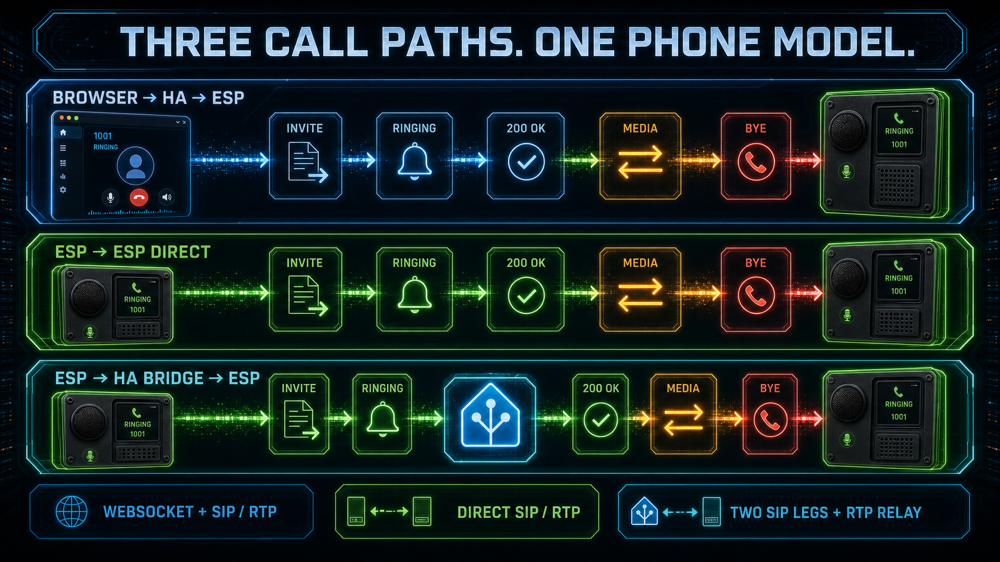
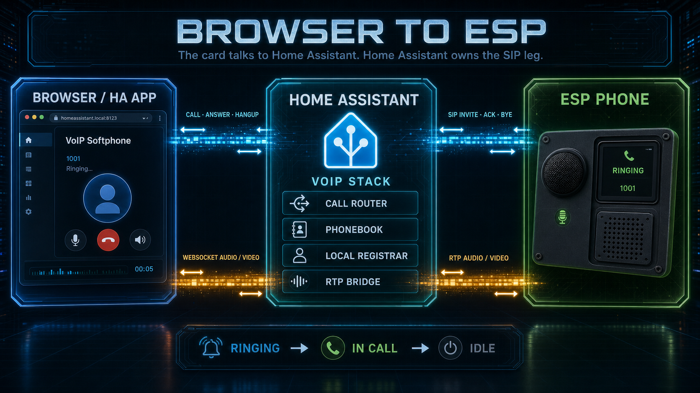
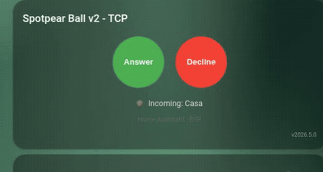
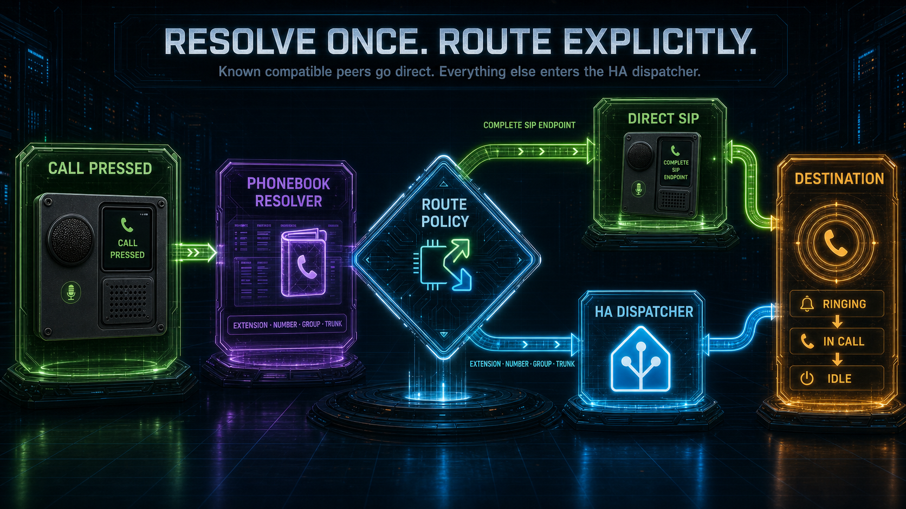

# Call Flows

This document explains what happens on the wire and in Home Assistant for the
main call paths. It is intentionally operational: when a call behaves oddly,
start here and compare the observed log path against the expected path.

## Common Pieces

Every call has these layers:

- SIP signaling: INVITE, 100 Trying, 180 Ringing, 200 OK, ACK, BYE, CANCEL.
- SDP negotiation: each leg negotiates its own RTP format.
- RTP media: direct endpoint media or HA-anchored relay/mixer media.
- Call registry: HA tracks source call ID, destination call ID, relay, client,
  pending invite and softphone state.
- Phonebook resolver: maps the dialed target to a route action.

## ESP To ESP Direct

1. ESP A selects `ESP B` from its synced phonebook.
2. The entry has a direct address/SIP URI and does not require `ha_bridge`.
3. ESP A sends SIP INVITE directly to ESP B.
4. ESP B rings or auto-answers depending on its own config.
5. RTP flows directly between ESP A and ESP B.
6. HA observes state through ESP sensors but does not route media.

Expected HA behavior: no `route_requested` event.

## ESP To HA Softphone

1. ESP dials the HA softphone name or extension, for example `Casa` or `666`.
2. ESP sends the call to HA.
3. HA resolves the target as `answer_ha`.
4. HA sends `100 Trying` then `180 Ringing`.
5. The HA softphone state becomes `ringing`.
6. The browser/card that owns the HA softphone may answer.
7. On answer, HA sends `200 OK` with SDP and the browser audio WebSocket binds
   to the call.
8. On decline/hangup, HA sends the appropriate SIP final response or BYE.

If HA softphone DND is enabled, HA returns `486 Busy Here` with terminal reason
`dnd`.

If HA softphone is already ringing, in call or has an active browser media
session, HA returns `486 Busy Here`.

## HA/Card To ESP

1. The card sends `voip_stack.call` with the selected target.
2. HA resolves the target from `sensor.voip_phonebook`.
3. If the target is an ESP, HA creates a SIP client leg to the ESP.
4. The HA softphone state moves to `calling`.
5. If the ESP rings, HA state becomes `remote_ringing`.
6. If the ESP answers, HA state becomes `in_call`.
7. If the call terminates, HA stops the client, relay/media reservation and
   updates the softphone state to a terminal state.

The card does not decide routing and does not filter the phonebook. It displays
the central roster and mirrors HA softphone state.

## ESP Mirror Card To Target

1. The ESP mirror card is bound to one ESPHome device.
2. Contact next/previous buttons press that ESP's own contact-cycler controls.
3. The normal Call button presses the ESP call control for the currently
   selected contact.
4. The keypad/manual target view sends the typed target to the same ESP
   `start_call` action.
5. The ESP first resolves the target through its local synced phonebook. Direct
   SIP targets can be called by the ESP itself.
6. If the target is not locally direct, the ESP sends the call to HA and HA
   applies the central dial plan: extension, group, registered SIP endpoint,
   trunk number or reject.

The keypad is not a second HA-only routing path and it must not overwrite the
ESP selected-contact sensor. Closing the keypad returns to the ESP contact
cycler.

## Registered SIP Endpoint To Registered SIP Endpoint

1. Endpoint A registers to HA with a local SIP account.
2. Endpoint B registers to HA with a local SIP account.
3. Endpoint A sends INVITE to HA, target `EndpointB` or B's `extension`.
4. HA recognizes A as a registered endpoint and uses the central dial plan
   immediately.
5. HA resolves B to B's current Contact URI.
6. HA sends INVITE to B and bridges the SIP/RTP legs.
7. B's final response is propagated back to A.

Expected log shape:

- `SIP RX INVITE sip:<target>@<ha>`
- `SIP TX INVITE <target>@<registered-contact-host>:<port>`
- `SIP bridge registered ... target=<target>`

Unexpected log shape:

- `SIP route requested ...` for ordinary registered endpoint calls. That means
  the call left the canonical dial plan and went into the automation fallback.

## Unknown Or Unregistered Caller

1. Any SIP peer with network reachability sends INVITE to the ESP or HA
   listener; no phonebook or registration lookup is used as a source allowlist.
2. The receiver validates the SIP transaction, Request-URI, current busy/DND
   state and SDP media.
3. A directly addressed idle ESP rings when media is compatible. HA resolves
   the destination using the same dial plan used for registered callers.
4. The call proceeds or receives the normal routing/media/status response.

The HA registrar authenticates REGISTER and publishes the endpoint's current
Contact. It does not make registered accounts the only callers HA or an ESP can
receive. Use network policy when an installation needs that restriction.

## In-Dialog Hold Or Media Update

1. A call is already established with its original negotiated media.
2. One peer sends an in-dialog INVITE or UPDATE carrying an SDP offer.
3. An ESP endpoint returns `488 Not Acceptable Here`; its original dialog and
   RTP selection remain active.
4. An HA-owned dialog validates the offer against the live media owner. A
   compatible audio change or direction/hold/resume update is answered and
   committed once without rerunning the dial plan or creating a second call.
5. An established HA video stream may change direction or RTP endpoint while
   keeping a compatible codec contract. A direct HA-browser dialog may also
   add/remove compatible video; a SIP-to-SIP bridge rejects topology or codec
   changes with `488`, leaving the original media usable.
6. A successful re-INVITE follows the normal 2xx/ACK transaction. If ACK never
   arrives, HA terminates the uncertain dialog; UPDATE needs no ACK.
7. Either peer can later send BYE and both sides clean up the active call.

An offerless UPDATE is accepted as a session refresh. An offerless re-INVITE is
rejected because HA does not implement the delayed offer-in-2xx/answer-in-ACK
exchange.

## Registered SIP Endpoint To HA

1. Registered endpoint calls `Casa` or HA's extension.
2. HA resolves the target as `answer_ha`.
3. HA sends `180 Ringing` immediately and updates HA softphone state.
4. If the caller sends CANCEL before answer, HA returns `487 Request
   Terminated` and clears pending state.

This path is a useful regression test for TCP SIP clients. The SIP listener
must send the `180` response before any slow UI/event work can delay the
transaction.

## HA Forward To Registered SIP Endpoint

1. An HA-owned inbound/ringing call already exists.
2. HA service `voip_stack.forward` is called with that `call_id`, or without it
   when exactly one call is forwardable on the selected logical phone; the
   destination is, for example, `SvcPhone` or extension `761`.
3. HA resolves the registered endpoint to its current Contact URI and replaces
   the destination leg while preserving the source call.
4. HA must not rewrite the destination to `sip:<target>@<ha-ip>`.

If it does rewrite to HA itself, the call loops into the inbound router and
appears as `route_requested`. That is a bug.

Use `voip_stack.call`, not `forward`, when there is no existing source call.

## Ring Group

1. Caller dials a group such as `RG Casa`.
2. HA resolves a roster entry with `metadata.group_type = ring`.
3. HA sends `180 Ringing` to the caller.
4. HA forks INVITE to all callable members except the caller.
5. Busy/declined members drop out.
6. First member to answer wins.
7. HA cancels the remaining forks.
8. HA bridges caller to the winner and reports `answered_by`.
9. Hangup from either side propagates to the other side.

Caller cancellation before answer must cancel every fork and release every RTP
reservation.

## Conference Group

1. Caller dials a group such as `CG Casa`.
2. HA resolves a roster entry with `metadata.group_type = conference`.
3. Caller joins the HA conference room immediately.
4. If configured, HA invites members listed in `ring_members`.
5. Invited members that answer join the room. There is no winner.
6. Members without conference ringing can still join manually by calling the
   group.
7. HA softphone can be a participant like any other endpoint.
8. The room ends when the last participant leaves.

Conference media is HA-mixed. Each participant receives the N-1 mix: everyone
except itself.

## Trunk Outbound

1. Caller dials an external number or a contact with `number`.
2. HA checks that no internal `extension` owns that target.
3. HA requires a registered trunk.
4. HA creates a trunk SIP client leg and a relay.
5. RTP is relayed between local caller and trunk endpoint.

If trunk is not registered, HA rejects with `trunk_unavailable`.

## Trunk Inbound: Direct Mode

1. A provider or PBX sends an INVITE to the registered HA trunk account.
2. HA replaces the provider Request-URI with the configured inbound default
   target.
3. With automation routing disabled, HA resolves that target immediately
   through the phonebook.
4. The result can ring HA, bridge to an ESP or registered phone, join a ring or
   conference group, or start the configured Assist destination.
5. HA negotiates and bridges the source and destination media legs when the
   route needs a bridge.

There is no DTMF collection and no pre-answer delay in Direct mode.

## Trunk Inbound: DTMF Mode

1. HA answers the trunk leg with its negotiated audio, telephone-event and,
   when offered and enabled, compatible video formats. Video sockets are
   pre-bound before the answer.
2. HA collects RTP telephone-event and SIP INFO digits for the configured
   timeout.
3. Explicit digits are resolved only as canonical phonebook extensions.
4. A valid extension routes to its entry. An HA browser phone inherits the
   pre-bound video sockets; an audio-only target releases them. An unknown
   explicit extension ends as `route_not_found`, releases every reservation
   and never falls back to another destination.
5. If the caller enters no digits, HA follows the configured default target.

The initial extension digits are route selection, not established-call DTMF
events. Once a bridged call is connected, later negotiated keys are published
as individual `dtmf` occurrences without interrupting media.

## Optional Automation Decision

Automation routing is an experimental, independently configurable override.
It is disabled by default.

When enabled, HA publishes one `route_requested` occurrence and waits up to
1.5 seconds for a decision:

- before the default route in Direct mode;
- before the no-digits fallback in DTMF mode.

Explicit DTMF extensions never enter this decision path. If no automation
acts, the original phonebook decision continues. A forward action moves the
same logical source call and does not create a second inbound call.

The public surface is the `route_requested` type on
`event.voip_stack_call`, consumed through Home Assistant's native
`event.received` trigger. Raw event-bus messages are integration plumbing, not
a second automation API.

The decision point is not expected for:

- registered endpoint calling another roster target;
- HA/card calling a roster target;
- ESP calling a known roster target;
- an explicit DTMF extension;
- any inbound call while automation routing is disabled.

## Unanswered HA Forward

1. The default route places the HA-owned logical call in `ringing`.
2. The call-state Sensor Entity attached to the destination phone publishes
   the same state and Call-ID as its softphone/card stream. The migrated
   default phone retains `sensor.voip_stack_call_state` for compatibility;
   additional phones have their own generated entity IDs.
3. A native HA state trigger may wait with `for:`, for example 30 seconds.
4. `voip_stack.forward` resolves the only forwardable call and claims a new
   routing revision.
5. HA releases the softphone, publishes its terminal `forwarded` transition,
   and attaches the replacement destination to the still-open source call.
6. On route failure, `on_failure: resume` restores HA ringing exactly once.

Room-specific automations should use the destination phone's state Sensor or
call Event Entity. Reserve aggregate `event.voip_stack_call` triggers for
PBX-wide inspection and the initial `route_requested` decision.

Callbacks from the previous revision cannot resurrect the released HA ringing
state. The card only renders these authoritative backend transitions.
