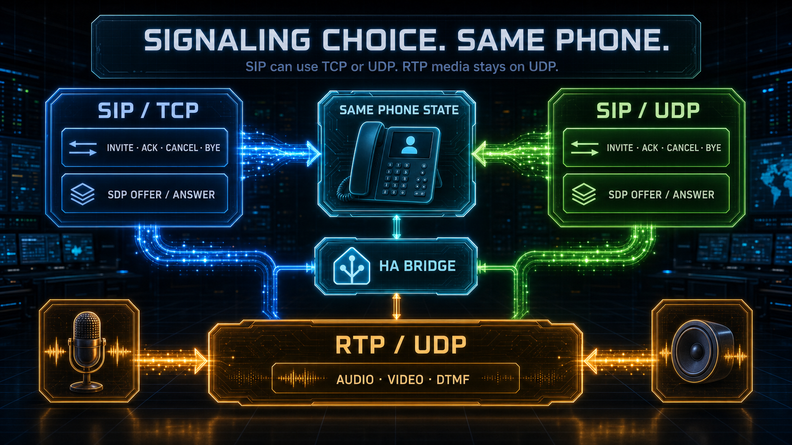
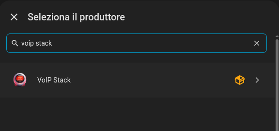
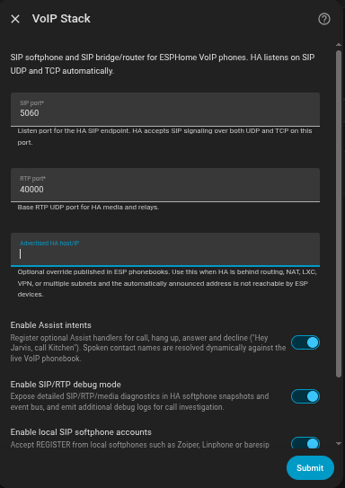
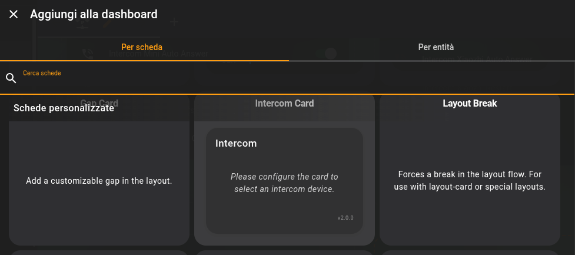
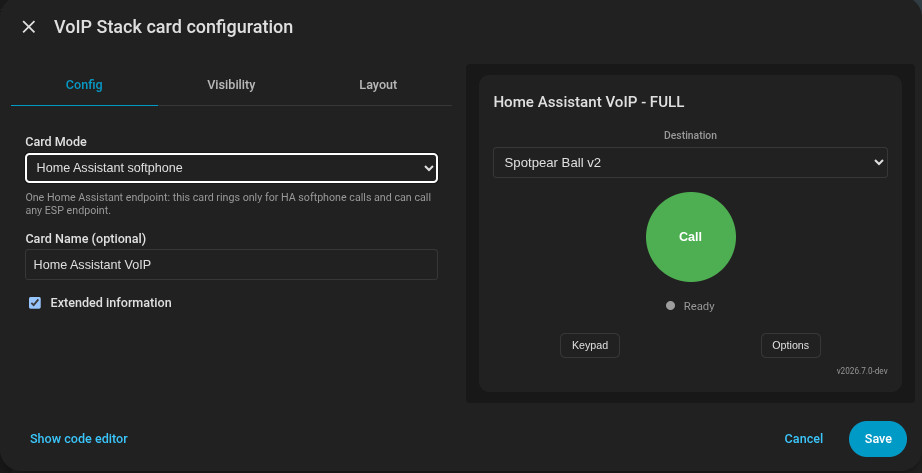
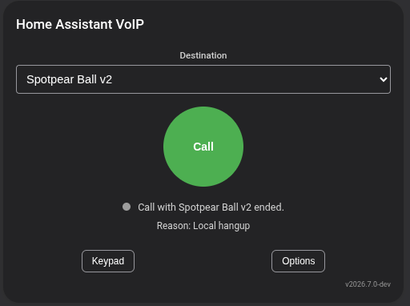
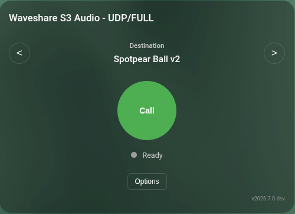
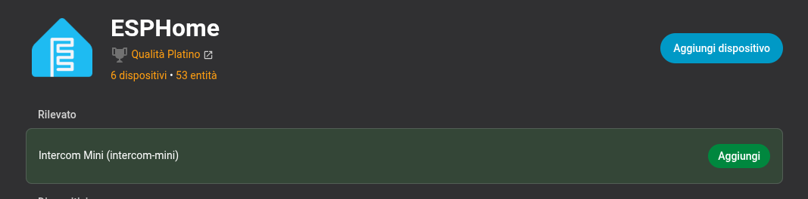

# Deployment guide

This guide maps the maintained YAMLs and the Home Assistant integration to the
current VoIP model. The old TCP/UDP intercom split is gone: every device is a
SIP phone, and `transport: udp` or `transport: tcp` only selects SIP signaling
transport.

## YAML tree

```text
yamls/
├── voip-only/       SIP phone + audio stack, no wake word or VA
├── full-experience/     SIP phone + audio stack + MWW/Voice Assistant/media
├── experimental/        bring-up/reference profiles
└── host/                local-only ESPHome host test YAMLs, gitignored
```

Choose the maintained YAML closest to the hardware and edit identity, pins and
network settings. Do not start from historical `*-tcp`, `*-udp` or
`*-sip` filenames; transport is now inside the `voip_stack` declaration.

## Network

SIP signaling listens on `sip_port` and may use UDP or TCP. RTP media always
uses UDP on `rtp_port`.



Use routable IP addresses in `phonebook` or let HA publish the central
`sensor.voip_phonebook`. For HA Container/Docker/LXC, host networking or an
explicit advertised host remains the simplest deployment because SIP/RTP use
inbound UDP/TCP sockets.

## ESP devices

Choose SIP signaling transport per device. SIP is implicit; `transport` selects
only whether signaling uses UDP or TCP:

```yaml
voip_stack:
  transport: udp
```

or:

```yaml
voip_stack:
  transport: tcp
```

Use `static_contacts` for a small fixed ESP-local dial plan. Use the HA
phonebook subscription package when HA should be the authority.

Supported audio shapes:

- full duplex: microphone plus speaker;
- mic only: sends audio but ignores remote playback;
- speaker only: plays remote audio but sends no mic RTP;

These are first-class SIP endpoint shapes. They are not compatibility modes.
An endpoint must provide at least one real audio direction; a signaling-only
device is not a VoIP phone and is rejected.

## Home Assistant

### Install through HACS

1. Search for **VoIP Stack** in HACS and select **Download**.
2. Restart Home Assistant.
3. Open **Settings → Devices & services → Add integration**.
4. Select **VoIP Stack** and complete the config flow.

<table>
  <tr>
    <td></td>
    <td></td>
    <td></td>
  </tr>
</table>

HACS registers the bundled Lovelace card automatically. A normal LAN can keep
SIP `5060` and RTP base `40000`.

For a manual source checkout, copy the component directory:

```bash
cp -r custom_components/voip_stack /config/custom_components/
```

The release asset `voip_stack.zip` is a flat HACS integration archive. Extract
it into `/config/custom_components/voip_stack/` and verify that
`manifest.json` is directly inside that directory before restarting HA.

Configure `voip_stack` with reachable SIP/RTP ports. HA is always the local
softphone and router/B2BUA. There is no separate "HA PBX" mode.

If HA is behind NAT, VPN, LXC, Docker, or multiple subnets, set the integration
advertise host so ESPs and softphones see a reachable SIP Contact/SDP address.

Use `ha_bridge` for routed or logical calls that should pass through HA.

Enable the local registrar if standard SIP endpoints should register to HA. Create
accounts with `voip_stack.create_account`; registered clients appear
in the central phonebook as softphone contacts.

Enable **Include voice assistant** only when a native HA Assist pipeline should
be callable. Choose HA's preferred pipeline or a specific one and assign an
explicit extension. The assistant becomes a normal phonebook destination and
uses that pipeline's existing STT, conversation agent and TTS configuration;
no second SIP listener or separate Assist satellite is deployed.

### Add and bind a browser phone

Use **Add phone** to create each room phone, then select that phone Device in
the card editor. The card's persisted settings update the same backend phone
configuration exposed by its HA entities.

<table>
  <tr>
    <td></td>
    <td></td>
  </tr>
  <tr>
    <td></td>
    <td></td>
  </tr>
</table>

An ESP mirror card binds to the existing physical ESPHome Device and controls
that endpoint's normal ESPHome entities.



After an upgrade, restart HA, run **Reconfigure** on the integration, then hard
refresh dashboards containing the card. In the Android Companion app use
**Settings → Companion App → Troubleshooting → Reset frontend cache**. Read
[`BREAKING_CHANGES.md`](BREAKING_CHANGES.md) before changing major versions.

### ESPHome external components

Maintained YAMLs already reference the stable `main` branches. A custom
lightweight AEC profile uses:

```yaml
external_components:
  - source: github://n-IA-hane/esphome-voip-stack@main
    components: [voip_stack]
  - source: github://n-IA-hane/esphome-audio-stack@main
    components: [esp_audio_stack, esp_aec]
```

Use `esp_afe` instead of `esp_aec` only for a profile designed around the full
AFE pipeline. After ESPHome or external-component upgrades, clear that device's
`.esphome` build cache before compiling again.

Add the flashed node through the normal ESPHome integration:



For ESP32-P4 display targets, start from the maintained board profile and read
its C6 firmware/resource notes before changing LVGL or audio features.


## Optional SIP trunk

The trunk is disabled by default. Leave it disabled for local-only VoIP
installs; no registration, external route or DTMF collector is started.

Enable it only when HA must register to a SIP provider or PBX. The trunk setup
asks for provider transport, server, credentials, optional outbound proxy,
default inbound target and optional DTMF digit collection.

Inbound provider calls are answered by HA so it can collect DTMF digits through
RTP `telephone-event` or compatible legacy SIP INFO. Normal mobile dialers can use
post-dial pauses, for example a contact that dials the provider number, waits,
and sends `100`. If no digits arrive, HA resolves the configured default target
(`HA` is the initial default). If digits arrive, HA resolves them through
central phonebook `extension` values.
If digits arrive and do not resolve, HA terminates the answered leg with
`route_not_found`.

## Media

ESP accepts compatible PCM SDP only. Unsupported codecs or oversized/unsupported
formats must receive a SIP failure such as `488 Not Acceptable Here`.

HA can bridge and resample between supported formats. Trunk/softphone legs may
negotiate Opus, G.722, PCMA or PCMU when the HA runtime provides the required
codec in both directions; optional codecs are not advertised when unavailable.
G.722 exists only on the HA/standard-SIP leg: ESP legs remain PCM-only and keep
their native quality. HA keeps the best negotiated quality per leg when
conversion is available. If a conversion cannot be built, HA terminates the
setup with `media_incompatible`.
