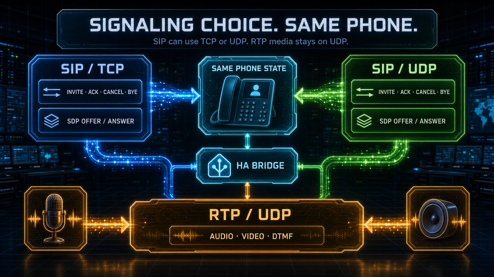
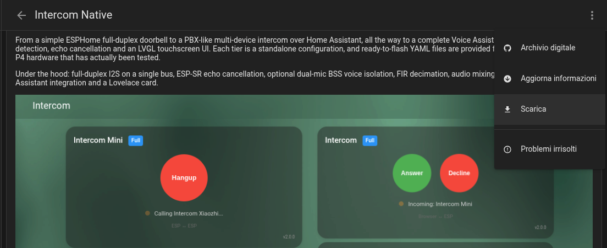
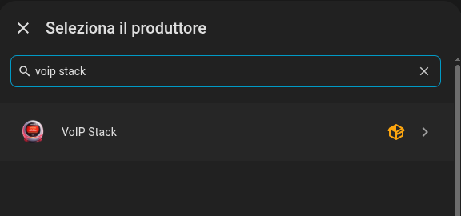
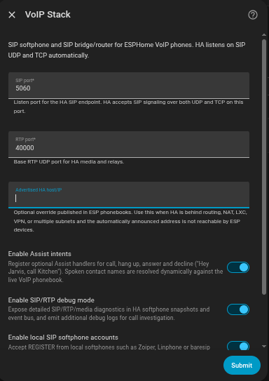
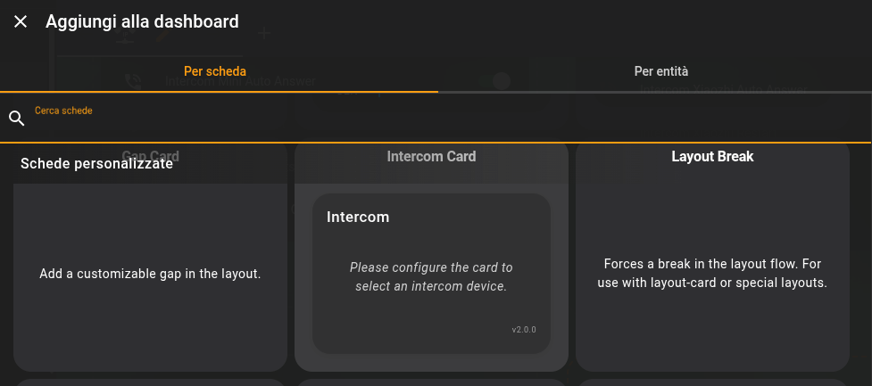
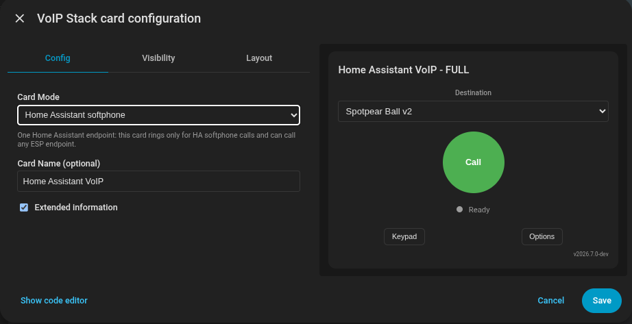
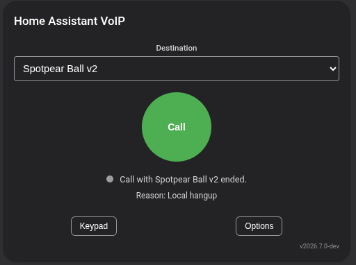
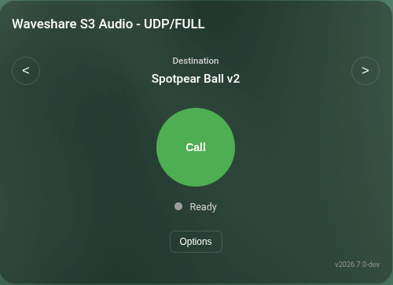
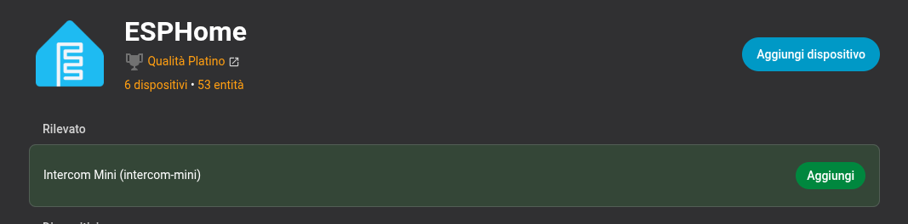

# Deployment guide

This guide covers installation, firmware selection and network settings.
`transport: udp` or `transport: tcp` selects SIP signaling transport; RTP audio
and video use UDP in both cases.

For 2026.10.0, use Home Assistant 2026.7.0 or newer. Firmware builds require
ESPHome 2026.9.0 or newer. HA and ESP firmware do not need matching version
numbers: a HACS update and a device firmware update are separate operations.
We recommend rebuilding from an updated maintained YAML to receive device
fixes, particularly on Generic S3.

## YAML tree

```text
yamls/
|-- voip-only/          SIP phone + audio stack, no wake word or VA
|-- full-experience/    SIP phone + audio stack + MWW/Voice Assistant/media
`-- experimental/       bring-up/reference profiles
```

Choose the maintained YAML closest to the hardware and edit identity, pins and
network settings. Do not start from historical `*-tcp`, `*-udp` or
`*-sip` filenames; transport is now inside the `voip_stack` declaration.

## Network

SIP signaling listens on `sip_port` and may use UDP or TCP. RTP media always
uses UDP on `rtp_port`.



Use routable IP addresses in `phonebook` or let HA publish the central
`sensor.voip_phonebook`. For HA Container/Docker/LXC, host networking or an
explicit advertised host remains the simplest deployment because SIP/RTP use
inbound UDP/TCP sockets.

## ESP devices

Choose SIP signaling transport per device. SIP is implicit; `transport` selects
only whether signaling uses UDP or TCP:

```yaml
voip_stack:
  transport: udp
```

or:

```yaml
voip_stack:
  transport: tcp
```

Use `static_contacts` for a small fixed ESP-local dial plan. For HA-managed
contacts, the ESP VoIP component now provides phonebook reception and discovery
itself. Enable `custom_services: true` in the existing `api:` block; do not add
the retired phonebook subscription package. See the
[ESP phone migration](ESP_ENTITY_SURFACE.md#migrating-an-existing-phone).

When using Audio Stack, declare a single `esp_audio_stack` instance. Its
microphone, speaker and controls find it automatically, so the maintained YAMLs
omit `esp_audio_stack_id`. Shared-bus and split-bus modes are both managed by
that one instance. The stack declaration, actions and idle condition can omit
IDs too. Add a stack `id` only if your custom lambdas or named references need it.

Supported audio shapes:

- full duplex: microphone plus speaker;
- mic only: sends audio but ignores remote playback;
- speaker only: plays remote audio but sends no mic RTP;

These are first-class SIP endpoint shapes. They are not compatibility modes.
An endpoint must provide at least one real audio direction; a signaling-only
device is not a VoIP phone and is rejected.

### Generic S3 Full and Full Lite

Both single-bus profiles combine software AEC, Voice Assistant, wake word, VoIP,
HTTP playback, TTS and timers. Choose according to flash size and needed features:

| Profile | Flash configuration | Sendspin | Build optimization |
|---|---|---|---|
| [Full AEC](../yamls/full-experience/single-bus/generic-s3-full-aec.yaml) | 8 MB | Included | Performance |
| [Full Lite AEC](../yamls/full-experience/single-bus/generic-s3-full-lite-aec.yaml) | 4 MB | Disabled, package line commented | Size |

**Full Lite is experimental and still requires PSRAM.** Its measured application
image is about 1.78 MB. The standard 4 MB OTA layout has two application slots of
1,835,008 bytes each, leaving roughly 59 KB per slot with the measured firmware.
The whole 4 MB flash is not available to one application. Check the build result
after changing features or dependencies; re-enabling Sendspin may exceed the slot.

Adapt GPIOs, flash size and PSRAM settings to your actual board. If moving to a
different partition layout, use a complete serial flash for this migration;
an ordinary OTA application upload is not a partition-layout migration.

Testing on the Generic reference board exposed CPU contention between AEC and
VoIP processing. The updated VoIP-only profiles and the single-bus Full/Full Lite
profiles place microphone capture and AEC on core 1, with VoIP tasks on core 0.
The VoIP-only profiles also use AEC `filter_length: 4` instead of `8`.
Rebuilding from a current example applies these changes to copied configurations.

#### Wi-Fi transmit power

The single-bus Full and Lite examples use:

```yaml
wifi:
  # Merge into your existing Wi-Fi block.
  output_power: 15dB
```

This limits the ESP's transmit power. It does not increase its receive
sensitivity. Treat 15 as a starting point for your installation.

- If the AP is distant or coverage is insufficient, comment out `output_power`,
  rebuild and upload. With the standard ESP-IDF settings this restores the
  default maximum of 20 dBm; actual transmit power also depends on data rate,
  radio and regulatory limits.
- If UDP `sendto` reports `ENOMEM`, especially near the AP, compare lower values
  such as `8.5dB` using real calls and media playback. Check both packet loss and
  usable range. Excessively low power can make coverage worse.
- `ENOMEM` can mean that network transmit buffers are exhausted. It does not
  by itself prove that the firmware has run out of all RAM, or that transmit
  power is the cause. If changing power does not help, collect the diagnostic
  output and investigate the connection and resource use.

### Selecting runtime features

Use the base Runtime Controller package and only the adapters your device needs
when building a custom configuration. The full preset intentionally includes
voice, media, timers, ringtone and presentation bindings; the no-LED preset only
removes the physical LED renderer.

The controller's optional VoIP, LED, output-script and state-observer support is
selected during compilation. Omitting a feature also omits its dedicated stored
state. A screenless device does not need a display adapter or LVGL.
See the [runtime package guide](https://github.com/n-IA-hane/esphome-runtime-controller/blob/main/MIGRATION.md#choose-packages)
for the required IDs and helpers of each package.

## Home Assistant

### Install through HACS

1. Search for **VoIP Stack** in HACS and select **Download**.
2. Restart Home Assistant.
3. Open **Settings → Devices & services → Add integration**.
4. Select **VoIP Stack** and complete the config flow.

<table>
  <tr>
    <td></td>
    <td></td>
    <td></td>
  </tr>
</table>

HACS registers the bundled Lovelace card automatically. A normal LAN can keep
SIP `5060` and RTP base `40000`.

For a manual source checkout, copy the component directory:

```bash
cp -r custom_components/voip_stack /config/custom_components/
```

The release asset `voip_stack.zip` is a flat HACS integration archive. Extract
it into `/config/custom_components/voip_stack/` and verify that
`manifest.json` is directly inside that directory before restarting HA.

Configure `voip_stack` with reachable SIP/RTP ports. HA is always the local
softphone and router/B2BUA. There is no separate "HA PBX" mode.

If HA is behind NAT, VPN, LXC, Docker, or multiple subnets, set the integration
advertise host so ESPs and softphones see a reachable SIP Contact/SDP address.

Use `ha_bridge` for routed or logical calls that should pass through HA.

Enable the local registrar if standard SIP endpoints should register to HA. Create
accounts with `voip_stack.create_account`; registered clients appear
in the central phonebook as softphone contacts.

Enable **Include voice assistant** only when a native HA Assist pipeline should
be callable. Choose HA's preferred pipeline or a specific one and assign an
explicit extension. The assistant becomes a normal phonebook destination and
uses that pipeline's existing STT, conversation agent and TTS configuration;
no second SIP listener or separate Assist satellite is deployed.

### Add and bind a browser phone

Use **Add phone** to create each room phone, then select that phone Device in
the card editor. The card's persisted settings update the same backend phone
configuration exposed by its HA entities.

<table>
  <tr>
    <td></td>
    <td></td>
  </tr>
  <tr>
    <td></td>
    <td></td>
  </tr>
</table>

An ESP mirror card binds to the existing physical ESPHome Device and controls
that endpoint's normal ESPHome entities.



After an upgrade, restart HA, then hard refresh dashboards containing the card. In the Android Companion app use
**Settings → Companion App → Troubleshooting → Reset frontend cache**. Read
[`BREAKING_CHANGES.md`](BREAKING_CHANGES.md) before changing major versions.

### ESPHome external components

For stable firmware, use component and package sources from `main`. A custom
lightweight AEC profile loads the components with:

```yaml
external_components:
  - source: github://n-IA-hane/esphome-voip-stack@main
    components: [voip_stack]
  - source: github://n-IA-hane/esphome-audio-stack@main
    components: [esp_audio_stack, esp_aec]
```

Use `esp_afe` instead of `esp_aec` only for a profile designed around the full
AFE pipeline. After ESPHome or external-component upgrades, clear that device's
`.esphome` build cache before compiling again.

Add the flashed node through the normal ESPHome integration:



For ESP32-P4 display targets, start from the maintained board profile and read
its C6 firmware/resource notes before changing LVGL or audio features.


## Optional SIP trunk

The trunk is disabled by default. Leave it disabled for local-only VoIP
installs; no registration, external route or DTMF collector is started.

Enable it only when HA must register to a SIP provider or PBX. The trunk setup
asks for provider transport, server, credentials, optional outbound proxy,
default inbound target and optional DTMF digit collection.

Inbound provider calls are answered by HA so it can collect DTMF digits through
RTP `telephone-event` or compatible legacy SIP INFO. Normal mobile dialers can use
post-dial pauses, for example a contact that dials the provider number, waits,
and sends `100`. If no digits arrive, HA resolves the configured default target
(`HA` is the initial default). If digits arrive, HA resolves them through
central phonebook `extension` values.
If digits arrive and do not resolve, HA terminates the answered leg with
`route_not_found`.

## Media

ESP accepts compatible PCM SDP only. Unsupported codecs or oversized/unsupported
formats must receive a SIP failure such as `488 Not Acceptable Here`.

HA can bridge and resample between supported formats. Trunk/softphone legs may
negotiate Opus, G.722, PCMA or PCMU when the HA runtime provides the required
codec in both directions; optional codecs are not advertised when unavailable.
G.722 exists only on the HA/standard-SIP leg: ESP legs remain PCM-only and keep
their native quality. HA keeps the best negotiated quality per leg when
conversion is available. If a conversion cannot be built, HA terminates the
setup with `media_incompatible`.
