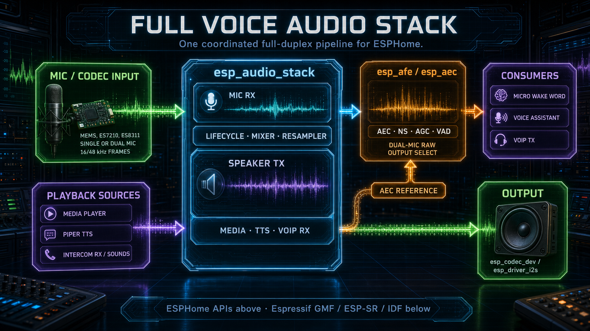

# Espressif components and licenses

This project is MIT-licensed, but maintained VoIP YAMLs can also use audio
components from the split
[`esphome-audio-stack`](https://github.com/n-IA-hane/esphome-audio-stack)
repository. Those audio features use Espressif components that are resolved by
ESPHome's IDF Component Manager when users build their own firmware.

The repositories ship YAML, ESPHome components and source code. They do not
ship prebuilt firmware binaries for these Espressif audio components.

For repository-wide attribution, ESPHome-derived component notes and the
Apache-2.0 license text used by local ESPHome compatibility forks, see
[`../THIRD_PARTY_NOTICES.md`](../THIRD_PARTY_NOTICES.md).

## Runtime components

The current audio stack uses these Espressif components:

| Component | Used by | License family | Notes |
|---|---|---|---|
| `espressif/esp-sr` | `esp_aec`, `esp_afe`, pulled directly or through GMF | Espressif MIT-style license, restricted to Espressif products | Provides AEC, AFE, SE/BSS, VAD, NS and AGC libraries. Some DSP implementation is shipped by Espressif as precompiled target libraries. |
| `espressif/gmf_ai_audio` | `esp_afe` | Espressif Modified MIT, restricted to Espressif products | Provides the official `esp_gmf_afe` element plus `esp_gmf_afe_manager`; `esp_afe` runs that element in a GMF pipeline while ESPHome keeps the microphone consumer facade. |
| `espressif/gmf_core` | Transitive dependency of GMF components | Espressif Modified MIT, restricted to Espressif products | Base GMF object and support layer required by GMF audio/AI/IO components. |
| `espressif/esp_audio_effects` | `esp_audio_stack` | Espressif MIT-style license, restricted to Espressif products | Provides `esp_ae_rate_cvt`, `esp_ae_bit_cvt` and data weaver APIs used for RX/TX conversion and layout. |
| `espressif/esp_codec_dev` | `esp_audio_stack` codec-backed builds | Apache-2.0 | Provides codec control plus I2S read/write. P4 and WS3 use ES7210/ES8311 through it; Spotpear single-mic uses ES8311 input/output through it. The generic codec wrapper also exposes ES8388, ES8374 and ES8389 where the board wiring matches those drivers. Generic no-codec builds use direct `esp_driver_i2s` read/write instead. |

The optional P4 H.264 profile additionally resolves
`espressif/esp_h264` 1.3.6 for hardware encode/software decode and
`espressif/esp_image_effects` 1.1.0 for its optimized I420-to-O_UYY_E_VYY
conversion. `p4_video_renderer` feeds that PPA-native layout directly to the
ESP-IDF PPA scale/rotate/color-conversion transaction; JPEG and audio-only
profiles do not resolve either H.264 dependency. `esp_h264` is Apache-2.0;
`esp_image_effects` uses Espressif Modified MIT and is restricted to Espressif
products. The corresponding notices are retained under `licenses/`.

Espressif component dependencies are intentionally latest-compatible unless a
component wrapper needs a documented minimum API generation. `esp_aec` requires
ESP-SR v2 because it wraps the `afe_aec_*` API, so it uses an ESP-SR v2
constraint rather than allowing the resolver to fall back to ESP-SR 1.x. If a
registry update breaks a supported board, add a pin with a short note naming the
component version, board, symptom and rollback target.

There is no P4 downgrade pin for `esp-sr`. The P4 full AFE target uses the same
GMF/ESP-SR generation as the S3 dual-mic target, including the `esp32p4` and
`esp32p4_less_v3` headers and prebuilt libraries shipped by Espressif.

## Component boundaries

The Espressif integrations are internal backends of existing ESPHome
components, not new mandatory external components layered on top of each other.
The public composition stays modular:

| ESPHome component | Espressif backend it owns | Required project components | Optional peers |
|---|---|---|---|
| `esp_audio_stack` | IDF `esp_driver_i2s` for I2S ownership, `esp_codec_dev` for codec/data devices, direct codec/I2S RX/TX transfer, `esp_audio_effects` for rate/layout conversion | internal audio core shared primitives and ESPHome `microphone`/`speaker` surfaces | `esp_aec` or `esp_afe` through `processor_id`; `voip_stack`, MWW and VA as consumers |
| `esp_aec` | `esp-sr` low-level `afe_aec` API | internal audio core | `esp_audio_stack` or standalone `voip_stack` as the caller |
| `esp_afe` | `gmf_ai_audio` `esp_gmf_afe` element + `esp_gmf_afe_manager` plus `esp-sr` | internal audio core | `esp_audio_stack` as the required steady-frame caller |
| `voip_stack` | none of the new Espressif audio libraries directly | ESPHome network/audio surfaces | native ESPHome audio, or `esp_audio_stack` as the recommended mic/speaker owner for AEC/AFE/full voice builds |

`esp_audio_stack` does not depend on `voip_stack`. A user can install only
`esp_audio_stack` and optionally `esp_aec` or `esp_afe` for
a Voice Assistant, media-player, microphone/speaker, or custom callback build.
The cross-component validation only runs when both `esp_audio_stack` and
`voip_stack` appear in the same YAML, to prevent double ownership of AEC or
DC-offset correction.

## Naming and license boundaries

Most GMF/audio components used by the audio backend are not generic MIT
libraries.
`gmf_ai_audio` and `esp_audio_effects` use Espressif's
modified MIT-style license: they may be used
with Espressif products, their copyright/permission notice must stay with copies
or substantial portions, and redistribution for non-Espressif products is
prohibited. `esp-sr` has the same practical hardware restriction. `esp_codec_dev`
is Apache-2.0.

Project policy:

| Area | Policy |
|---|---|
| Runtime target | Audio firmware using these components is for Espressif SoCs/products only. |
| Vendoring | Do not vendor Espressif source or binary blobs into this repository unless the license is reviewed again. Let ESPHome/IDF Component Manager resolve them during the user's build. |
| Notices | Keep this document and upstream component names/links current. If distributing prebuilt firmware, include the relevant Espressif notices/licenses with the firmware distribution. |
| Public component naming | Prefer a descriptive compatibility name that does not imply official Espressif ownership or endorsement. `esp_audio_bridge` or `esp_audio_stack` is safer than `espressif_audio`; if `espressif_audio` is used, documentation must state that it is an ESPHome/community component using Espressif libraries, not an official Espressif product. |
| Branding | Do not use Espressif logos or trade dress in the component UI/docs. If a logo is ever used, follow Espressif's logo guidelines and include their trademark disclaimer. |
| API wording | It is fine to say "uses Espressif ESP-IDF/GMF/ESP-SR components" when that is factually true. Avoid wording such as "official Espressif component" for this repository's own ESPHome component. |

## Reference components

These components are used as official reference material for board and codec
conformance, but are not currently a replacement for `esp_audio_stack`:

| Component or BSP | Used for | License family | Notes |
|---|---|---|---|
| `espressif/esp_board_manager` / `periph_i2s` | Reference for Espressif board-level I2S ownership | Espressif Modified MIT, restricted to Espressif products | Audited but not used by the active backend. The adapter uses official `esp_driver_i2s` internally, but currently hides DMA channel config and enables channels during peripheral ref, which does not fit this ESPHome lifecycle. |
| Waveshare `esp32_p4_wifi6_touch_lcd_x` BSP | Reference for Waveshare P4 pinout, ES8311/ES7210 setup and PA control | See upstream BSP package | The BSP uses `esp_codec_dev` and standard I2S examples. Our full-duplex TDM path still needs custom ESPHome integration for mic/ref staging, mixer, VoIP calls and Home Assistant entities. |

## Generated-code coverage

The current generated-code snapshots confirm:

- Waveshare P4 landscape AFE: TDM ES7210 input and ES8311 output go through
  `esp_codec_dev`; dual mic is structural with SE/BSS enabled, VAD/AEC boot ON
  and FD high-perf as the maintained default. It uses `gmf_ai_audio` and the
  same ESP-SR v2 generation as the S3 dual-mic target, not the historical
  standalone P4 ESP-SR 2.3.x override.
- Waveshare S3 full AFE: TDM ES7210 input and ES8311 output also go through
  `esp_codec_dev`; dual mic is structural with SE/BSS enabled.
- Spotpear single-mic AEC: ES8311 input and ES8311 output go through
  `esp_codec_dev`; stereo RX supplies mic plus playback reference, and the
  processor is standalone `esp_aec` over Espressif's `afe_aec_create("MR", ...)`
  contract.
- Generic S3 AEC: remains no-codec and uses standalone `esp_aec` over the same
  `esp_audio_stack` bus facade, with `previous_frame` as the light reference
  profile for voip-only and full AEC presets.
- Generic S3 AFE: remains no-codec but uses `esp_afe` over the same bus facade,
  with the TYPE2-style software reference path for larger flash layouts.
- Generic S3 dual-bus VoIP: remains no-codec and uses the same
  `esp_audio_stack` facade, but creates separate ESP-IDF I2S simplex channels
  for RX and TX. This path is only compiled when YAML uses `rx_bus` and `tx_bus`.

## Source audit findings

The current integration has been checked against the Espressif component sources
resolved in the generated builds:

- `esp_codec_dev` accepts `codec_if = NULL` as long as `data_if` is present and
  `dev_type` is not `ESP_CODEC_DEV_TYPE_NONE`. That remains a valid upstream
  pattern, but the current `esp_audio_stack` no-codec backend intentionally uses
  direct `esp_driver_i2s` read/write so 4 MB Generic AEC profiles do not pull
  codec or GMF IO dependencies.
- The shared I2S data interface plus separate IN and OUT device handles is an
  official pattern. Espressif's `codec_dev_test` creates one `data_if`, one
  ES8311 DAC device and one ES8311 ADC device, then opens, closes and reopens
  record and playback in both orders.
- Spotpear's single physical ES8311 does not need to be forced into one
  `ESP_CODEC_DEV_TYPE_IN_OUT` device. Espressif's ES8311 driver tracks paired
  ADC/DAC codec instances internally, and the official test covers the same
  split-device shape we use for ESPHome's separate microphone and speaker
  surfaces.
- The TDM ES7210 plus ES8311 flow is also covered by Espressif tests: playback
  uses ES8311 OUT, record uses ES7210 IN, both share one I2S `data_if`, and the
  record side can select a non-contiguous TDM channel mask.
- Single-mic plus playback-reference AEC is covered by Espressif's low-level
  `afe_aec` contract: the input format `MR` means one microphone channel and
  one playback reference channel. Spotpear uses this direct official path after
  runtime testing showed the full AFE manager feed/fetch path saturating on the
  single-mic codec topology.
- Dual physical I2S buses are handled at the IDF channel layer, not by changing
  the ESP-SR audio contract. ESP-IDF supports simplex channel allocation by
  passing only one channel handle to `i2s_new_channel()`. The dual-bus no-codec
  path uses one RX simplex channel and one TX simplex channel on different I2S
  ports, then feeds the same mono mic plus playback reference frames to
  `afe_aec`.
- `esp_gmf_afe_manager` exposes runtime feature toggles for AEC, VAD and SE
  that are relevant to this ESPHome integration. It does not expose NS or AGC in
  its feature enum, so keeping NS/AGC changes as AFE recreate operations is
  deliberate while staying on the stock manager.
- `esp_gmf_afe_manager_get_chunk_size()` exposes the feed chunk size only. The
  wrapper learns a differing fetch size from the first result callback and bumps
  the ESPHome frame-spec revision if needed. This is a known integration edge to
  watch during runtime tests, not a reason to bypass the manager.

## PSRAM policy

Do not treat all Espressif components the same:

- `esp-sr` AFE exposes `memory_alloc_mode` in `afe_config_t`. Public YAMLs can
  choose `more_internal`, `internal_psram_balance` or `more_psram`; the current
  default stays aligned with Espressif's PSRAM-friendly AFE profile unless a
  board-specific test proves otherwise.
- `esp_gmf_afe_manager` has no public allocation toggle. Its manager object and
  feed buffer use `heap_caps_calloc_prefer(..., MALLOC_CAP_SPIRAM,
  MALLOC_CAP_INTERNAL)`, and its feed/fetch task stacks are created in PSRAM
  when `CONFIG_SPIRAM_BOOT_INIT` is available. This is an Espressif baseline,
  not a fork point unless runtime evidence points at it.
- `gmf_core` OAL helpers generally allocate from PSRAM when
  `CONFIG_SPIRAM_BOOT_INIT` is enabled. We currently use only the GMF AFE
  manager path, not a full GMF pipeline.
- `esp_codec_dev` does not expose a PSRAM policy in its public codec/data APIs.
  Our integration passes existing IDF I2S handles and the component mostly owns
  small codec/data interface objects plus codec register state.
- `esp_audio_effects` `esp_ae_rate_cvt` exposes quality/performance knobs
  (`complexity` and `perf_type`), but no public "allocate in PSRAM" knob. Our
  wrapper controls the scratch buffers it owns and opens all converter handles
  before the first realtime frame.
- The public dual-mic full-experience targets use a hybrid bridge-buffer
  placement: keep the per-frame AFE feed scratch and fetch output ring internal,
  move the larger AFE feed staging ring to PSRAM, and place ESPHome-owned audio
  and VoIP frame buffers in PSRAM. DMA descriptors and I2S driver buffers
  remain internal. This is the current WS3/P4 baseline for HTTPS media plus TTS
  plus VoIP stress.

Runtime test interpretation: PSRAM use inside GMF/esp-sr is expected. If a test
crashes or glitches, first capture the stack and memory snapshot; do not fork or
override Espressif allocation policy without evidence.

## Migration matrix

The current direction is to use Espressif code where it cleanly owns a problem,
and keep ESPHome code where it owns board wiring, callbacks, Home Assistant
entities or device-specific data routing.

| Candidate | Upstream role | Decision | Reason |
|---|---|---|---|
| `esp_gmf_afe` from `gmf_ai_audio` | Full GMF AFE element over the AFE manager | Integrated now | `esp_afe` now instantiates the official element inside a GMF pipeline. Voice-command assets stay disabled (`models=nullptr`, `vcmd_detect_en=false`) because ESPHome owns MWW/VA state. |
| `esp_gmf_afe_manager` from `gmf_ai_audio` | Owns esp-sr AFE feed/fetch tasks, suspend/resume and runtime feature toggles | Integrated now | Used underneath the GMF AFE element. ESPHome supplies bounded input/output bridge ports so the I2S owner still follows ESPHome microphone/speaker semantics. |
| `esp_gmf_aec` from `gmf_ai_audio` | GMF pipeline element for standalone AEC | Defer | It is relevant to future standalone AEC cleanup, but the current `esp_aec` path already uses the same low-level esp-sr `afe_aec` engine without importing GMF port ownership into ESPHome's microphone and speaker facade. |
| `afe_aec` from `esp-sr` | Low-level standalone AEC API | Integrated now | No-codec and Spotpear single-mic AEC devices keep a direct ESPHome-friendly processor while still using Espressif's current AEC implementation and official `MR` input format. |
| `gmf_audio` / `aud_rate_cvt`, `aud_bit_cvt`, `aud_deintlv`, `aud_intlv` | GMF audio pipeline elements for conversion and layout | Deferred | Official examples run codec at 48 kHz and insert GMF conversion elements before AEC. `esp_audio_stack` currently uses the lower `esp_audio_effects` primitives in-place; full GMF task/port ownership remains a future step. |
| `esp_audio_effects` / `esp_ae_rate_cvt`, `esp_ae_bit_cvt`, data weaver, channel convert | Standalone C API behind GMF conversion elements | Integrated now | RX bit/rate/layout conversion, mono-speaker duplication onto stereo STD TX, TDM TX layout, TX bit conversion and stereo-to-mono software AEC reference conversion use Espressif APIs. True `speaker_channels: 2` STD output is already ESPHome interleaved PCM and is written directly. `audio_effects.rate_cvt_complexity` and `audio_effects.rate_cvt_perf_type` expose the official rate-converter knobs in YAML. |
| `gmf_io` / `io_codec_dev` | GMF IO wrapper around codec-device read/write | Not used in `esp_audio_stack` | Sendspin / `speaker_source` need playback timestamps tied to I2S DMA completion. `esp_audio_stack` therefore uses `esp_codec_dev_read/write` directly and registers the ESP-IDF I2S TX completion callback, mirroring ESPHome's native I2S speaker model. |
| `esp_codec_dev` | Codec control plus I2S read/write abstraction | Integrated now | `esp_audio_stack` now creates one shared I2S data interface and separate IN/OUT codec devices, matching Espressif's test pattern. ES7210, ES8311, ES8388, ES8374 and ES8389 control/gain/volume/mute/data read/write go through the official component while ESPHome keeps mic/speaker callback routing. |
| `esp_board_manager` / `periph_i2s` | Board/peripheral lifecycle manager for I2S TX/RX STD/TDM/PDM | Audited, not active | Official adapter, but it currently hides `i2s_chan_config_t` DMA/auto-clear policy and enables channels on ref. Active backend stays on official `esp_driver_i2s` direct ownership. |
| `esp_capture` audio sources | High-level capture sources, including codec AEC capture | Do not integrate now | It owns a capture pipeline and source lifecycle intended for recording/streaming. It conflicts with ESPHome's microphone, speaker, mixer and VoIP ownership. Useful as reference only. |
| Waveshare BSP | Board pinout, codec, PA and display/touch setup | Copy patterns only | It validates hardware constants and codec setup style. Its audio examples are standard I2S/codec flows, not our 48 kHz full-duplex TDM with two mics plus reference. |

## Exposed capability checklist

The public `esp_audio_stack` surface is deliberately broad enough for custom
audio boards while still keeping fake knobs out:

1. **STD stereo speaker output** is exposed through `esp_audio_stack.speaker_channels: 2` plus `num_channels: 2` and the standard ESPHome speaker platform. `num_channels` alone stays a physical bus setting so codec-feedback boards can keep mono media playback on a stereo TX bus.
2. **TDM layout** exposes `tdm_total_slots`, one or two mic slots, `tdm_ref_slot` and `tdm_tx_slot`. RX slot extraction and TDM TX layout use Espressif audio-effects primitives.
3. **Codec selection** exposes ES7210 input plus ES8311/ES8388/ES8374/ES8389 generic input/output through `esp_codec_dev`.
4. **Rate and bit conversion** expose official `esp_ae_rate_cvt` complexity/performance and automatic bit-depth conversion for 24/32-bit bus formats.
5. **Processor integration** stays behind the `AudioProcessor` facade so users can pick `esp_aec`, `esp_afe`, or no processor without depending on `voip_stack`.
6. **Lifecycle/power hooks** expose audio, mic, speaker and amplifier-required edges for board-level PA and power policy.

Not exposed as YAML switches yet: PDM full-duplex, arbitrary GMF element graphs,
codec-private analog register scripts, and raw multi-channel microphone output
as a standard ESPHome microphone. Those require separate backend/component work;
exposing them as inert options would make custom builds harder to debug.

## Future work

- **Dual I2S microphones with software AEC reference**: Espressif AFE can
  consume interleaved `MMR` frames (two microphone channels plus playback
  reference). A future `esp_audio_stack` mode can build that frame explicitly
  from a stereo INMP441-style microphone bus (`MM`) and the existing software
  reference path (`R`, for example `aec_reference: previous_frame`). This is
  separate from the current single-mic `MR` AEC path and should be implemented
  only after release validation, because it changes the AFE feed layout and
  needs hardware tests with a real two-mic board.

## Practical rule

When adding or updating audio features, prefer Espressif-provided managers and
codec helpers when they fit the ESPHome architecture. Keep copyright and license
notices intact, cite the component dependency in the relevant ESPHome component,
and do not vendor Espressif source or binaries into this repository unless the
license is reviewed again.
