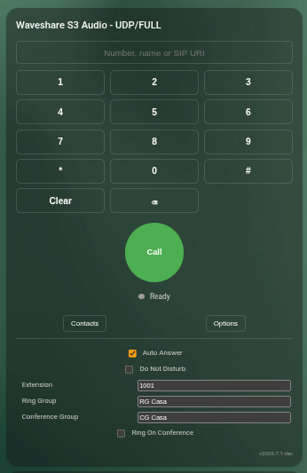

# ESP VoIP Entity Surface

`voip_stack:` is the SIP/RTP engine. It can run headless: an ESP can call
static contacts or direct SIP peers without exposing any Home Assistant entity.

Home Assistant features need an explicit entity surface. The maintained
packages expose it for you:

```yaml
packages:
  voip_ha_integration: !include packages/voip/ha_integration.yaml
```

Maintained YAMLs already include the appropriate entity package. When building
a custom YAML from the bare `voip_stack` component, add this package or declare
the equivalent entities manually. Otherwise the ESP may still be a working SIP
phone, but Home Assistant will not discover it as a phonebook peer and ESP
mirror cards will not have state to display.

## Entities

| Entity | Required for | Purpose |
| --- | --- | --- |
| `text_sensor: type: endpoint` | HA phonebook/dialplan | Publishes ESP SIP identity, ports, transport, extension and audio formats. |
| `text_sensor: type: state` | ESP mirror card | Current ESP call state, for example `idle`, `ringing`, `calling`, `in_call`. |
| `text_sensor: type: caller` | ESP mirror card | Current incoming caller. |
| `text_sensor: type: destination` | ESP mirror card | Selected/outgoing destination. |
| `text_sensor: type: last_reason` | ESP mirror card | Why the last call ended. |
| `text_sensor: type: contacts` | Local UI/card context | Compact contact count/status. |
| `text: type: ring_groups` | PBX groups | Comma-separated ring group memberships, editable from HA. |
| `text: type: conference_groups` | PBX groups | Comma-separated conference group memberships, editable from HA. |
| `switch: conference_ring` | PBX conference ringing | Whether this endpoint rings when another member starts one of its conference groups. |
| `text_sensor: type: transport` | Debug | Active SIP signaling transport. |
| `text_sensor: type: sip_snapshot` | Debug | Compact SIP/media diagnostic snapshot. |

If the card does not mirror an ESP's state, check that the device exposes at
least `state`, `caller`, `destination` and `last_reason`.



If the ESP does not appear in the HA phonebook, check that it exposes
`endpoint` and that the endpoint state is not `unknown` or `unavailable`.

## Manual YAML

The package above is recommended. Equivalent manual YAML:

```yaml
text_sensor:
  - platform: voip_stack
    type: endpoint
    name: VoIP Endpoint
  - platform: voip_stack
    type: state
    name: VoIP State
  - platform: voip_stack
    type: caller
    name: VoIP Caller
  - platform: voip_stack
    type: destination
    name: VoIP Destination
  - platform: voip_stack
    type: last_reason
    name: VoIP Last Reason
  - platform: voip_stack
    type: contacts
    name: VoIP Contacts

text:
  - platform: voip_stack
    type: ring_groups
    name: VoIP Ring Groups
  - platform: voip_stack
    type: conference_groups
    name: VoIP Conference Groups

switch:
  - platform: voip_stack
    conference_ring:
      name: VoIP Ring On Conference
```

## Debug Package

Optional diagnostics:

```yaml
packages:
  voip_debug: !include packages/voip/debug.yaml
```

This adds `transport` and `sip_snapshot`.

LVGL profiles may project the same public call state and terminal reason:


