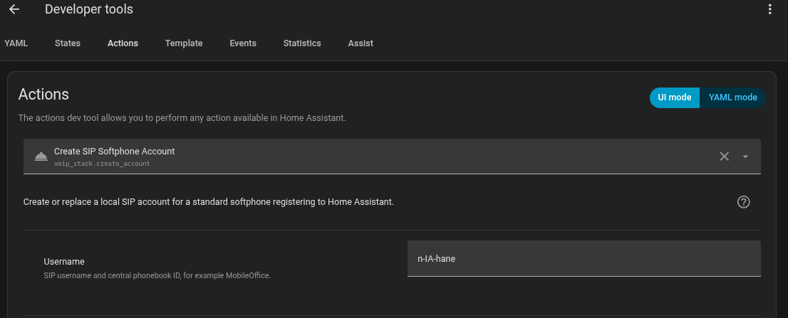
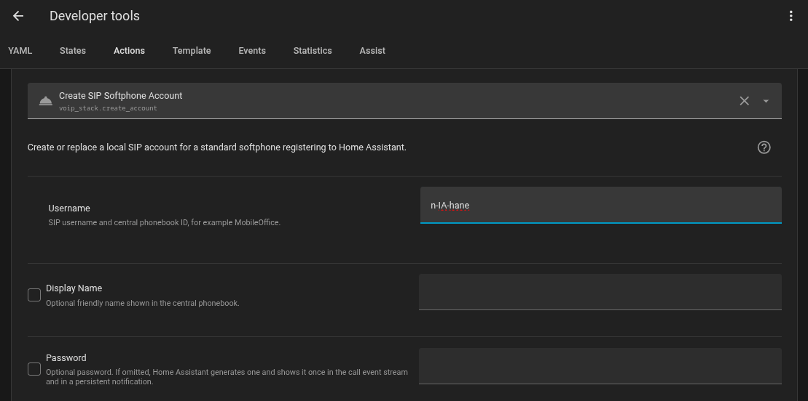

# Home Assistant services

The `voip_stack.*` services are the public control surface for the HA
softphone, central phonebook, local SIP endpoint accounts and automation
fallback routing.

The card uses these services too. The card does not implement private routing
logic.

## Softphone services

The normal automation editor shows one optional `device_id` phone picker. If
it is omitted, the default HA phone is selected. This is the only public phone
selector: it identifies the local phone performing the action, never the
remote destination. Internal endpoint and entity IDs are deliberately not
alternative action inputs. `call_id` and stale-decision guards remain under
the collapsed **Advanced options** section where concurrency requires them.

### `voip_stack.call`

Originate a call from Home Assistant.

`destination` is the only destination field. Its value can be a roster name,
extension, group name, public number, `user@host` or `sip:user@host`.
The central phonebook resolves that value; no destination Device ID is needed.

Optional:

- `send_video`: offer the selected browser phone's camera when SIP video is
  enabled. Receiving video does not require this flag.
- `ha_bridge`: force HA to anchor the route when that is valid.

`voip_stack.call` supports Home Assistant's optional action response. When a
caller requests a response, it receives the authoritative logical-phone
snapshot after origination, including `call_id`, `state`, endpoint identity and
the negotiated media fields already available at that point. The Lovelace card
uses the standard Home Assistant `call_service` WebSocket command with
`return_response: true`; there is no parallel private start command.

### `voip_stack.forward`

With `call_id`, moves an HA-owned pending, ringing or remotely ringing call to
another dial-plan destination. Repeated forwarding cancels the previous
ringing SIP leg before starting the replacement.

If `call_id` is omitted, HA infers it only when exactly one call is forwardable
for the selected logical phone. Use `voip_stack.call` to originate a new call.

Important rule: forwarding to a registered SIP endpoint keeps that endpoint's
current registration Contact as the destination. It must not rewrite to
`sip:<target>@<ha-ip>`.

Optional stale-decision guards:

- `expected_state`: state copied from `event.voip_stack_call`.
- `expected_sequence`: sequence copied from the same occurrence.
- `on_failure`: `resume` (default), `terminate`, or `busy`.

See [Automation Dial Plan](AUTOMATION_DIALPLAN.md) for complete examples.

### `voip_stack.answer`

Answer the pending call on the selected phone. The Device picker supports
integration-owned HA phones and compatible ESPHome mirror phones.

If `call_id` is omitted and exactly one call is pending, that call is answered.
Set `send_video: true` to send that browser phone's camera when SIP video is
enabled and the negotiated call permits it.

For conference calls, `call_id: conference:<room>` joins the HA softphone to
the room.

### `voip_stack.decline`

Reject the pending call on the selected phone.

Fields:

- `call_id`: optional when only one call is pending.
- `status`: SIP final status, default `603` for this action. Automatic busy and
  DND routing decisions use `486` independently.
- `reason`: SIP reason phrase.
- `decline_reason`: application terminal reason propagated in Reason headers
  and state.

### `voip_stack.hangup`

Hang up the selected phone's active call or a specific `call_id`.

It stops SIP client legs, relay/media reservations, pending invites and HA
softphone media where applicable.

### `voip_stack.set_dnd`

Enable or disable DND on the selected HA softphone.

When DND is enabled, calls targeting HA return `486 Busy Here` with terminal
reason `dnd`.

### `voip_stack.set_auto_answer`

Enable or disable Auto Answer on the selected logical HA phone. The value is
persisted in that phone's config subentry and exposed by its native **Auto
answer** switch. Every card bound to the phone sees the same setting; clearing
one browser's cache does not reset it. A browser still needs persistent
microphone permission before it can answer automatically.

### `voip_stack.set_send_video`

Enable or disable default camera transmission on the selected logical HA
phone. The value is persisted in that phone's config subentry and exposed by
its native **Send video** switch. Every card bound to the phone sees the same
setting. Camera permission remains local to whichever browser wins media
ownership for the call.

### `voip_stack.set_ha_softphone_settings`

Publish HA softphone identity and group membership.

Fields:

- `extension`: internal extension published in the central roster.
- `ring_group`: comma-separated ring group memberships.
- `conference_group`: comma-separated conference group memberships.
- `conference_ring`: whether HA rings when another participant starts one of
  its conference groups.
- `auto_answer`: persistent Auto Answer preference.
- `send_video`: persistent default camera-transmission preference.

Changing these settings updates HA's virtual endpoint sensor. The phonebook
sensor observes that change, rebuilds the central roster and pushes updates to
online ESP devices. The same values are editable directly from each browser
phone Device through native Extension, Ring groups, Conference groups and Ring
for conference calls entities, plus Auto answer and Send video switches. The
Device entities, this action and the card all use the same persisted phone
configuration.

## Phonebook services

### `voip_stack.add_contact`

Add or replace one manual central contact.

Useful fields:

- `name`: required.
- `id`: optional stable ID, defaults to name.
- `address`: direct endpoint host/IP.
- `sip_uri`: complete SIP URI.
- `extension`: internal dial-plan alias.
- `number`: external trunk number.
- `ha_bridge`: force HA routing.
- `transport`, `port`, `rtp_port`: direct SIP/RTP endpoint metadata.
- `tx_formats`, `rx_formats`, `max_payload_bytes`: optional media metadata.
- `ring_group`, `conference_group`, `conference_ring`: group membership.

### `voip_stack.remove_contact`

The action exposes one required field named `name`; its value may match the
manual contact's name, stable ID, extension or number.

### `voip_stack.set_contacts`

Replace all manual contacts with a JSON roster document.

Dynamic ESP, HA and registered SIP endpoint entries are not manual contacts and
are rebuilt from their live sources.

### `voip_stack.clear_contacts`

Clear manual contacts only.

### `voip_stack.export_phonebook`

Return the current central JSON phonebook in the administrator-only service
response. The roster is never broadcast on the Home Assistant event bus.

### `voip_stack.push_phonebook`

Push the current central JSON phonebook to online ESP devices.

The normal path is automatic: phonebook changes trigger a rebuild and push.
Home Assistant also refreshes and pushes again when an ESPHome
`*_set_roster_json` service is registered, so rebooting ESPs receive the roster
after their action surface is ready. Use this service for diagnostics or manual
recovery.

### `voip_stack.purge_devices`

Remove unavailable ESPHome VoIP devices from the HA device registry.

Without `device_id`, only unavailable/unknown devices older than
`min_unavailable_hours` are purged. A large value is a safe no-op test.

## Local SIP endpoint account services

These accounts are for standard SIP endpoints registering to HA: phones,
softphones, ATAs, baresip, pjsua and similar clients.

<table>
  <tr>
    <td></td>
    <td></td>
  </tr>
</table>

### `voip_stack.create_account`

Create or replace a local SIP endpoint account.

Fields:

- `username`: SIP username and roster ID.
- `display_name`: optional friendly name.
- `password`: optional. If omitted, HA generates one and returns it once in the
  administrator-only action response.
- `enabled`: default true.
- `replace`: allow replacing an existing account.
- `extension`: optional internal extension. When set, the endpoint can be
  called by name or extension.
- `ring_group`, `conference_group`, `conference_ring`: group membership.

If a manual password is provided, HA preserves it exactly without echoing the
password in the response, logs or events.

### `voip_stack.remove_account`

Remove a local SIP endpoint account and active registration.

### `voip_stack.enable_account`

Enable an account.

### `voip_stack.disable_account`

Disable an account and clear active registration.

### `voip_stack.rotate_account_password`

Generate a new password, clear active registration and return the replacement
once in the administrator-only action response.

### `voip_stack.list_accounts`

Return configured accounts without passwords in the administrator-only action
response.

## Automation route service

### `voip_stack.set_deadline` / `voip_stack.cancel_deadline`

Arm or cancel an explicit per-call `calling` or `ringing` deadline. Expiry
publishes `calling_timeout_requested` or `ringing_timeout_requested` only when
the call is still in the same state and sequence. A deadline never changes the
route itself.

These call-global controls are administrator-only for authenticated service
callers. Internal Home Assistant automations remain allowed.

Fields for `set_deadline`:

- `call_id`, `phase`, `timeout`.
- optional `expected_state` and `expected_sequence` stale-decision guards.

### `voip_stack.route`

Apply a decision to a pending inbound SIP route request.

This call-global control is administrator-only for authenticated service
callers. Internal Home Assistant automations remain allowed.

Fields:

- `call_id`: required.
- `action`: `answer_ha`, `decline`, `busy`, `forward`, `bridge`, `default`,
  `cancel`.
- `destination`: forward/bridge destination.
- `status`, `reason`, `decline_reason`: optional terminal response metadata.

Use this only for the automation fallback path. Known roster targets should be
handled by the central dial plan without waiting for this service.

### `voip_stack.select_inbound_destination`

Select the initial destination while an inbound `route_requested` decision is
pending. This is the normal automation action for initial trunk routing.

- `destination`: required phonebook name, group, extension, registered phone,
  Assist extension, SIP URI or routable number.
- `call_id`: optional when exactly one inbound route is pending; required when
  several calls are waiting concurrently.
- `expected_state` / `expected_sequence`: optional stale-event guards.

This action does not forward an already-ringing call. Use
`voip_stack.forward` for that later lifecycle operation.

## Native call event entity

`event.voip_stack_call` is the browsable automation surface for call lifecycle,
routing deadlines and in-call DTMF. Its state is the last occurrence timestamp;
the occurrence type and call envelope are attributes. Raw event-bus messages
are internal transport between the integration and its Event Entities, not a
second public automation API.

Each integration-owned phone Device also exposes a scoped call Event Entity
and an enum call-state Sensor Entity. Prefer those entities for automations
about one room/handset, such as "Casa has rung for 30 seconds" or "Test missed
an incoming call". Use the aggregate entity for PBX-wide logic and
`route_requested`. The default phone's state sensor keeps the historical
`sensor.voip_stack_call_state` entity ID for compatibility even though it is
now attached to that phone Device.

The call-state sensor is durable and therefore supports native state triggers
with `for:`. Its attributes include `call_id`, `direction`, `ingress`,
`peer_name` and `terminal_reason`; `ingress` is `trunk` for provider/PBX calls
and `extension` for locally originated calls. The selected sensor identifies
the phone: an automation on Casa's sensor does not apply to every logical
phone.

## Experimental: in-call DTMF event entity occurrence

This event surface remains experimental in `2026.8.0`. Automations that operate
gates, locks or other security-sensitive devices must validate the expected
caller/source and digit rather than matching the digit alone.

During an established call bridged by HA, each negotiated RFC 4733
`telephone-event` key or compatible in-dialog SIP INFO key produces a `dtmf`
occurrence on the involved phone Event Entity and on
`event.voip_stack_call`. This does not invoke the initial trunk extension
router and does not transfer the active call.
Detection and event publication are HA-backend features; they add no DTMF
parser, callback or media-loop work to ESP endpoints.

```yaml
triggers:
  - trigger: event.received
    target:
      entity_id: event.casa_call
    options:
      event_type:
        - dtmf
conditions:
  - condition: state
    entity_id: event.casa_call
    attribute: source
    state: Cordless
  - condition: state
    entity_id: event.casa_call
    attribute: digit
    state: "1"
actions:
  - action: lock.unlock
    target:
      entity_id: lock.gate
```

The event carries one key at a time plus both call IDs, caller, callee,
`source`, `source_leg`, diagnostic `side`, and the transport (`rtp_event` or
`sip_info`). It is available only for calls that pass through VoIP Stack in
HA; direct peer-to-peer ESP calls remain invisible to HA.

See the complete
[in-call DTMF recipe](AUTOMATION_DIALPLAN.md#open-a-gate-with-in-call-dtmf)
for source-leg filtering and security notes.
