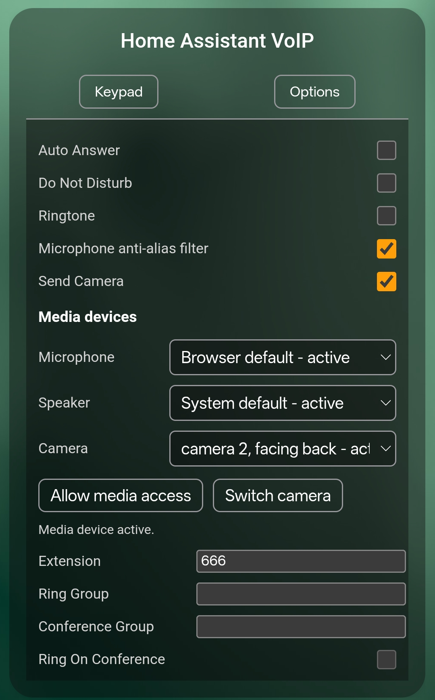

# What is new in 2026.9.0

`2026.9.0` is the stable release of the call-lifecycle, SIP interoperability and
ESP32-P4 videophone work developed after `2026.8.0`.

## One Home Assistant call model

Dashboard phones, ESPHome devices, registered SIP clients, trunks, forwarding,
ring groups and conferences now use one generation-owned call session with
explicit legs. Answer, bridge activation, media updates, termination and final
cleanup pass through shared primitives instead of route-specific call engines.

Public idle is reported only after call tasks, sockets, relays, transcoders and
RTP reservations are reusable. This prevents a completed call from leaving an
endpoint busy or racing an immediate redial.

## Standards-based SIP trunks and media

Provider identity, logical SIP domain, local Contact and outbound proxy are
kept as separate roles. Registered UDP trunks reuse the signaling socket and
source port that completed REGISTER for INVITE, authentication, ACK, in-dialog
requests and BYE.

Each bridge leg negotiates its own codec, payload, packet time and direction.
Compatible media remains direct. A bounded converter is used only when active
legs require different supported video formats. Audio remains established when
video is added, removed or rejected through re-INVITE.

## Home Assistant phone experience

Phonebook presence follows real SIP registrations and ESPHome availability,
while static contacts and browser phones retain their own availability rules.
DTMF follows the established bridge through RFC 4733 or SIP INFO. Browser
phones remember their preferred microphone, speaker and camera and can change
them without replacing the SIP call.

The card, editor, configuration, entities, repairs and service errors include
Brazilian Portuguese and German translations.

The card Options view now lets each browser or Companion app select its
preferred microphone, speaker and camera. It can also request media permission
and switch between the available cameras without changing the active SIP call.
Future releases will continue consolidating media-device discovery and
selection across browsers and mobile platforms.

## ESPHome P4 videophone

The maintained ESP32-P4 profiles support bidirectional SIP video over JPEG or
H.264 as separate compile-time choices. Initial video and audio-first video
updates preserve bidirectional audio. Camera capture, transport, decode and
panel presentation use bounded queues, persistent workers and reusable buffers.

The full JPEG profile combines the videophone with AFE, Micro Wake Word, Voice
Assistant, LVGL, TTS, HTTP media and Sendspin. H.264 remains the experimental
codec profile, while JPEG is the stable full-device baseline.

Camera work is maintained in the project fork of @Psix-anp's component and is
being proposed upstream as focused pull requests. Once the required changes
are accepted there, maintained YAMLs can point directly to that upstream
repository.

## Coordinated ESP components

Audio Stack, ESP VoIP Stack, Runtime Controller and the P4 camera component are
released together as `v2026.9.0`. Maintained YAMLs point to their stable `main`
branches. Project-owned ESPHome compatibility forks are documented in
[Espressif components and licenses](ESPRESSIF_COMPONENTS.md).

## Known issues

On some browsers and mobile devices, the operating system initially exposes
only a generic camera or a partial device list. Open the card Options and tap
`Allow media access` to grant permission and display all available
microphones, speakers and cameras.

## Upgrade

Read [Breaking changes](BREAKING_CHANGES.md) before upgrading from `2026.8.0`.
Restart Home Assistant after installing the HACS archive, clear the dashboard
or Companion app frontend cache and rebuild maintained ESPHome profiles from
the current YAML files.
