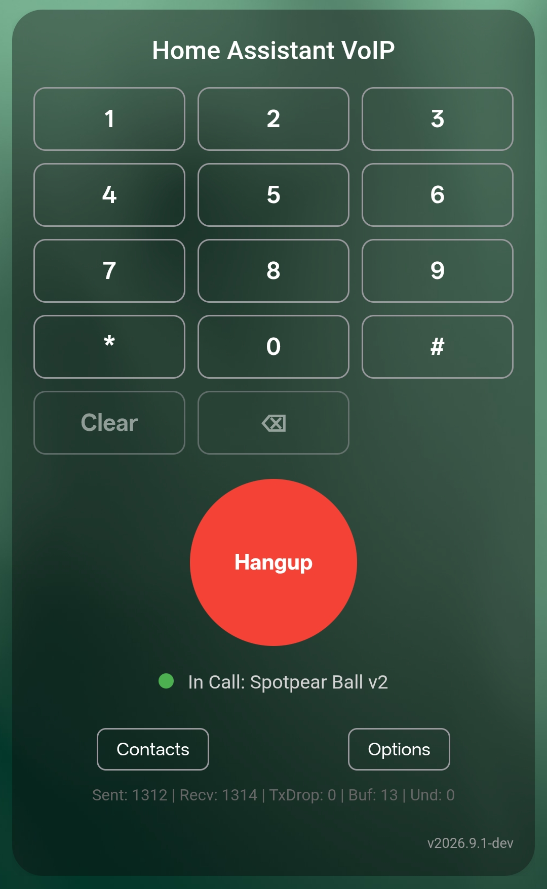

# 2026.9.1-dev pre-release: cleaner audio, real codecs and in-call DTMF

`2026.9.1-dev` starts the next active development cycle. The stable release
remains `2026.9.0`. These notes will grow as further features and fixes enter
the candidate.

This revision makes the phone system less interested in special cases and more
interested in behaving like a phone system. ESP endpoints publish their real
media capabilities, compatible legs avoid unnecessary transcoding, the HA
phone can operate an IVR, and browser audio follows its own clock instead of
hoping the UI thread remains in a generous mood.

## ESPHome phones now publish their real codec capabilities

An ESPHome endpoint can advertise ordered transmit and receive RTP formats,
including codec, sample rate, channels and packet time. Home Assistant uses
that information in the same way it uses the capabilities of another SIP
phone. The endpoint is no longer routed through a special hard-coded media
profile merely because it is an ESP device.

When both call legs negotiate a compatible compressed format, HA relays the
payload without decoding and encoding it again. Payload type, RTP sequence,
timestamp and SSRC are still rewritten for the destination dialog. When the
legs are not compatible, the existing bounded media relay transcodes each
direction independently.

Debug diagnostics report a transcoding path only when conversion is actually
required. The normal production path does not enable media capture or verbose
codec diagnostics automatically.

## Opus is optional in compact ESP profiles

The standalone VoIP component can now negotiate RFC 7587 Opus in addition to
its existing PCM formats. Qualified Spotpear, WS3 and P4 JPEG VoIP-only
development profiles prefer mono Opus at 48 kHz RTP clock and 20 ms packet
time, with a 10 ms Opus alternative. Each firmware advertises Opus only.
Incompatible direct peers can route through Home Assistant, which performs the
required transcoding.

Opus is intentionally optional and compile-time gated. Full profiles continue
using the proven PCM configuration because wake word detection, AFE, Voice
Assistant, media playback, TTS and Sendspin already consume their hardware
budget. Codec selection therefore follows the selected product profile instead
of silently adding compressed-codec dependencies to every firmware.

This is a current hardware-resource limit, not a SIP interoperability limit.
Real-device testing of an Opus-only Spotpear Full build showed that incoming RTP
kept its required 20 ms cadence with no packet loss, while the device could only
encode about 15 frames per second and decode about 20 frames per second instead
of the required 50. The encoder and decoder each need a heavily accessed Opus
pseudostack. Keeping those working sets in PSRAM is too slow under the complete
AFE, wake word, LVGL and media workload, while moving them to internal memory
leaves too little DMA-capable RAM for the display and audio hardware.

For now, maintained Full profiles therefore remain PCM-only. Qualified
VoIP-only profiles have enough remaining resources for bidirectional Opus and
did not show the same runtime limitation. A future Full Opus profile remains
possible if the codec working-memory contract or the available hardware budget
improves, but it will require complete real-device concurrency qualification.

## Packet time and SDP offers are smaller and more interoperable

Endpoints may support different packet times for the same wire codec. Offers
now publish one payload for each actual RTP encoding and preserve the preferred
packet time instead of repeating the same codec several times. The answerer
selects a packet time supported by both transmit and receive paths.

This keeps ordinary UDP INVITE requests below the LAN MTU in the validated
profiles without treating TCP as the primary solution. TCP remains a normal
standards-based transport or fallback when selected by the peer or route.

SIP URIs without an explicit remote port now use the scheme default, 5060 for
`sip` and 5061 for `sips`. HA's local listener port is no longer reused as an
unrelated destination port in direct calls, forwarding, groups, conferences or
inbound bridges.

## The HA phone now has an in-call keypad

The Home Assistant card reuses its normal keypad during an established call.
Digits entered while idle still build a destination. Digits entered during a
call are sent through the negotiated telephone-event payload, with SIP INFO
available for compatible peers. Hangup remains visible in the keypad view and
the card returns to its ordinary terminal screen when either side ends the
call.

Each new dialog also resets temporary card surfaces. An Options or keypad view
left open by the previous call can no longer hide Answer and Decline on the
next incoming call.

The same operation is available as the `voip_stack.send_dtmf` Home Assistant
action. ESP phones advertise DTMF only when their firmware contains the new
RFC 4733 implementation, so audio-only firmware does not gain a fictional
capability.

  

The keypad replaces the normal call view only while it is needed. `Hangup`
remains available, `Contacts` returns to destination selection, and remote or
local hangup restores the ordinary terminal screen. It is a telephone keypad,
not a modal dungeon with no exit.

## Browser audio follows RTP cadence without crackling

The browser receive path now separates network packet arrival from Web Audio
rendering. The page WebSocket sends negotiated PCM frames directly to the
playback AudioWorklet, removing the former Worker and MessageChannel hop. The
worklet converts RTP frame cadence into the exact render blocks requested by
the browser audio clock.

An adaptive, bounded jitter buffer absorbs packet bursts and short Android
WebView scheduling stalls. It starts with a conservative reserve, learns only
from delivery gaps that exceed the current protection, and releases surplus
one frame at a time after a stable interval. This prevents both failure modes:
draining to an unrealistically small buffer after a few quiet seconds, and
growing to the maximum because ordinary message batching kept resetting the
recovery timer.

The same path reports input, output, drop, buffer and underrun counters.
Underrun diagnostics distinguish network arrival gaps from delivery stalls
inside the WebView, so a bad scheduler is no longer framed for a crime
committed by RTP.

## More resilient embedded registration and call control

The SIP registrar accepts the equivalent Digest URI form used by some embedded
door stations when the request omits port 5060 but the signed Digest URI states
it explicitly. The exception is deliberately narrow: the SIP user, host, URI
parameters and effective port must still match, and the Digest response is
verified against the exact URI signed by the client. Different ports or URI
parameters remain rejected.

During an active browser call, the shared softphone engine now checks the Home
Assistant connection and recovers through the official connection API after a
confirmed half-open WebSocket. Hangup and Decline use the same engine-owned
terminal operation, reconnect once when transport failure is confirmed, then
read the authoritative call state before deciding whether a retry is needed.
The monitor is suspended while an Android page is hidden, so normal Companion
app lifecycle transitions do not cause a false reconnect.

## Home Assistant and ESP component cleanup

- DNS resolver imports and resolver initialization run outside the HA event
  loop, removing blocking-import warnings without changing RFC 3263 routing.
- The SPI PSRAM DMA adapter now matches the implementation merged upstream in
  ESPHome pull request 18699.
- Maintained YAMLs use ESPHome's official speaker interface and
  `speaker_source` media player. The obsolete local speaker fork has been
  removed.
- Spotpear and WS3 profiles keep their large audio and signaling allocations
  reusable instead of rebuilding them for every call.
- HA and ESP log one warning when their coordinated VoIP Stack versions do not
  match. The warning is deliberately emitted once per mismatch instead of on
  every state update.

ESP discovery now keeps the stable SIP route separate from the complete media
contract. The route state retains a backward-compatible PCM format, while a
bounded diagnostic state carries directional RTP codecs, DTMF support, video
codec and component version. Large P4 profiles therefore remain discoverable
instead of exceeding Home Assistant's 255-character entity-state limit.

## Call ownership and cleanup are now centralized

Home Assistant now keeps one authoritative owner for each call generation.
Routing, forwarding, browser phones, registered SIP clients, media bridges and
termination all commit through the same lifecycle primitives instead of
maintaining partially independent state paths.

The shared cleanup barrier closes call legs, RTP relays, video transcoders,
timers and port reservations before the endpoint becomes reusable. Delayed
callbacks from an older call generation cannot alter a newer call that reused
the same public identity.

Dial targets, phonebook entries and service aliases now use canonical parsers
and tables. Registered contacts also preserve the signaling transport observed
during REGISTER. This prevents a large video INVITE from being changed to TCP
when the selected registered endpoint is explicitly reachable only through
its UDP binding.

## Current candidate qualification

- 1700 software tests passed, with 4 intentional deselections and 133
  parameterized subtests.
- 95 Home Assistant runtime tests passed.
- The complete local SIP laboratory passed caller and callee hangup, CANCEL,
  manual answer and decline, auto answer, forwarding, two browser subscribers,
  registered SIP clients, video added in-dialog and final resource cleanup.
- Browser playback consumed 49 measured input frames and produced 338 audio
  render blocks with zero underruns in the registered video call witness.
- SIP INFO and RFC 4733 DTMF passed in both directions, including the complete
  `0-9*#` keypad sequence.
- An Android call through the deployed Home Assistant instance exchanged 775
  receive and 762 transmit RTP audio packets with WS3, with zero PLC, late
  discard, queue drop or terminal resource leak.
- The current P4 JPEG profile completed an Android audio and video call with
  sendrecv media. Browser diagnostics reported 1526 receive and 1504 transmit
  audio packets, zero audio PLC or queue drops, and zero video loss, reorder or
  access-unit queue drops. P4 presented 74 of 75 admitted JPEG frames and
  returned every call-scoped resource to zero after hangup.
- A physical OnePlus Nord 5 Companion call held browser playback at zero
  underruns after the direct WebSocket-to-AudioWorklet path and bounded adaptive
  reserve were deployed. The buffer absorbed measured WebView delivery stalls
  instead of converting them into periodic audio gaps.

The P4 camera is configured for 10 FPS, but this Android witness produced about
4.6 encoded and presented frames per second. The result proves stable media and
physical presentation for this call, not achievement of the configured maximum
frame rate.

## Upgrade notes

The former local `speaker` fork is no longer shipped. Custom YAMLs that still
request it from this repository must migrate to the official ESPHome speaker
interface and `speaker_source` media player before rebuilding.

The Opus-only codec configurations require the matching
`esphome-voip-stack@dev` component. Maintained development YAMLs already point
to the coordinated `dev` branches.

## Known issue

High-refresh-rate operation on the OnePlus Nord 5 still needs separate
qualification, especially during touch and orientation changes. The current
physical validation used the stable 60 Hz mode. The adaptive buffer fixes the
independent periodic scheduling gaps observed at 60 Hz, but it is not evidence
that every 120 Hz WebView lifecycle path is now qualified.

## Installation and feedback

In HACS, open VoIP Stack, use the three-dot menu, select Redownload and choose
`2026.9.1-dev`. Restart Home Assistant and clear the browser or Companion app
cache so the updated card module is loaded.

When reporting a regression, include the exact test time, call direction,
endpoint models, negotiated codecs and sanitized logs from INVITE through
final cleanup.
